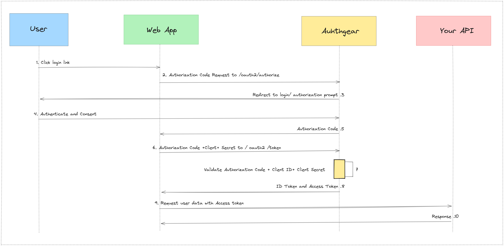
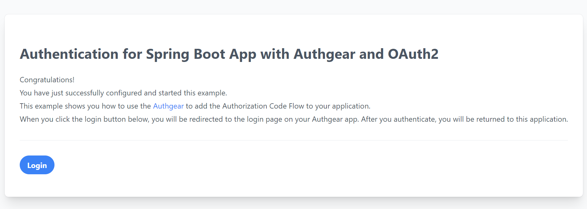
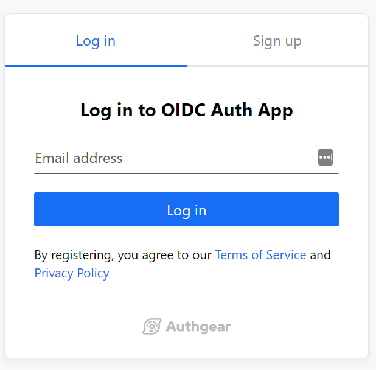
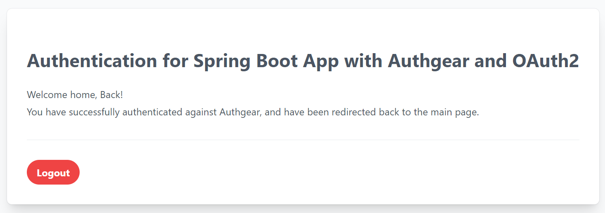

<a href="/zh-hant/" target="_blank">Authgear</a> 是一個免費使用的身份平台，用於管理對您的應用程式的存取。它使用特殊的 **OpenID Connect (OIDC)** 協定和 **OAuth 2.0 授權框架** 來確認使用者是誰並允許/禁止他們存取受保護的資源。借助 Authgear，您可以輕鬆地為使用者添加不同的方式來登入和存取您的應用程式和 API，而無需擔心其工作原理的技術細節。 Authgear 負責驗證使用者並授予他們權限的複雜部分，因此您可以專注於建立應用程式和業務價值功能。

在這篇文章中，您將學習 **如何使用 Java Spring Boot 應用程式新增身份驗證** <a href="https://tools.ietf.org/html/rfc6749" target="_blank">OAuth2</a> 使用 Authgear 作為身分提供者 (IdP)。

## 學習目標

您將在整篇文章中了解到以下內容：

- 授權程式碼流程如何運作。
- 如何在 Authgear 上建立應用程式。
- 如何啟用基於電子郵件的登入。
- 為 Spring Boot App 新增註冊和登入功能。

## 授權代碼流如何與 Authgear 配合使用

在深入實施之前，我們先了解一下 <a href="https://tools.ietf.org/html/rfc6749#section-4.1" target="_blank">授權碼流程</a> 在我們的範例中有效。此流程只能用於機密應用程式（例如常規 Web 應用程式），因為涉及**將授權代碼交換為令牌**。以下是此流程中的步驟：

<!--FIGURE-->

<!--/FIGURE-->

1. 用戶在 **Spring 應用程式**中選擇 **登入**。
1. **Spring Security** 將使用者重新導向至 **Authgear 授權伺服器**（/oauth2/authorize 端點）。
1. **Authgear** 將使用者重新導向至登入頁面和授權提示。
1. 使用者使用配置之一進行身份驗證 <a href="https://docs.authgear.com/strategies/user-identity-and-authenticator" target="_blank">登入選項</a> （例如，透過電子郵件）。
1. **Authgear** 使用一次性授權代碼將使用者重新導向回應用程式。
1. **Spring OAuth2** 用戶端將授權程式碼、應用程式的用戶端 ID 和應用程式的憑證（例如用戶端金鑰）傳送至 **Authgear** （/oauth2/token 端點）。
1. **Authgear** 驗證授權代碼、應用程式的用戶端 ID 和應用程式的憑證。
1. **Authgear** 使用 ID 令牌和存取權杖（以及可選的刷新令牌）進行回應。
1. 應用程式可以使用存取令牌呼叫 API 來存取有關使用者的信息。
1. API 使用請求的資料進行回應。

## 將登入新增至您的 Spring Web 應用程式

本範例使用 <a href="https://docs.spring.io/spring/docs/current/spring-framework-reference/web.html" target="_blank">春季MVC</a> 和 <a href="https://www.thymeleaf.org/" target="_blank">百里香葉</a> 和 <a href="https://docs.spring.io/spring-security/reference/whats-new.html" target="_blank">SpringSecurity 6</a> 建立常規 Web 應用程序，它使用 Authgear **透過 Authgear 提供的登入頁面**添加身份驗證。可以找到範例的完整原始碼 <a href="https://github.com/Boburmirzo/authgear-spring-oauth2-example" target="_blank">在 GitHub 上</a>.

## **先決條件**

在開始之前，您將需要以下內容：

- Java 17 或更高版本。您可以使用 <a href="https://sdkman.io/" target="_blank">SDKMAN！</a> 如果您還沒有安裝 Java，請安裝它。
- **免費的 Authgear 帳號**。 <a href="https://accounts.portal.authgear.com/signup" target="_blank">報名</a> 如果您還沒有的話。

## 第 1 部分：配置 Authgear

要使用 Authgear 服務，您需要在 Authgear 中設定一個應用程式 <a href="https://portal.authgear.com/" target="_blank">儀表板</a>。您可以在 Authgear 應用程式中設定您正在開發的專案的身份驗證工作方式。

### 第 1 步：配置應用程式

使用互動式選擇器建立新的**Authgear OIDC 用戶端應用程式**或選擇代表您要整合的專案的現有應用程式。

<!--FIGURE-->

<!--/FIGURE-->

Authgear 中的每個應用程式都分配有一個字母數字的唯一客戶端 ID，您的應用程式程式碼將使用該 ID 透過 Spring Boot 呼叫 Authgear API <a href="https://docs.spring.io/spring-security/reference/reactive/oauth2/client/index.html" target="_blank">OAuth 2 用戶端</a>。記下輸出中的 Authgear 頒發者（例如，https://example-auth.authgear-apps.com/）、CLIENT ID、CLIENT SECRET 和 OpenID 端點。您將在客戶端應用程式配置的下一步中使用這些值。

<!--FIGURE-->

<!--/FIGURE-->

### 步驟 2：設定**重定向 URI**

**重定向 URI** 是應用程式中您希望 Authgear 在使用者通過身份驗證後將其重定向到的 URL。在我們的例子中，它將是我們的 Spring Boot 應用程式的主頁。如果未設置，用戶登入後將不會返回您的應用程式。

### 第三步：選擇登入方式

建立 Authgear 應用程式後，您可以選擇使用者需要如何**在登入頁面上進行身份驗證**。從“身份驗證”選項卡，導航至“登入方法”，您可以從各種選項中選擇**登入方法**，包括透過電子郵件、行動裝置或社交媒體，只需使用使用者名稱或您指定的自訂方法。對於此演示，我們選擇 **電子郵件+無密碼** 方法，要求使用者註冊帳戶並使用電子郵件登入。他們的電子郵件將收到一次性密碼 (OTP)，並驗證代碼以使用該應用程式。

<!--FIGURE-->

<!--/FIGURE-->

## 第 2 部分：配置 Spring Boot 應用程式

### 步驟1：添加Spring依賴

要建立新的 Spring Boot 應用程序，您可以使用 <a href="https://start.spring.io/" target="_blank">春季初始化</a>。然後將依賴項新增至 pom.xml 文件，例如 <a href="https://mvnrepository.com/artifact/org.springframework.boot/spring-boot-starter-oauth2-client" target="_blank">spring-boot-starter-oauth2-客戶端</a> starter 提供了向 Web 應用程式新增身份驗證所需的所有 Spring Security 依賴項，而 Thymeleaf 僅用於建立單頁面 UI。

```

  <dependencies>
      <dependency>
          <groupId>org.springframework.boot</groupId>
          <artifactId>spring-boot-starter-web</artifactId>
      </dependency>
      <dependency>
          <groupId>org.springframework.boot</groupId>
          <artifactId>spring-boot-starter-oauth2-client</artifactId>
      </dependency>
      <dependency>
          <groupId>org.springframework.boot</groupId>
          <artifactId>spring-boot-starter-thymeleaf</artifactId>
      </dependency>
      <dependency>
          <groupId>org.thymeleaf.extras</groupId>
          <artifactId>thymeleaf-extras-springsecurity6</artifactId>
          <version>3.1.1.RELEASE</version>
      </dependency>
  </dependencies>
  
```

### 步驟 2：使用 Authgear 設定 OIDC 驗證

Spring Security 可以輕鬆設定您的應用程式以使用 OIDC 提供者（例如 Authgear）進行身份驗證。我們需要使用 Auhgear 提供者設定將客戶端憑證新增至 **application.properties** 檔案。您可以使用下面的範例，並將屬性替換為 Authgear 應用程式中的值：

```

spring.security.oauth2.client.registration.authgear.client-id={your-client-id}
spring.security.oauth2.client.registration.authgear.client-secret={your-client-secret}
spring.security.oauth2.client.registration.authgear.authorization-grant-type=authorization_code
spring.security.oauth2.client.registration.authgear.scope=openid
spring.security.oauth2.client.registration.authgear.redirect-uri=http://localhost:8080/
spring.security.oauth2.client.provider.authgear.token-uri=https://{DOMAIN}/oauth2/token
spring.security.oauth2.client.provider.authgear.authorization-uri=https://{DOMAIN}/oauth2/authorize

# To logout from the app
authgear.oauth2.end-session-endpoint=https://{DOMAIN}/oauth2/end_session
  
```

### 步驟 3： 在您的應用程式中新增登入訊息

若要啟用使用者使用 Authgear 登錄，請建立一個提供 **SecurityFilterChain** 實例的類，新增 @EnableMethodSecurity 註釋，並重寫必要的方法：

```

@Configuration
@EnableMethodSecurity(securedEnabled = true)
public class SecurityConfig {

    @Value("${authgear.oauth2.end-session-endpoint}")
    private String endSessionEndpoint;

    @Bean
    public SecurityFilterChain configure(HttpSecurity http) throws Exception {
        http.authorizeHttpRequests((requests) -> requests
                // allow anonymous access to the root page
                .requestMatchers("/").permitAll()
                // authenticate all other requests
                .anyRequest().authenticated())
            // enable OAuth2/OIDC
            .oauth2Login(withDefaults())
            // configure logout handler
            .logout(logout -> logout.logoutRequestMatcher(new AntPathRequestMatcher("/logout"))
                .logoutSuccessUrl("/")
                .addLogoutHandler(oidcLogoutHandler()));
        return http.build();
    }

    LogoutHandler oidcLogoutHandler() {
        return (request, response, authentication) -> {
            try {
                response.sendRedirect(endSessionEndpoint);
            } catch (IOException e) {
                throw new RuntimeException(e);
            }
        };
    }
}
  
```

### 第四步：新增首頁

我們使用 Thymeleaf 模板建立一個簡單的 home.html 頁面。當使用者開啟在 http://localhost:8080/ 上執行的頁面時，我們會顯示一個有登入或登出按鈕的頁面：

<!--FIGURE-->

<!--/FIGURE-->

### 第5步：新增控制器

接下來，我們建立一個控制器類別來處理傳入的請求。該控制器呈現 home.html 頁面。當使用者進行身份驗證時，應用程式會檢索使用者的個人資料資訊屬性來呈現頁面。

```

@Controller
public class HomeController {
    @GetMapping("/")
    String home() {
        return "home";
    }
}
  
```

### 第 6 步：運行應用程式

要運行應用程序，您可以執行 mvn spring-boot:run 目標。或從編輯器執行主ExampleApplication.java 檔案。範例應用程式可從 http://localhost:8080/ 取得。

<!--FIGURE-->

<!--/FIGURE-->

點擊 **登入** 按鈕將重定向到 Authgear 登入頁面。

<!--FIGURE-->

<!--/FIGURE-->

您也可以從 Authgear 入口網站自訂登入頁面 UI 視圖。註冊後，您將在電子郵件中收到 OTP 代碼以驗證您的身分。

<!--FIGURE-->

<!--/FIGURE-->

並登入您的新帳戶，您將被重新導向回主頁：

<!--FIGURE-->

<!--/FIGURE-->

您已成功設定 Spring Boot 應用程式以使用 Authgear 進行身份驗證。現在用戶可以註冊新帳戶、登入和登出。

## 後續步驟

您可以使用 Authgear 做更多事情。探索其他登入方法，例如使用 <a href="https://docs.authgear.com/strategies/email-login-link" target="_blank">魔法連結</a> 在電子郵件中， <a href="https://docs.authgear.com/strategies/how-to-setup-sso-integrations" target="_blank">社群登入</a>， 或者 <a href="https://docs.authgear.com/strategies/whatsapp-otp-login" target="_blank">WhatsApp 免洗密碼</a>。對於當前應用程序，您還可以 <a href="https://docs.authgear.com/strategies/user-identity-and-authenticator" target="_blank">新增更多用戶</a> 來自 Authgear 入口網站。
