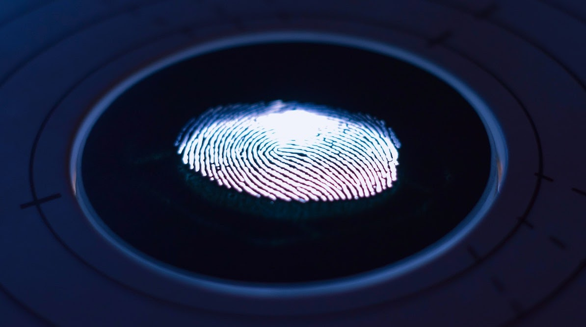

隨著配備生物感測器的行動裝置普及，生物辨識驗證已成為最常見的登入方式之一。和傳統帳號密碼驗證相比，它更安全、也更方便。當使用者嘗試登入應用程式時，系統會比對其生物特徵與資料庫中的紀錄，確認是否為合法使用者。

不過，如果傳統帳密驗證長期主導市場，為什麼你還要導入生物辨識？原因不只「登入更快」與「更安全」而已。

本文將討論：

<nav id="table-of-content">
    <ul>
        <li><a href="#def">什麼是生物辨識驗證？</a></li>
        <li><a href="#why">為什麼我的應用程式或網站應提供生物辨識登入？</a></li>
        <li><a href="#benefits">使用 Authgear 導入生物辨識登入的好處</a></li>
        <li><a href="#types">生物辨識驗證有哪些類型？</a></li>
        <li><a href="#authgear">如何在應用程式或網站中提供生物辨識驗證？</a></li>
    </ul>
</nav>

<h2 id="def">什麼是生物辨識驗證？</h2>

簡單來說，生物辨識驗證是透過比對使用者提供的生理特徵（inherence factors）與資料庫中的資料來驗證身分。這些特徵例如臉部特徵、指紋等，具有高度個人性且難以複製。正因為這些生理特徵具獨特性，才讓多種生物辨識技術得以落地，並成為日常生活的一部分。

生物辨識與密碼驗證的差異不只在「驗證因子」。一般而言，密碼會透過<a href="/post/password-hashing-salting" target="_blank">雜湊與加鹽</a>安全儲存於伺服器；而生物資料通常不會在伺服器與裝置間來回傳遞。當你使用生物辨識登入時，實際上解鎖的是用來驗證使用者的數位憑證或私鑰，而不是直接「把生物資料送出去」。

生物辨識常作為次要驗證方式（在輸入帳密後），或提供給回訪使用者作為主要登入方式。以多數銀行 App 為例，首次登入需要帳密，之後可直接用 Face ID 或 Touch ID，速度更快且通常更安全。

<h2 id="why">為什麼我的應用程式或網站應提供生物辨識登入？</h2>

<!--FIGURE-->

<!--/FIGURE-->

### 使用者體驗與偏好

相較於傳統帳號密碼，生物辨識驗證對使用者而言明顯更快。使用者不必再輸入可能會忘記的帳號密碼，只需按壓指紋辨識器或看向手機鏡頭即可完成驗證。

若想了解消費者對驗證方式的偏好，<a href="https://www.visa.ie/visa-everywhere/innovation/biometrics-next-frontier-payments.html" target="_blank">VISA 對 1,000 名美國人進行調查</a>，結果顯示：

- 86% 受訪者有興趣使用生物辨識驗證。
- 70% 認為生物辨識更容易使用，但只有 46% 認為它比密碼更安全。

即使只有不到一半的人認為生物辨識更安全，多數人仍認同它更方便。隨著使用者信任逐步提升，開發者勢必需要提供生物辨識登入，才能優化網站與 App 的體驗。

### 更強的資料安全

雖然生物辨識仍非萬無一失，但在多個層面上仍比帳密驗證更安全：

1. 使用者不會「忘記自己的生物特徵」。
1. 使用者獨特的生物特徵更難被駭客複製。
1. 根據 <a href="https://www.gartner.com/smarterwithgartner/the-iam-leaders-guide-to-biometric-authentication" target="_blank">Gartner</a>，生物辨識安全性不只來自特徵獨特性，也來自「難以冒充活體向感測器呈現特徵」。

雖然 2013 年 iPhone 5S 推出 Touch ID 後，曾在 48 小時內被破解，但與常被寫在便條紙或文件中的密碼／PIN 相比，現代生物辨識整體安全性已大幅提升。

生物辨識仍有可改進之處，例如準確率、成本與軟體漏洞，但它比傳統方式更受歡迎已是明確趨勢。

	<h2 class="title cta-split-content-left">使用 Authgear 提供更安全、體驗更佳的登入流程</h2>
  
快速為你的 App 加上生物辨識與其他驗證能力

  <a href="/talk-with-us" target="_blank" class="w-inline-block">
  	
預約 Demo

<h2 id="benefits">使用 Authgear 導入生物辨識登入的好處</h2>

在 App 中導入生物辨識登入，不只提升便利性。以下是透過像 Authgear 這類<a href="/post/what-is-customer-identity-and-access-management-ciam" target="_blank">顧客身分與存取管理（CIAM）</a>方案可帶來的商業效益。

### 降低成本並縮短上市時間

很多人第一時間不會想到這點，但導入生物辨識確實能在多方面降本。當客戶可用生物辨識登入，帳號復原與密碼重設需求通常會下降，減少營運成本。許多銀行 App 也用<a href="/post/sms-otp-vulnerabilities-and-alternatives" target="_blank">簡訊 OTP</a>做二次驗證，但簡訊服務並非免費。增加生物辨識作為可選方案，也能降低驗證簡訊發送量。

此外，Authgear 已完成生物辨識能力建置，使用 Authgear 可大幅縮短開發與上線時間。

### 降低通過資安稽核與審查的成本

許多產業，尤其醫療與金融，對資安合規要求嚴格。企業需確保 App 具備雙因素驗證、生物辨識登入等功能。Authgear 已替你完成重工，你只要整合網站或 App，即可快速部署安全機制，提升稽核通過率。

### 降低開發錯誤風險

自行開發並維護生物辨識與其他驗證功能，容易出錯。Authgear 協助各種規模企業保護其應用程式，並持續更新最佳實務，讓你的團隊專注核心功能，而非分心在驗證與帳號管理細節。

<h2 id="types">生物辨識驗證有哪些類型？</h2>

<!--FIGURE-->

<!--/FIGURE-->

### **指紋辨識**

每個人的指紋都不同，連同卵雙胞胎也不相同，因此是理想的生物辨識因子。指紋辨識透過指紋驗證身分，且因行動裝置普及而成為最廣泛使用的技術之一。

### **臉部辨識**

臉部辨識常見於電影，現在也已廣泛應用在執法、金融服務等產業。其核心是分析臉部幾何與特徵結構。系統會根據你的資料建立加密數位模型，供後續驗證比對使用。

### **眼部辨識**

你可能看過電影裡主角盯著儀器掃描眼球進入機密設施，這就是眼部辨識。

眼部辨識可分為虹膜與視網膜辨識。虹膜掃描使用紅外線分析虹膜紋路；視網膜掃描則檢查眼底血管的獨特分布。

雖然在媒體中很常見，但它的導入成本較高，因此不如臉部與指紋普及。

### **聲紋辨識**

聲紋辨識會分析音色、音高、頻率等語音特徵來確認身分。現在不少行動裝置助理只會回應已在設定中註冊過的聲音。

此外還有靜脈紋路、步態等生理與行為特徵可用於驗證，但普及度不如上述方式。

<h2 id="how-to-include-biometric-auth">如何在應用程式或網站中提供生物辨識驗證？</h2>

若要自行打造能支援多種驗證方式的系統，工程量通常很大。將驗證系統外包可加速開發、降低資料外洩風險，並讓團隊聚焦核心業務。

Authgear 提供應用程式所需的完整功能，例如無密碼與生物辨識、SSO 與社群登入、密碼政策管理、雙因素驗證等。若要啟用生物辨識，你只需在 Portal 中開啟設定，並依照我們的[文件](https://docs.authgear.com/strategies/biometric)在行動 SDK 啟用生物辨識登入。

<!--FIGURE-->

<!--/FIGURE-->

歡迎<a href="/talk-with-us" target="_blank">聯絡我們</a>，了解 Authgear 如何幫助你打造流暢體驗並提升資料安全。
