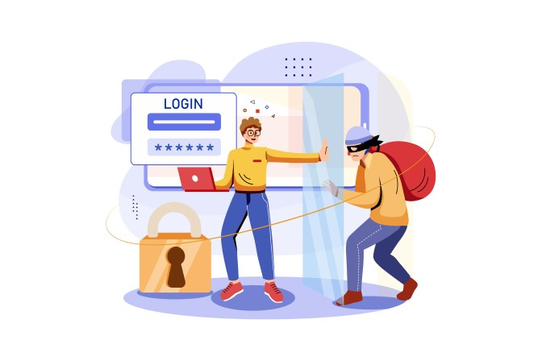
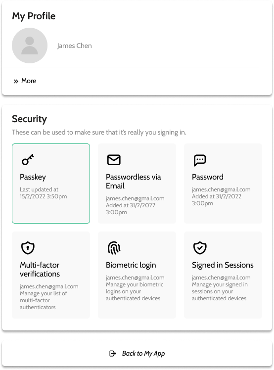

2020 年，美國證券交易委員會（SEC）在一份<a href="https://www.sec.gov/files/Risk%20Alert%20-%20Credential%20Compromise.pdf" target="_blank">報告</a>中強調了 credential stuffing 攻擊日益升高的風險。這種資安威脅之所以持續嚴重，部分原因是它利用了人們每天都在犯的簡單錯誤。我們大多數人都知道不該在多個平台重複使用同一組帳號密碼，但這種情況仍非常普遍，也讓自動化攻擊變得過於容易。

網路上流傳著包含數百萬筆 Email 與對應密碼的<a href="https://www.troyhunt.com/the-111-million-pemiblanc-credential-stuffing-list/" target="_blank">credential stuffing 清單</a>，在使用者甚至毫不知情的情況下，把他們與其資料置於風險之中。Credential 濫用的普遍性與其對網路安全造成的威脅，讓我們有必要更深入理解它。

這正是我們整理這篇完整指南的原因：帶你了解這種資安威脅包含哪些內容，以及該如何有效防範。

<nav id="table-of-content">
    <ul> 
        <li><a href="#definition">什麼是 Credential Stuffing？</a></li>
        <li><a href="#how">Credential Stuffing 攻擊如何運作？</a></li>
        <li><a href="#difference">Credential Stuffing 與 Brute Force 攻擊的差異</a></li>
        <li><a href="#prevent">如何防止 Credential Stuffing？</a>
            <ul style="margin-top:17.92px;margin-bottom:0">
                <li><a href="#user">使用者端</a></li>
                <li><a href="#company">企業端</a></li>
            </ul>
        </li>
        <li><a href="#authgear">建立你的 Credential Stuffing 防線</a></li>
    </ul>
 </nav>

<h2 id="definition">什麼是 Credential Stuffing？</h2>

Credential stuffing 之所以難以防範，原因之一是許多人仍不清楚它到底是什麼。先用一句簡單定義說明：**Credential stuffing 是一種網路攻擊，攻擊者會把在其他服務的資料外洩事件中遭駭或遭竊取得的憑證（帳號與密碼組合），拿去嘗試登入另一個不相關的服務**。它有時也被稱為 password stuffing，本質上是利用遭竊資訊來「詐騙式取得使用者帳號存取權」（<a href="https://owasp.org/www-community/attacks/Credential_stuffing" target="_blank">OWASP</a>）。

如果你覺得這聽起來很可怕，那是因為它確實如此。當一個人在多個網站使用相同 Email 與密碼時，一旦這組憑證外洩，攻擊者就可能進入這些帳號。結果就是跨平台的資料安全同時遭到破壞，而起點可能只是一組憑證被盜。

<h2 id="how">Credential Stuffing 攻擊如何運作？</h2>

<!--FIGURE-->

<!--/FIGURE-->

要知道如何防止 credential stuffing，首先要理解攻擊是如何發生的。大規模 credential 濫用通常遵循以下流程：

1. 首先，攻擊者會建置能同時登入多個帳號、並偽裝不同 IP 位址的機器人。這讓攻擊既快速又能掩蓋痕跡。
1. 接著，他們會執行自動化流程，批次測試遭竊憑證能否在多個網站上登入。核心仍是速度。
1. 之後，攻擊者會監看哪些登入成功。一旦成功，就能從被入侵帳號取得可識別個人資訊、信用卡資料或其他有價值資訊。
1. 這些帳號資訊會被保留以供日後利用，也可能被用在釣魚攻擊，或其他依賴被入侵服務進行的交易。

此流程的高效率，使得 credential stuffing 即便成功率大約只有千分之一，對攻擊者仍有利可圖。他們可以取得大量憑證，再由駭客間交易。這類交易通常以清單形式流通，例如名為「<a href="https://www.troyhunt.com/the-111-million-pemiblanc-credential-stuffing-list/" target="_blank">Pemiblanc</a>」的清單，2018 年就包含了 1.11 億個 Email 位址。更可怕的是，現在網路上還有許多類似清單，而多數人從未察覺。

<h2 id="difference">Credential Stuffing 與 Brute Force 攻擊的差異</h2>

Open Web Application Security Project（OWASP）是專注於提升軟體安全的國際非營利組織。它在<a href="https://owasp.org/www-community/attacks/Credential_stuffing" target="_blank">credential stuffing 定義</a>中指出，credential stuffing 可被視為 brute-force 攻擊的子類別。不過兩者差異仍十分明顯，例如：

- Brute force 攻擊是在**沒有上下文**的情況下，透過亂數字串、常見密碼規則或常用詞典去猜測憑證；相對地，credential stuffing 使用的是已被確認過的憑證。
- Credential stuffing 透過資料外洩取得資訊，並因使用者重複使用密碼而提升效率；brute force 則依賴使用者設定過於簡單、可猜測的密碼。Brute force 本質是猜謎，credential stuffing 則更具針對性。
- Brute force 攻擊成功率通常更低，因為它不像 credential stuffing 一樣，能利用既有外洩資料。

防禦 brute force 的簡單方法之一，是建立含多種字元、字母與數字的強密碼。但這不一定能防住 credential stuffing。若同一密碼被用在多個帳號，不管多強都仍可能被重放攻擊利用。這就是為什麼導入雙因素驗證（2FA）非常關鍵：它要求使用者提供第二驗證因子才能登入系統。有了這層保護，僅靠遭竊憑證通常不足以讓攻擊者入侵帳號。

理解如何防止 credential stuffing，核心在於看見哪些環節能讓攻擊更難執行。這通常需要多層防禦、並同時考量各方角色，接下來我們就深入說明。

<h2 id="prevent">如何防止 Credential Stuffing？</h2>

<!--FIGURE-->

<!--/FIGURE-->

對企業而言，令人不安的現實是：正如美國 2018 年的一宗<a href="https://www.troyhunt.com/the-111-million-pemiblanc-credential-stuffing-list/" target="_blank">FTC 案件</a>所示，若客戶資料因 credential stuffing 受到威脅，法律責任至少仍有一部分在公司身上。即使是使用者重複使用密碼所致，也不足以讓應用程式背後的公司完全免責。

預防 credential stuffing 不只是保護資料隱私，更是避免企業承擔使用者帳號被冒用所帶來的後果。它影響所有利害關係人，而要阻止它，需要雙方都做出改變。因此，理解如何防範 credential stuffing 攻擊對所有人都很重要。

<h3 id="user">從使用者端著手</h3>

2019 年英國<a href="https://www.ncsc.gov.uk/news/most-hacked-passwords-revealed-as-uk-cyber-survey-exposes-gaps-in-online-security" target="_blank">網路安全調查</a>顯示，當時英國仍有 2,320 萬人把「123456」當作密碼。保護使用者免受 credential stuffing 影響，在很多情況下是從他們設定密碼那一刻就開始。問題在於，太多使用者仍在問「什麼是 credential stuffing？」而未意識到自己的選擇對避免憑證濫用有多重要。以下是使用者可採取的重要步驟：

#### **使用密碼管理器，並為每項服務建立唯一密碼**

建立一組強密碼後再重複用在多個帳號，仍不足以阻止 password stuffing。只要資訊重用一次，就等於暴露風險。這就是為什麼每個帳號都應使用獨立密碼。密碼管理器不只可協助儲存與整理密碼，也可為不同服務產生唯一密碼，避免所有服務都共用同一組密碼。

#### **啟用雙因素驗證**

現在大多數服務都提供雙因素驗證。開啟這個簡單功能，對想避免成為 credential stuffing 受害者的使用者有巨大幫助。系統除了帳號密碼之外，還會要求另一個驗證因子（如 PIN、指紋等）才能存取系統。此外，每次登入時也會在手機或其他已連線裝置收到通知。這一步看似小，卻非常有效，因為它能在憑證被冒用時提醒使用者。

Credential stuffing 最可怕的一點在於：若未啟用雙因素驗證，你很可能要等到事情嚴重失控時，才會發現帳號早已被他人使用。

<h3 id="company">從企業端著手</h3>

<a href="/zh-Hant/post/how-to-protect-your-users-from-automated-attacks" target="_blank">保護使用者免受自動化攻擊</a>不只是為了避免法律後果，更是為了確保整體線上使用體驗的安全。企業必須做得更多，以避免 credential stuffing 帶來的破壞。這不只關乎企業形象，更關乎使用者最基本的隱私。對任何公司而言，懂得如何防止 credential stuffing 都是維持資安的基礎。以下是可採用的工具：

#### **多因素驗證（MFA）**

<a href="/zh-Hant/post/what-is-multi-factor-authentication-mfa" target="_blank">多因素驗證</a>（MFA）顧名思義，是要求超過一種因子來驗證使用者身分。最常見的因子包括：

- 使用者知道的事（通常是密碼）
- 使用者擁有的事（例如安全權杖）
- 使用者本身的特徵（例如指紋）

舉例來說，使用者登入網站時，可能需要先輸入密碼，再輸入發送到手機的驗證碼。MFA 的目的，是在登入流程加入額外的安全層。好處是即使攻擊者擁有某人的帳號密碼，沒有第二驗證因子仍無法存取帳號。

有效的資料安全通常是透過層層疊加防護，讓駭客更難在不被發現的情況下突破。把 MFA 納入這道防線，尤其是與其他安全措施結合時，會形成高度有效的 credential stuffing 防禦方案。

#### **Passkeys**

新一代數位憑證是 <a href="/features/passkeys" target="_blank">Passkeys</a>。這種方案可讓使用者完全無密碼登入，進而消除 password stuffing 風險。使用者不必再煩惱建立獨特且複雜的密碼，或頻繁變更密碼。取而代之的是，使用者註冊網站應用程式時會先建立使用者名稱，之後透過生物辨識或 PIN 驗證，就像解鎖手機一樣。

這能降低登入與註冊流程摩擦，並提升資料安全，因為攻擊者無法誘騙使用者交出憑證。Credential stuffing 的成功仰賴密碼；當沒有密碼可用時，攻擊者就無從下手。Passkeys 讓企業可從根本繞過此類攻擊威脅。

#### **CAPTCHA**

CAPTCHA 要求使用者執行動作以證明自己是人類，目的在於讓 credential stuffing 機器人更難運作。不過，駭客可透過無頭瀏覽器相對容易地繞過 CAPTCHA。和 MFA 一樣，CAPTCHA 屬於可與其他安全解決方案搭配的工具，也只在特定情境特別有用。

CAPTCHA 有助於阻擋自動化登入嘗試，但這項工具本身仍有可被自動化攻擊利用的弱點。因此，只部署 CAPTCHA 通常不足以防禦攻擊。雖然它是預防 credential stuffing 最常見的工具之一，但效果仍不如其他可用的安全措施。最佳情況下，它能讓自動化登入攻擊更耗時，但不足以完全阻止 credential stuffing。

#### **裝置指紋（Device Fingerprinting）**

企業可使用 JavaScript 蒐集使用者裝置資訊，為每個新進入的 Session 建立一個「指紋」。這個指紋會綜合使用者作業系統、語言、瀏覽器、時區等參數。建立後即可與其他嘗試登入該帳號的瀏覽器比對；但使用者可能擁有多個裝置，若每次新瀏覽器登入都觸發警告，也可能損害使用體驗。

參數要設多嚴格、採取哪些措施，取決於導入方，甚至可以做到封鎖該 IP。不過一般建議是至少組合 2-3 個參數，並採取較溫和措施，例如暫時封鎖，直到確認帳號再次安全為止。

<h2 id="authgear">建立你的 Credential Stuffing 防線</h2>

<a href="/" target="_blank">Authgear</a> 提供多項高度有效的功能，協助你防止 credential stuffing 攻擊。包括 <a href="/features/biometric-authentication" target="_blank">Biometric Logins</a>、作為 MFA 因子的 <a href="/features/whatsapp-otp" target="_blank">Whatsapp OTPs</a>，以及透過 <a href="/features/passkeys" target="_blank">Passkey</a> 實現完全無密碼登入。

此外，Authgear 也提供多種次要驗證因子，例如 TOTP、Email OTP，以及額外密碼等機制，幫助你保護使用者免受 credential stuffing 影響。

<!--FIGURE-->

<!--/FIGURE-->

預建的帳號設定頁也可供使用者啟用 MFA、管理憑證，以及在觀察到任何可疑行為時撤銷已登入 Session。

<!--FIGURE-->

<!--/FIGURE-->

Credential 攻擊對使用者安全與資料隱私造成的威脅不容忽視。想了解 Authgear 如何協助你建立對抗這些威脅的防線，歡迎<a href="/talk-with-us" target="_blank">聯絡我們</a>。
