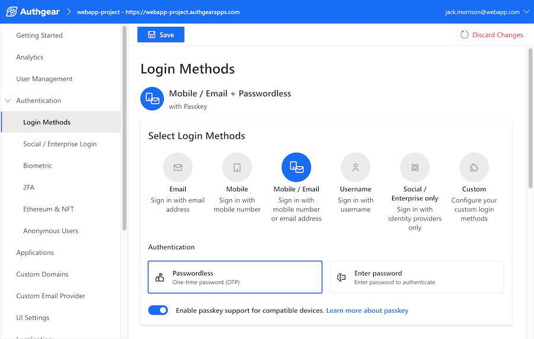

近期一項 <a href="https://www.pwc.com/us/en/services/consulting/library/consumer-intelligence-series/future-of-customer-experience.html" target="_blank">PWC 調查</a>指出，32% 的顧客表示只要有一次不好的體驗，就會停止與該品牌互動。這點無庸置疑：對任何追求成功的企業而言，客戶體驗都必須被列為優先要務；而在數位場景中，關鍵就在於確保每一次線上互動都是正面的。

在這篇文章中，我們會探討企業如何透過 Customer Identity and Access Management（CIAM）解決方案改善數位客戶體驗。優化使用者登入與存取你服務的方式，不只對數位客戶體驗有顯著幫助，也能直接改善你的營運成果。

<nav id="table-of-content">
    <ul>
        <li><a href="#how">如何透過 CIAM 改善數位客戶體驗？</a>
            <ul>
                <li><a href="#registraion">簡化註冊流程</a></li>
                <li><a href="#login">讓登入更順暢</a></li>
                <li><a href="#sso">以 SSO 串起多平台體驗</a></li>
                <li><a href="#security">提升安全與信任</a></li>
                <li><a href="#service">自助式管理能力</a></li>
            </ul>
        </li>
        <li><a href="#benefits">CIAM 帶來的商業效益</a>
            <ul>
                <li><a href="#convert">提高訪客轉換</a></li>
                <li><a href="#sales">提升銷售並留住客戶</a></li>
                <li><a href="#cost">降低客服成本</a></li>
                <li><a href="#loyalty">建立客戶忠誠</a></li>
            </ul>
        </li>
        <li><a href="#authgear">用 Authgear 升級數位客戶體驗</a></li>   
    </ul>
</nav>

<h2 id="how">如何透過 CIAM 改善數位客戶體驗？</h2>

改善客戶體驗是一場沒有終點的戰役，企業必須在「體驗」與「安全」之間找到最佳平衡，才能同時降低流程摩擦並建立顧客信任。從更順暢的註冊與登入，到更高的信任感，以下是把優質 CIAM 整合到 App 與各種平台後，如何提升數位客戶體驗。

<h3 id="registraion">簡化註冊流程</h3>

<!--FIGURE-->

<!--/FIGURE-->

客戶與企業網站最早的互動之一，通常就是註冊新帳號。這個流程經常既繁瑣又惱人：表單過長、問題過多，最後讓不少人直接放棄。這也是為什麼落地頁與註冊頁的流失率有時可高達 <a href="https://andrewchen.com/investor-metrics-deck" target="_blank">80%</a>。

為了幫助企業維持客戶參與度，Authgear 提供遵循高註冊轉換最佳實務的預建註冊樣板，讓註冊流程成為促成新客戶轉換的關鍵，而不是把人嚇跑的障礙。

我們也提供 <a href="/zh-Hant/post/social-login-guide" target="_blank">社群登入選項</a>，像是使用 Facebook、Google、Apple 等帳號登入。使用者可以直接用既有憑證在你的 App 或網站完成註冊。對數位客戶體驗來說，最大好處是使用者能略過大部分（甚至全部）最麻煩的註冊步驟。

此外，我們也支援 <a href="/features/passkeys" target="_blank">Passkey</a>。這是一種有機會徹底取代帳號密碼的替代式驗證方式。有了 Passkey，使用者不再需要建立並記住複雜密碼，只要像平常解鎖手機那樣，透過生物辨識或 PIN 即可完成驗證，進一步簡化註冊流程並提升數位客戶體驗。

<h3 id="login">讓登入更順暢</h3>

當註冊完成後，接下來要跨越的關卡就是登入。幸好，透過 Passkey 與前文提到的其他 <a href="/zh-Hant/post/passwordless-authentication-complete-guide" target="_blank">無密碼驗證</a>方式，記住複雜密碼不再是必要負擔。Authgear 也提供其他無密碼選項，包括 <a href="/features/whatsapp-otp" target="_blank">WhatsApp OTP</a>、<a href="/features/biometric-authentication" target="_blank">生物辨識驗證</a> 與 SMS OTP。

<!--FIGURE-->

<!--/FIGURE-->

讓客戶更容易登入，是思考「如何改善數位客戶體驗」時最直接有效的方法之一。你可以把註冊與登入流程想像成商店大門：如果門太重、難開，或在應該自動開啟時沒有反應，顧客很可能直接放棄，改去更容易進入的地方。

透過 CIAM 提供 <a href="/zh-Hant/post/frictionless-authentication" target="_blank">無摩擦驗證</a>體驗，你就能掌握顧客對品牌最早、也最關鍵的第一印象。這正是讓顧客持續參與，而非中途離開的關鍵。

<h3 id="sso">以 SSO 串起多平台體驗</h3>

Single Sign-On（SSO）允許使用者以一組憑證登入多個網站。對於同時營運多個平台的企業，SSO 能在各服務之間建立更一致的體驗。

它能把同一品牌旗下的各個 App 串接起來，並讓整體登入流程更便利。使用者不需要為每個網站或 App 使用不同登入，僅需一組帳號即可。這不只更方便，也能反映出平台營運者的專業與一致性。

<h3 id="security">提升安全與信任</h3>

信任是任何長期關係的核心，但要和顧客建立信任並不容易。CIAM 在數位客戶體驗上的最大價值之一，就是不只讓註冊與登入更便利，還能以實質安全感作為後盾。

無摩擦驗證固然重要，但若流程過於寬鬆，也可能讓人覺得安全不足。我們的 CIAM 解決方案專注協助企業保護自身與使用者資料，防止未授權存取，讓顧客在每一次數位互動中都感到安心。

在「降低使用門檻」與「維持高安全」之間取得平衡並不容易，但我們已經找到這個平衡點，並且一次又一次看到它如何幫助企業建立顧客信任。

<h3 id="service">自助式管理能力</h3>

Authgear 等 CIAM 還能透過自助式功能改善數位客戶體驗。過去，像忘記密碼或調整登入資訊這類需求，通常都要找客服；而 Authgear 提供帳號設定頁，讓使用者能自行完成大部分操作。

<!--FIGURE-->

<!--/FIGURE-->

使用者可以依個人需求，隨時更新個人資料、重設密碼、調整驗證方式，以及管理已綁定帳號，不必再等客服團隊花上數小時甚至數天回覆。

<h2 id="benefits">CIAM 帶來的商業效益</h2>

選擇用 CIAM 解決「如何改善數位客戶體驗」這個問題，也會帶來一系列額外效益。從提升轉換率與銷售，到降低客服成本，CIAM 不只對客戶有利，對企業也同樣有利。以下是具體方式：

<h3 id="convert">提高訪客轉換</h3>

透過 CIAM 降低註冊流程摩擦，企業不只能降低新訪客跳出率，也能確保更多人真正完成註冊。這一步看似簡單，卻可能帶來重大的財務效益。

這代表企業可以擴大電子報名單，並在廣告投放上更精準，把一般訪客一步步轉成忠實客戶。它能確保拉新策略發揮預期效果，為後續銷售成長打下基礎。

<h3 id="sales">提升銷售並留住客戶</h3>

註冊是一回事，但要讓人完成首次互動後願意再回來，才是關鍵。根據 <a href="https://andrewchen.com/investor-metrics-deck" target="_blank">50-75%</a> 的統計，許多在網站註冊的使用者後續都會處於不活躍狀態。當你透過廣告或電子報成功把他們帶回來時，密碼與不良 CIAM 實踐不該再成為他們繼續停用的原因。

這正是整合 CIAM 的價值所在。它不只改善數位客戶體驗，也讓顧客即使久未使用，仍能更容易回到你的平台。即便使用者沒有採用無密碼方式、需要調整登入資料，也沒問題；自助設定功能會再次發揮作用，幫助你留住注意力並逐步帶動更多銷售。

如今許多網站會在使用者接近完成付款時才要求重新登入。問題是，若這段登入流程有任何惱人之處，往往就足以讓人直接放棄購買。不要讓這種事發生。順暢的驗證流程能精簡整個購買旅程，降低棄單，進而帶來更多成交。

<h3 id="cost">降低客服成本</h3>

客服成本對企業來說可能是巨大負擔，尤其在規模成長後更明顯。問題在於，如果客服支援不足，客戶體驗會顯著下滑，最終影響銷售。像 Authgear 這樣的 CIAM 解決方案，就是為了在維持正向數位客戶體驗的同時，降低客服成本。

我們首先透過無密碼驗證選項來達成這點。客服最常見的問題之一，是使用者忘記密碼導致帳號被鎖。改用無密碼後，企業可直接避開這類問題，意味著更少客服請求與更高顧客滿意度。

此外，我們的 CIAM 自助功能在這方面也帶來顯著效益。若使用者需要改密碼、更新個資或調整驗證方式，不需要再寄信給客服，自己就能完成設定。

這些看似小調整，實際上能大幅減少客服工單量，進而降低企業為滿足使用者需求所需投入的人力。

<h3 id="loyalty">建立客戶忠誠</h3>

培養客戶忠誠的關鍵，在於每次造訪都能提供無縫且安全的體驗。回到前面提過的數據：一次不良體驗就足以讓 32% 顧客離開；而一次安全事故，更可能同時讓企業損失資料與忠誠度。

符合規範並重視資料隱私的 CIAM，會讓使用者更安心使用你的平台，並在長期中建立忠誠。客戶需要被確信：登入流程不只方便，也同樣安全。可強化資安防護的無密碼方案，不只是改善客戶體驗的優質 CIAM，也是建立忠誠度的重要工具。

一個你知道「安全又好用」的網站，永遠比隱私存疑的平台更有吸引力。安全性與可靠性對客戶忠誠至關重要，而這正是 CIAM（尤其是 Authgear 的做法）能帶來大量效益的領域。

<h2 id="authgear">用 Authgear 升級數位客戶體驗</h2>

客戶應該能輕鬆使用你的各種平台，並在每一步都確信自己的資料受到保護。我們的無密碼選項、自助設定功能與預建註冊樣板，正是為此而設計。Authgear 的 CIAM 方法不只容易整合到 App 與網站，還能額外提升客戶體驗與資料隱私。

理解如何改善數位客戶體驗是一回事，而在 Authgear，我們已準備好把它提升到下一個層次。

點擊<a href="/solutions/customer-identity-and-access-management" target="_blank">這裡</a>了解更多 CIAM 解決方案，或<a href="/talk-with-us" target="_blank">聯絡我們</a>，和我們聊聊你的業務需求，以及 Authgear 如何協助你在順暢數位客戶體驗與強健資料安全之間取得理想平衡。
