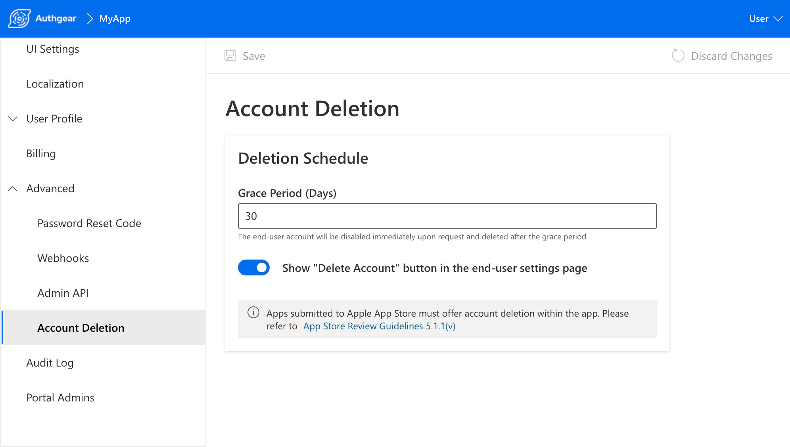

與<a href="https://en.wikipedia.org/wiki/Right_to_be_forgotten" target="_blank">「被遺忘權」</a>（Right to Erasure）相關的隱私保護法規，已在多個司法轄區落地，例如歐盟 GDPR。除此之外，Apple 也宣布：<a href="https://developer.apple.com/news/?id=i71db0mv" target="_blank">所有上架 App Store 的 App 必須提供 App 內發起刪除帳號</a>，並於 2022 年 6 月 30 日生效。

## 刪除帳號按鈕（Delete Your Account）

我們正在幫助你讓使用者對自身資料有更高控制權。現在，你只要幾個步驟就能在 App 中加入 **Delete your account** 按鈕。

<!--FIGURE-->

<!--/FIGURE-->

如果你使用 Authgear 提供的隱私設定預建前端，此按鈕會顯示在「My Account」面板中，且設計上容易被使用者找到。

<!--FIGURE-->

<!--/FIGURE-->

你也可以在 Authgear Portal 調整帳號刪除前的停用等待時間（**Grace Period**）。

<!--FIGURE-->

<!--/FIGURE-->

若你選擇自行實作 **Delete Account** 按鈕，也可在後端透過 <a href="https://docs.authgear.com/integrate/account-deletion#initiate-deletion-from-admin-api" target="_blank">Admin API</a> 發起刪除流程。

## 新增 Webhook 事件

刪除帳號不只是移除 Authgear 內的資料，更應包含與帳號相關的個人資料清除。

這次更新也加入了多個實用 webhook 事件，例如 <code>user.disabled</code>、<code>user.deletion_scheduled</code> 與 <code>user.deleted</code>，讓你可更容易與其他系統整合資料刪除流程。

更多整合細節，請參考 <a href="https://docs.authgear.com/integrate/account-deletion" target="_blank">Account Deletion 官方文件</a>。
