使用者註冊是大多數 Web 應用的重要指標，而追蹤這些事件可以帶來有價值的洞察。當新使用者註冊時收到通知，不只是為了掌握數量，也有助於即時互動。例如，當使用者在你的系統完成驗證後，你可以立刻發送歡迎訊息，或介紹註冊優惠與特別方案。談到使用者驗證時，<a href="/" target="_blank">Authgear</a> 提供完整且豐富的驗證功能。那如果你想在每位新使用者註冊後，馬上在 Slack 收到通知呢？

你可以用許多低程式碼工具做到這件事，例如 <a href="https://zapier.com/" target="_blank">Zapier</a> 與 <a href="https://n8n.io/" target="_blank">N8n</a>。但透過 Authgear，你可以把驗證流程與訊息通知直接整合。本文將一步步帶你整合 Authgear 的 **Hooks and Events** 與 <a href="https://slack.com/" target="_blank">Slack</a>，完成這個流程。

## **為什麼是 Authgear？**

**Authgear** 是一個身分即服務（IDaaS）平台，支援多種驗證方式，例如 <a href="/features/social-login" target="_blank">社群登入</a>、<a href="/features/passwordless-authentication" target="_blank">無密碼驗證</a>、<a href="/features/biometric-authentication" target="_blank">生物辨識登入</a>、透過 SMS/WhatsApp 的 <a href="/features/whatsapp-otp" target="_blank">一次性密碼（OTP）</a> 等等。它也內建可客製化的登入頁，你不需要花時間設計 UI 或實作複雜的驗證流程。Authgear 以開發者友善為核心，並提供可回應不同使用者事件的 <a href="https://docs.authgear.com/how-to-guide/events-hooks/denohooks" target="_blank">Hooks</a>。Authgear 也提供瀏覽器內程式碼編輯器，讓你撰寫 **JavaScript/Typescript code**，把額外邏輯部署在 Authgear 維運的無伺服器基礎架構上執行。接下來我們就會使用這項能力，在新使用者註冊後傳送 Slack 訊息。

## Prerequisites

- **Authgear 帳號：** 如果你還沒有帳號，可以註冊<a href="https://accounts.portal.authgear.com/signup?_ga=2.4973620.602174723.1690789558-1174359617.1686657394" target="_blank">免費 Authgear 帳號</a>。
- **在 Authgear 中設定一個應用程式**。無論是 Web、行動或桌面應用都可使用。若你還沒有任何串接 Authgear 的應用，可依照 <a href="https://docs.authgear.com/get-started/start-building" target="_blank">Authgear Start Building</a> 建立。
- **Slack 帳號：** 若你尚未有 Slack 帳號，可到 [這裡](https://slack.com/get-started) 免費註冊，並前往 Slack 的 <a href="https://slack.com/get-started#/createnew" target="_blank">Get Started page</a>。
- **Slack workspace：** 你需要可管理該 workspace 的權限。若你正在建立全新 workspace，可參考<a href="https://slack.com/help/articles/206845317-Create-a-Slack-workspace" target="_blank">這份指南</a>。

## Setting up the Slack Webhook

在整合 Authgear 之前，你需要先在 Slack 建立 webhook。

### Create a Slack Workspace

如下圖，我建立了一個名為 authgear-example-sign-up 的新 workspace：

<!--FIGURE-->
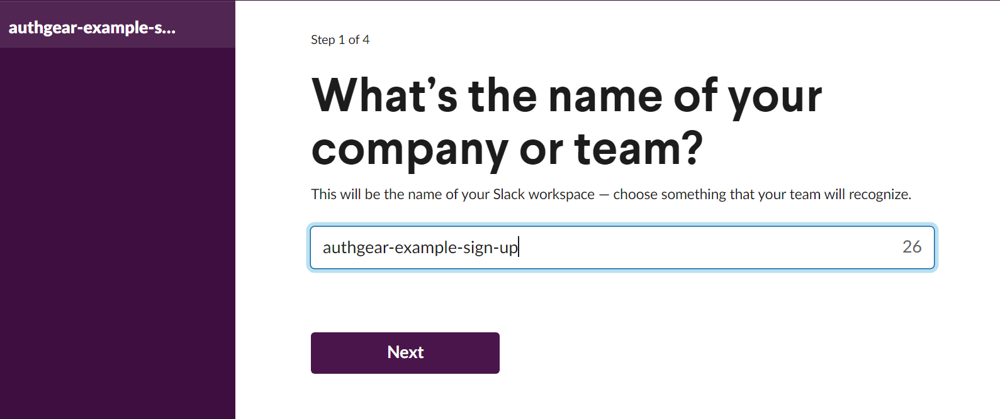
<!--/FIGURE-->

並在其中建立一個新的 Admin 帳號：

<!--FIGURE-->
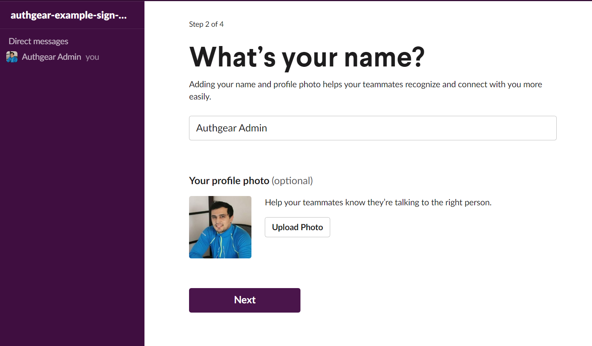
<!--/FIGURE-->

接著建立一個名為 notification-sign-up 的 Slack channel，用來接收使用者註冊通知：

<!--FIGURE-->
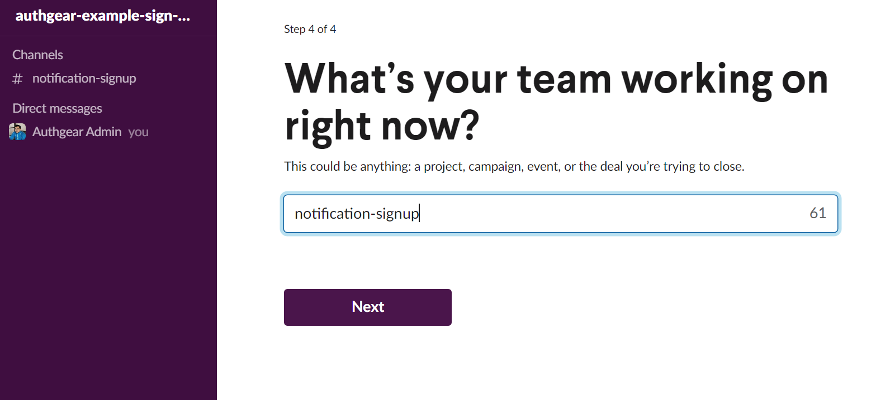
<!--/FIGURE-->

### Create a Slack App

前往 <a href="https://api.slack.com/apps" target="_blank">Slack API page</a>，建立一個全新的 app（**from scratch**）。我們會用它來傳送 webhook 資訊：

<!--FIGURE-->
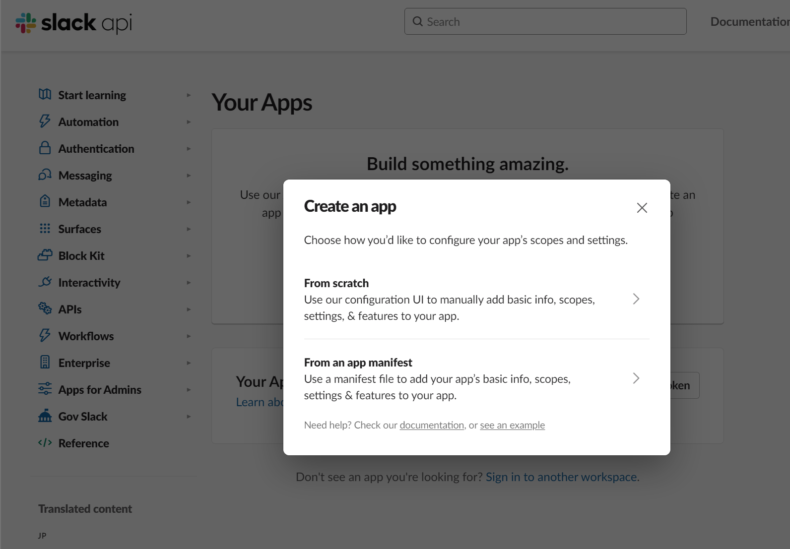
<!--/FIGURE-->

下一步請輸入 app 名稱，並選擇要連接的 workspace。請務必確認這是正確的 workspace，因為之後無法再變更 app 的 workspace。選好後，按下 **Create App**。

<!--FIGURE-->
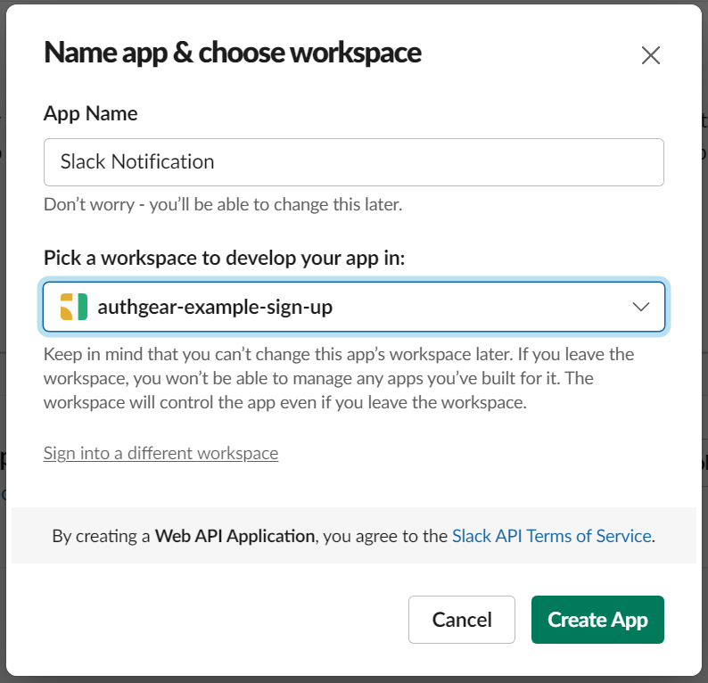
<!--/FIGURE-->

### Enable Incoming Webhooks

在「Add features and functionality」區塊中，點選「Incoming Webhooks」並啟用。

<!--FIGURE-->
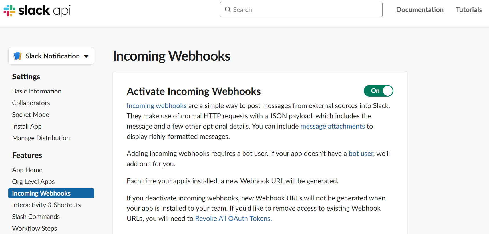
<!--/FIGURE-->

往下捲動並點選「Add New Webhook to Workspace」。選擇要接收通知的 channel，然後按下「Allow」。

<!--FIGURE-->
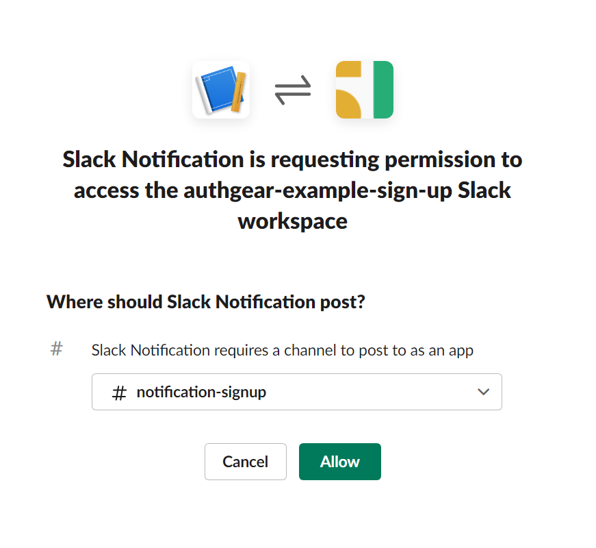
<!--/FIGURE-->

往下捲動並點選「Add New Webhook to Workspace」。選擇要接收通知的 channel，然後按下「Allow」。

<!--FIGURE-->
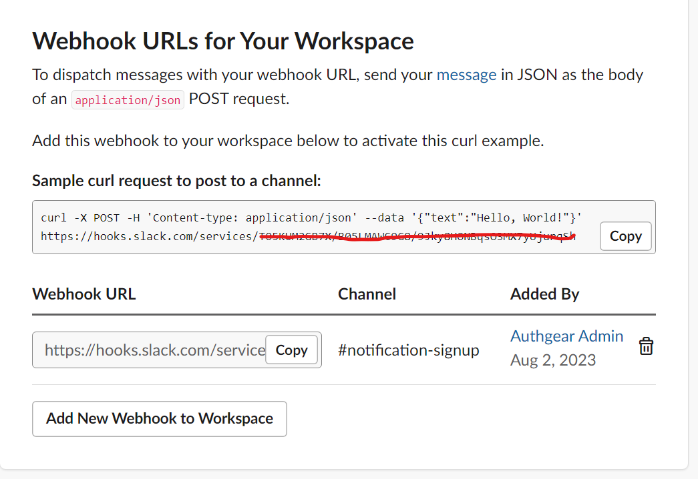
<!--/FIGURE-->

## Integrating Authgear with Slack Webhook

拿到 Slack Webhook URL 後，你就可以設定 Authgear Hook，讓它回應 <a href="https://docs.authgear.com/how-to-guide/events-hooks/event-list#user.created" target="_blank">user.created</a> 這個 <a href="https://docs.authgear.com/how-to-guide/events-hooks#non-blocking-events" target="_blank">non-blocking</a> 類型事件。

### Writing a Hook Function

前往 <a href="https://portal.authgear.com/" target="_blank">Authgear Portal</a> 的 **Advanced**->**Hooks** 區塊，**Add** 一個新的 **Non-blocking** Event：

<!--FIGURE-->
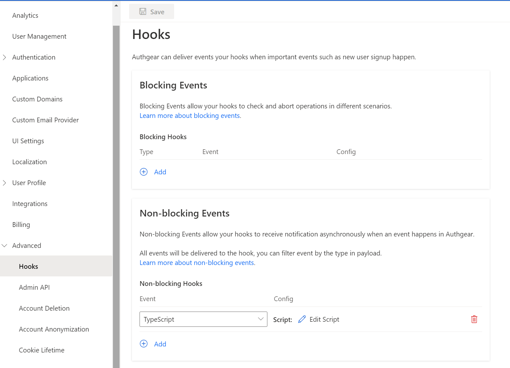
<!--/FIGURE-->

將 Hook 的 **Type** 選為 *TypeScript.*你將撰寫一個函式來回應使用者建立事件並發送 Slack 通知。點選 **Config** 下的 **Edit Script**，即可進入編輯器：

<!--FIGURE-->
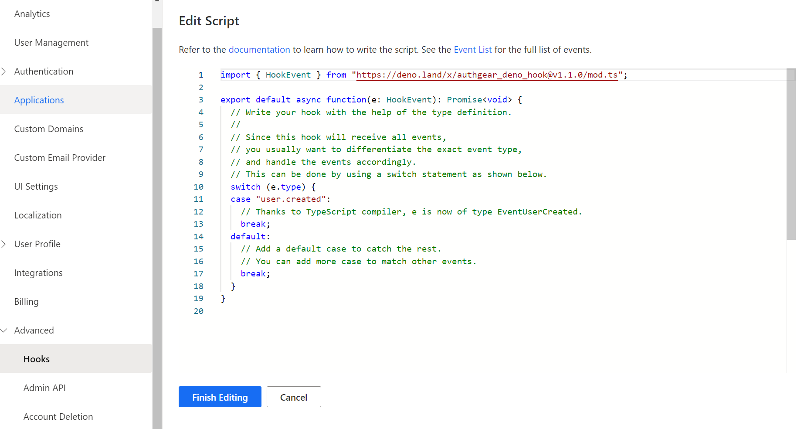
<!--/FIGURE-->

我們希望在 EventUserCreated 觸發時，向 Slack webhook URL 發送一個 POST 請求：

```

import { EventUserCreated } from "https://deno.land/x/authgear_deno_hook@v1.1.0/mod.ts";

export default async function(e: EventUserCreated): Promise<void> {
 
    const url = "YOUR_SLACK_WEBHOOK_URL";
    // Replace the text below with the actual message you want to send.
    const message = `New account signup: ${e.payload.identities[0].claims.email} has joined!`;
    const payload = {
      text: message,
    };
    const headers = {
      "Content-Type": "application/json",
    };
    // Send a POST request to the Slack webhook URL with the message.
    await fetch(url, {
      method: "POST",
      headers: headers,
      body: JSON.stringify(payload),
    });
      
}
  
			</void>
```

這個非同步 TypeScript 函式會在使用者註冊後執行。將 *YOUR_SLACK_WEBHOOK_URL* 替換為你先前複製的 URL。完成後，點選 **Finish Editing**，並在 Hooks 頁面 **Save** 變更。

### Validate the new hook

當所有設定完成後，就可以測試新建立的 hook 是否正常運作。最簡單的方式是到 [Authgear Portal](https://portal.authgear.com/) 的 **User Management** 頁面手動建立一個**新使用者**。

<!--FIGURE-->
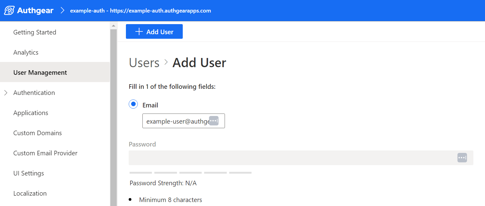
<!--/FIGURE-->

### Validate the new hook

當所有設定完成後，就可以測試新建立的 hook 是否正常運作。最簡單的方式是到 <a href="https://portal.authgear.com/" target="_blank">Authgear Portal</a> 的 **User Management** 頁面手動建立一個**新使用者**。

<!--FIGURE-->
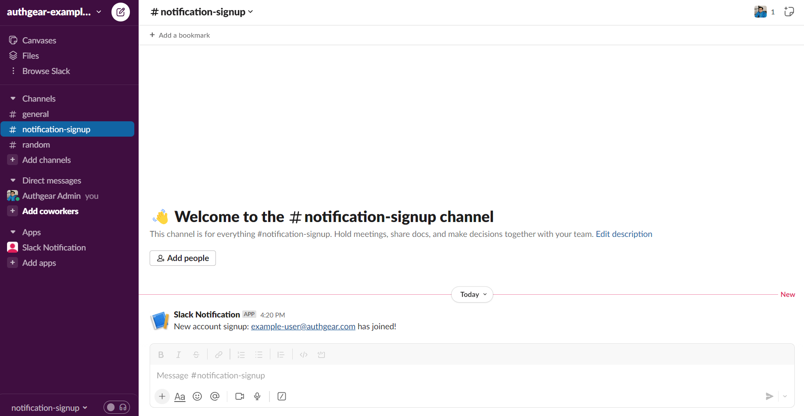
<!--/FIGURE-->

另一種驗證方式是，當你把系統整合 Authgear App 並設定好登入方式後，讓新使用者實際完成註冊流程。你也可以在 Authgear dashboard 的 **Getting Started** 頁面使用 **Try it now** 功能測試。

<!--FIGURE-->
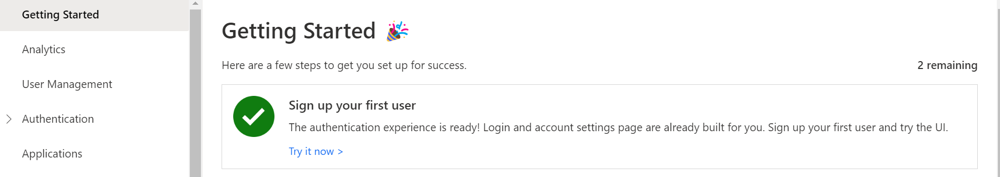
<!--/FIGURE-->

當你用 email 完成註冊後，Slack 就會收到訊息：

<!--FIGURE-->
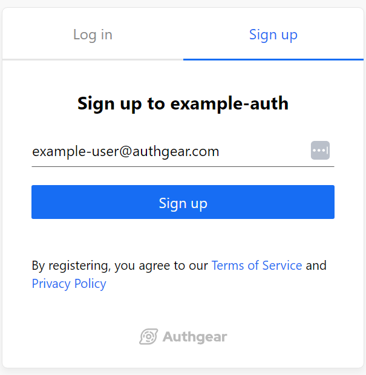
<!--/FIGURE-->

## Summary

Authgear 的 Hooks 提供了可客製化的方式來回應使用者相關事件。整合 Slack 後，你可以在偏好的頻道中即時收到新使用者註冊更新。也別忘了探索其他 <a href="https://docs.authgear.com/how-to-guide/events-hooks/event-list" target="_blank">events</a>，並依你的需求延伸整合！

### Related resources

<a href="/zh-hant/post/how-profile-enrichment-can-boost-your-product" target="_blank">How Profile Enrichment can boost your product</a>
