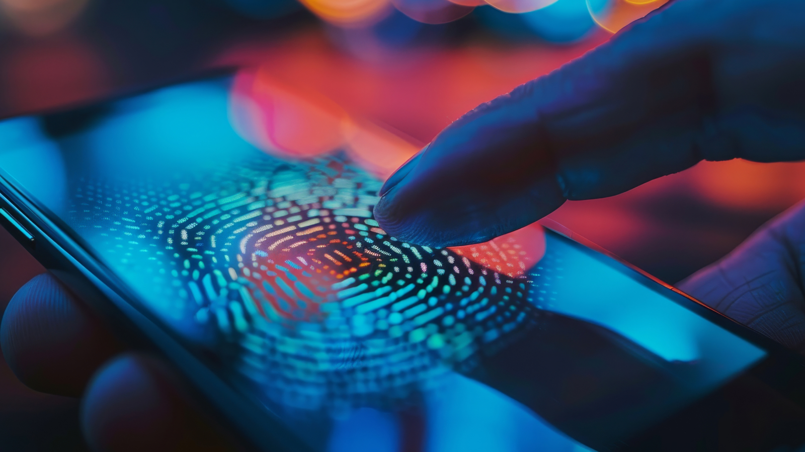
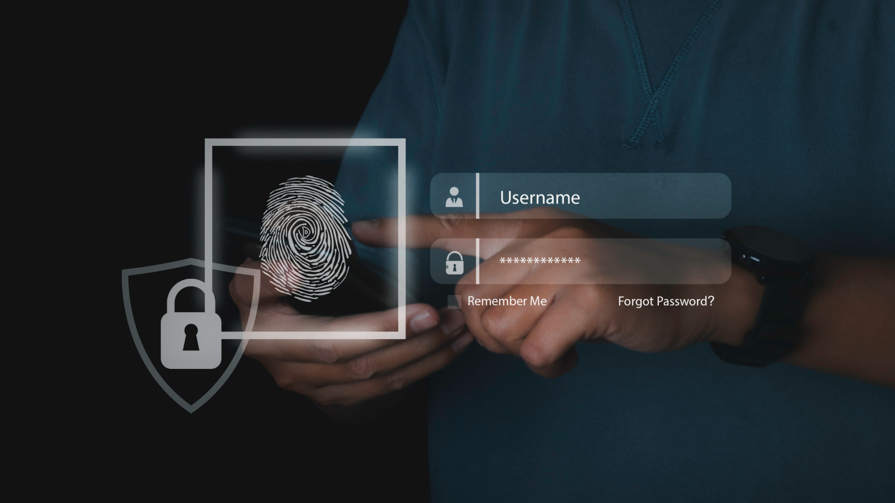

## 生物辨識驗證如何運作？通往未來安全的完整指南

生物辨識驗證透過從傳統密碼系統轉向依賴個人獨特生理或行為特徵，徹底改變了數位安全。這種轉變大幅提升了安全性與使用便利性。早期生物辨識先驅聚焦於指紋辨識，利用電容式感測器擷取細緻的指紋特徵；隨著技術進步，又納入光學與超音波感測，進一步提升準確度與可靠性。

後來，隨著以 Apple Face ID 為代表的人臉辨識問世，生物辨識應用場景更進一步擴展。這項技術利用精密的 3D 建模感測器建立臉部立體特徵，並加入注意力偵測機制以加強安全性。指紋辨識主要依賴固定的生理特徵；相較之下，人臉辨識還可納入臉部表情、頭部移動等行為元素，使其成為更動態的驗證方式。

### Android 生物辨識：更複雜的生態

<!--FIGURE-->

<!--/FIGURE-->

相較於 iOS，**Android 生物辨識驗證因其開源特性與硬體供應商多樣性而更為複雜**。為了對應這種差異，Android Compatibility Definition Document（CDD）將生物辨識裝置分為兩種安全等級：Class 3（BIOMETRIC_STRONG）與 Class 2（BIOMETRIC_WEAK）。指紋感測器通常可符合嚴格的 Class 3 標準；但缺乏先進 3D 建模能力的人臉辨識系統，往往只落在安全性較低的 Class 2。這種落差突顯了開發者在實作 Android 生物辨識方案時，必須仔細評估目標裝置能力，才能確保足夠安全。

雖然 Android 生物辨識可提升安全與便利，但仍面臨幾項挑戰：

- **碎片化（Fragmentation）**：Android 裝置型號與系統版本多元，導致硬體與軟體實作不一致，增加相容與穩定實作難度。
- **安全風險（Security Risks）**：Class 2 裝置較容易受到偽造攻擊；若金鑰管理或儲存方式不當，也可能引入額外漏洞。
- **使用者體驗（User Experience）**：要把生物辨識無縫整合進產品流程並不容易，需細緻處理註冊流程、錯誤回復與備援機制。
- **法規遵循（Regulatory Compliance）**：生物資料受多種隱私法規約束，開發與部署時需面對更高合規複雜度。

### 不只解鎖：以生物辨識保護敏感資料

<!--FIGURE-->

<!--/FIGURE-->

iOS 與 Android 都提供成熟的原生 API，讓開發者可利用生物辨識來保護敏感資料。這些 API 提供了加密資料與限制僅生物驗證通過者可存取的能力。不過常見誤區是誤以為「有生物辨識就絕對安全」。**許多開發者仍會把密碼或 refresh token 明文存放在裝置上，誤認生物辨識保護已足夠。** 一旦裝置被攻陷，攻擊者仍可能直接取得這些關鍵憑證。

Tokenization（代碼化）是可搭配生物辨識的重要安全措施：把信用卡號等敏感資料替換成沒有直接價值的 token。token 本身無法還原原始資料；在整合生物辨識後，流程可先將敏感資料轉成 token，再以生物辨識控制 token 存取。交易或授權時只使用 token，而原始資料保持加密且隔離狀態，可顯著降低資料外洩風險。

透過生物辨識 + tokenization，組織可同時提升安全、降低詐欺並滿足資料隱私法規。它也可減少使用者記憶複雜密碼的負擔，進一步改善體驗。典型例子是生物辨識支付驗證：使用者的卡片資料先 token 化並安全儲存，後續購物只需生物辨識驗證，再以 token 完成付款，不暴露原始卡號。這種組合能同時兼顧高安全與高可用性。

### 生物辨識驗證的一般流程

<!--FIGURE-->

<!--/FIGURE-->

生物辨識驗證透過一系列嚴謹步驟，安全地完成身分確認。流程通常從金鑰產生與使用者註冊開始：系統建立密碼學金鑰、擷取生物特徵並轉換為模板，再以公鑰加密後安全儲存。

在驗證階段，系統擷取使用者的生物資料並與加密模板比對。比對成功後，裝置可使用私鑰解開儲存模板，接著生成 challenge 並以私鑰加密後送往伺服器驗證。伺服器若能用對應公鑰解密 challenge，即可確認使用者身分。

這套流程凸顯了穩健密碼學實作與安全金鑰管理的重要性；兩者配合下，生物辨識可同時提供高安全與高便利。

### Step 1. 金鑰建立與註冊

1. 產生公開金鑰與私密金鑰。
1. 將私鑰安全儲存在裝置內。
1. 擷取生物特徵並建立 template。
1. 以公鑰加密 template 並安全儲存。

### Step 2. 驗證流程

1. 若生物特徵比對成功，裝置使用私鑰解密已儲存模板。
1. 產生 challenge，並以私鑰加密 challenge。

### Step 3. 伺服器驗證

1. 將加密後 challenge 傳送至伺服器。
1. 伺服器嘗試使用公鑰解密 challenge。
1. 若可成功解密，即驗證通過。

### Web 生物辨識：深入 WebAuthn

<!--FIGURE-->

<!--/FIGURE-->

Web 生物辨識把生物驗證擴展到網頁環境，讓使用者可在 Web 應用中直接以指紋或人臉確認身分。核心技術是 Web Authentication API（WebAuthn）。

WebAuthn 提供將強驗證整合到網路服務的標準化框架。它利用各平台既有的生物感測器與安全能力，建立安全且友善的驗證體驗。透過硬體級安全金鑰與生物因子，WebAuthn 可大幅提升對釣魚與憑證竊取的防護能力。

但要全面普及 WebAuthn，仍需處理以下挑戰：

- 瀏覽器相容性：不同瀏覽器與作業系統支援程度不一，整合與測試複雜。
- 使用者體驗：註冊與驗證流程必須直觀，才能提高採用率。
- 安全風險：需持續防範偽造攻擊與新型漏洞，並定期進行安全評估。
- 隱私疑慮：必須妥善回應生物資料蒐集、儲存與使用的隱私問題，建立使用者信任。
- 無障礙可及性：設計與實作需兼顧身心障礙者可用性。

### 身分驗證未來：生物辨識將持續深化

<!--FIGURE-->

<!--/FIGURE-->

生物辨識驗證已成為現代安全體系的核心，為傳統密碼機制提供更強且更便利的替代方案。從硬體依賴、軟體實作，到 Web 驗證與身分確認機制，理解其底層運作是發揮技術價值的關鍵。

隨著生物辨識持續進化，未來將出現更精密、更安全的方案，持續重塑我們與數位系統互動的方式。

準備好以生物辨識提升你的應用安全了嗎？   
[了解 Authgear 如何簡化 Web 與行動應用的生物辨識整合](/zh-hant/features/biometric-authentication/)。
