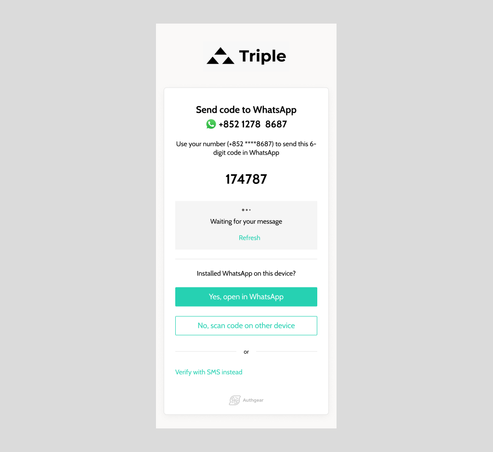

過去 SMS 是企業與客戶溝通主力，可發 OTP、促銷與交易訊息。但隨著通訊 App 普及，企業互動方式也快速轉變。WhatsApp 在全球擁有龐大用戶規模，成為品牌不可忽視的行銷渠道之一。

儘管如此，許多企業仍未充分利用 WhatsApp Business。本文將說明：

<nav id="table-of-content">
    <ul>
        <li><a href="#why-whatsapp">為什麼要做 WhatsApp 行銷？</a></li>
        <li><a href="#benefits">WhatsApp 行銷可帶來哪些效益？</a></li>
        <li><a href="#whatsapp-features">WhatsApp 有哪些功能可達成行銷目標？</a></li>
        <li><a href="#authgear-whatsapp">用 WhatsApp OTP 開始你的行銷策略</a></li>
    </ul>
</nav>

<h2 id="why-whatsapp">為什麼要做 WhatsApp 行銷？</h2>

<!--FIGURE-->

<!--/FIGURE-->

使用者日常溝通高度依賴通訊 App，因為它更便宜、更穩定，且可傳送圖片、影片與群組訊息。WhatsApp 的龐大月活規模，讓它成為極具價值的觸達通道。

相較其他平台，WhatsApp 行銷常有更好表現，例如：

- 訊息通常在數秒內被閱讀。
- 使用者回覆意願更高。
- 點擊率普遍優於多數傳統渠道。

此外，越來越多消費者偏好可「即時聊天」的品牌，並因此提升信任。

<h2 id="benefits">WhatsApp 行銷的核心效益</h2>

### 建立更強客戶關係

品牌可透過自動回覆、快速回應與互動式溝通，提升親近感與忠誠度。

### 提升轉換率與商機

相較電話，客戶更願意開啟並回覆 WhatsApp 訊息，讓觸達與轉換更容易。

### 顯著降低行銷成本

WhatsApp 單訊息成本通常低於 SMS；同時因互動更高，有助提升留存，降低獲客成本壓力。

<h2 id="whatsapp-features">WhatsApp 哪些功能最有助行銷？</h2>

WhatsApp Business 提供多項工具，幫助品牌有系統地與客戶互動。

### 自動問候與離線訊息

可在新客戶首次聯絡、或一段時間未互動後自動發送訊息，也可設定非營業時間自動回覆，管理回應預期。

### 快速回覆（Quick Replies）

客服可預設高頻問答模板，以關鍵字快速回覆常見問題，提升效率與一致性。

<!--FIGURE-->

<!--/FIGURE-->

<h2 id="authgear-whatsapp">用 WhatsApp OTP 開始你的行銷策略</h2>

WhatsApp OTP 不只改善登入體驗，也能提升轉換率、降低 drip campaign 成本，並延續前文提到的 WhatsApp Business 各項優勢。

### 每年至少節省 10,000 美元

許多在地商家仍習慣用 SMS 發送 OTP；但 SMS 的費率往往不低，也可能隨供應商調整而變動。當活躍使用者呈指數成長時，每月 SMS OTP 帳單可能迅速失控，成為沉重負擔。

若改以 WhatsApp 發送 OTP，透過 Authgear 每月最低約 20 美元即可起步；以每月約 3 萬次登入估算，相較 SMS 有機會每年省下至少 1 萬美元。

### 以「用戶發起」驗證降低 drip campaign 成本

Authgear 的 WhatsApp OTP 流程設計讓**由使用者主動開啟對話**：使用者輸入 WhatsApp 號碼後，系統產生 OTP，並請他們在 WhatsApp 中送出以完成驗證。配合 WhatsApp 近年採用的<a href="https://developers.facebook.com/docs/whatsapp/pricing/" target="_blank">對話計價模式</a>，由使用者發起的對話通常比由企業發起便宜得多，因此有機會讓 drip campaign 相關成本降低至少約 60%。

### 提升 App 註冊轉換率

僅用帳號密碼註冊時，註冊表單流失率可能高達約 60%，因為使用者對冗長註冊流程已相當疲憊。改用 WhatsApp OTP，使用者不必承受密碼型註冊的摩擦，有助提升轉換並強化安全性。

想了解更多，請參考 <a href="/zh-hant/features/whatsapp-otp" target="_blank">WhatsApp OTP 功能頁</a>，或直接<a href="/zh-hant/schedule-demo/" target="_blank">聯絡我們</a>評估你的商業場景。
