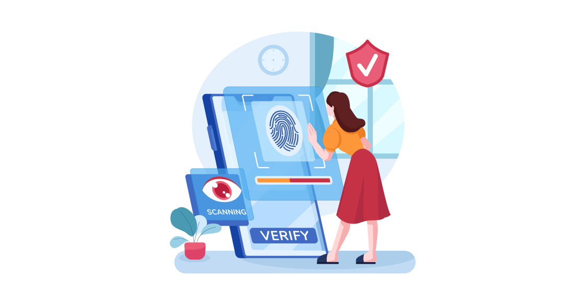
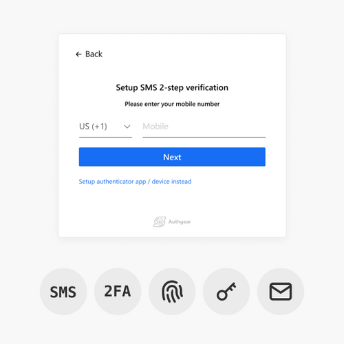
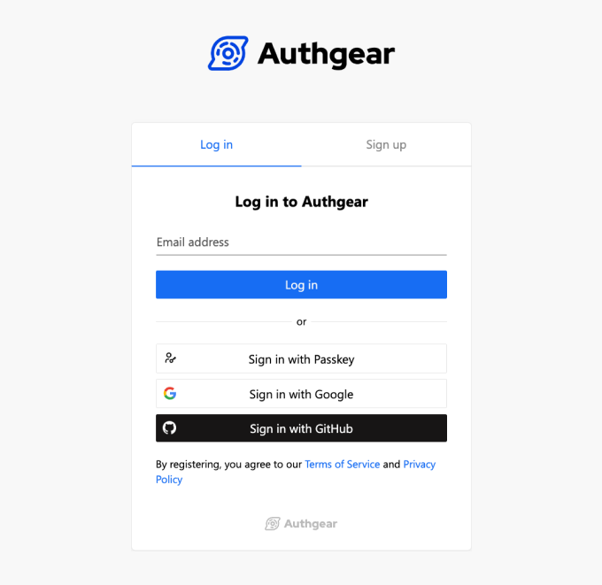
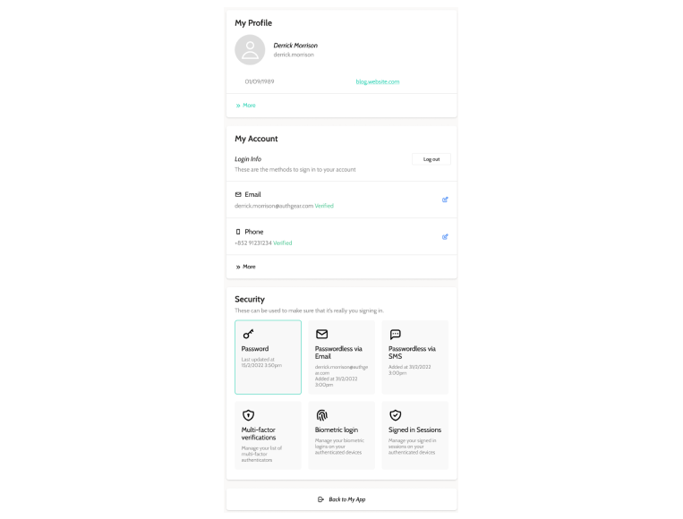
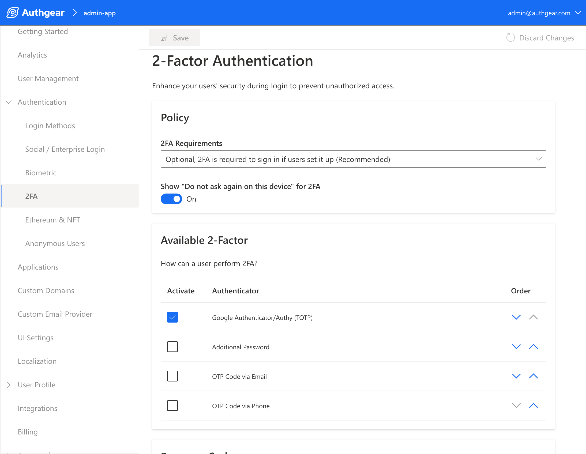

    
根據 <a href="https://www.pwc.com/us/en/industries/financial-services/library/next-in-insurance-top-issues.html" target="_blank">PWC</a> 的觀察，保險業正以前所未見的速度變化。疫情雖帶動<a href="https://www.pwc.com/us/en/industries/financial-services/library/insurance-consumer-survey.html" target="_blank">壽險購買需求</a>，也同時催生更高數位期待的消費者。大家被迫在線上完成一切，對「不好用」的服務耐性更低。

PWC 比較 2018 與 2021 的 6000 名保戶調查後發現，偏好行動理賠申請的比例上升 77%，而因數位體驗差而想換保險公司的比例上升 80%。關鍵訊息很清楚：數位能力在保險業已是競爭核心。

如今「具備數位能力」不再是加分，而是基本門檻。保險公司要同時滿足數位體驗、資料安全與營運效率，保險業 IAM 正是解法之一。以下以 <a href="/zh-hant/" target="_blank">Authgear</a> 為例說明。

<nav id="table-of-content"> Table of Content
    <ul>
        <li><a href="#why">為什麼保險業需要 IAM？</a>
            <ul>
                <li><a href="#customer">客戶期待更快、更好的線上服務</a></li>
                <li><a href="#external">保險公司常需與外部角色協作</a></li>
            </ul>
        </li>
        <li><a href="#ciam">保險 IAM 如何幫助建立長期客戶關係？</a>
            <ul>
                <li><a href="#signup">更順暢的註冊與登入體驗</a></li>
                <li><a href="#ux">更好的客戶體驗與服務</a></li>
                <li><a href="#security">更強的資安防護</a></li>
            </ul>
        </li>
        <li><a href="#external-iam">如何提升外部團隊協作效率？</a>
            <ul>
                <li><a href="#productivity">無摩擦 onboarding，提升生產力</a></li>
                <li><a href="#it">顯著降低 IT 成本與複雜度</a></li>
                <li><a href="#business">安全且順暢地開放商務應用存取</a></li>
            </ul>
        </li>
        <li><a href="#authgear">保險 IAM 是保險業成功關鍵</a></li>
    </ul>
</nav>

<h2 id="why">為什麼保險業需要 IAM？</h2>

<!--FIGURE-->

<!--/FIGURE-->

IAM（Identity and Access Management）可拆成不同使用類型，每種都能為保險業帶來價值。它是一整套管理存取與身分安全的技術。

我們怎麼登入，直接影響資料安全，也影響服務取得的速度與便利性。這就是保險公司需要把 IAM 納入核心數位策略的原因。

<h2 id="customer">客戶期待更快、更好的線上服務</h2>

在全面數位化的今天，客戶預期所有線上互動都要快且順。好不好用，已是評價保險服務的重要指標。CIAM（Customer IAM）可讓保險公司在任何時間、任何地點安全驗證客戶並授權服務存取。

CIAM 的亮點之一是多種無密碼登入。使用者可透過 <a href="/zh-hant/features/whatsapp-otp" target="_blank">OTP</a>（SMS/WhatsApp）或生物辨識登入。Authgear 的 <a href="/zh-hant/features/biometric-authentication" target="_blank">生物辨識驗證</a>有一個關鍵差異：**不會逾時失效**。也就是說，客戶在裝置上啟用後，可長期安全使用生物辨識再次登入，特別適合一年只登入一兩次的保險客戶。

<!--FIGURE-->

<!--/FIGURE-->

簡單來說，許多生物辨識會用 refresh token 維持登入，通常每隔一段時間（常見上限約 180 天）需重新以密碼登入。Authgear 則採用公鑰密碼學：私鑰只留在使用者裝置，透過伺服器端公鑰驗證，能在維持安全下避免頻繁重登。

保險客戶登入頻率低，很容易忘記密碼並產生挫折。用 Authgear 生物辨識後，除非更換裝置，通常可持續使用。這能顯著降低摩擦並提升品牌好感。

<h2 id="external">保險公司常需與外部角色協作</h2>

保險公司常需和代理人、經紀人與第三方協作，這些角色可能要存取內部資源。如何在資訊流動與資料安全間取得平衡，會帶來複雜 IAM 挑戰，傳統內部系統常難以應對。

Authgear 已協助許多企業集中管理<a href="/zh-hant/solutions/frontline-workers-identity/" target="_blank">內外部身分</a>：把客戶應用接入 Authgear 管理外部工作人員，再串接既有內部 WIAM（Workforce IAM）系統。重點是整合與優化現有架構，而不是增加負擔。

<h2 id="ciam">保險 IAM 如何幫助建立長期客戶關係？</h2>

吸引客戶只是第一步，能否長期留存取決於持續服務與體驗優化。保險 IAM 可同時提升拉新與留存，原因如下：

<h3 id="signup">更順暢的註冊與登入體驗</h3>

Authgear 提供可客製的預建註冊頁，遵循最佳實踐降低註冊摩擦，協助保險公司提高轉換。註冊流程若卡頓或冗長，潛在客戶很容易流失。

<!--FIGURE-->

<!--/FIGURE-->

註冊後，Authgear 以 OTP、生物辨識、<a href="/zh-hant/features/passkeys" target="_blank">Passkey</a> 等無密碼驗證，讓登入更簡單、更安全。使用者不再需要記住複雜密碼，也能降低密碼相關風險。

這些能力既保護資料，也降低忘記密碼帶來的挫折。只要線上流程有摩擦，都可能讓客戶離開。Authgear 的保險 IAM 方案可幫助保戶體驗更穩定，進而保護保險公司的業務成果。

<h3 id="ux">更好的客戶體驗與服務</h3>

登入後，Authgear 也提供預建帳號設定頁，讓使用者管理個人資料、驗證方式與登入會話，提升掌控感與便利性。

<!--FIGURE-->

<!--/FIGURE-->

此外，Authgear 還有客服可用的管理後台，能協助處理忘記密碼或疑似被入侵等問題。這對維持安全又友善的服務體驗非常關鍵。

<h3 id="security">更強的資安防護</h3>

Authgear 的保險 IAM 支援 OTP 與無密碼驗證等多因素保護，能有效降低網路犯罪風險。保險系統中的客戶資料高度敏感且有價值，保險公司有責任用足夠的技術防禦威脅（如 credential stuffing）。當使用者感受到你重視安全，也會提高信任。

<h2 id="external-iam">如何提升外部團隊協作效率？</h2>

IAM 不只改善客戶體驗，也能優化保險公司與外部團隊的協作方式：

<h3 id="productivity">無摩擦 onboarding，提升生產力</h3>

過去常需為外部合作夥伴建立企業信箱，合約到期後再清理帳號，流程繁瑣。Authgear 讓外部人員可直接用個人 email／手機註冊，再透過核准流程授權其存取內部資源。

這能大幅簡化 onboarding，讓團隊把時間放在產出，而不是耗在開帳號流程。

<h3 id="it">顯著降低 IT 成本與複雜度</h3>

Authgear 的自助流程可降低 IT 維運與密碼重設成本。相較其他方案，我們的保險 IAM 月費更具成本效益，讓外部身分管理不只更安全，也更省、更好維護。

<h3 id="business">安全且順暢地開放商務應用存取</h3>

<a href="https://financesonline.com/password-statistics/" target="_blank">Finances Online</a> 引用 Microsoft 指出：MFA 可阻擋 99.9% 網攻（2020）。自 2017 年以來，暗網流通的失竊密碼已超過 5.55 億組，登入風險不容忽視。

Authgear 可讓開發者輕鬆配置 2FA 與無密碼驗證，為保險 IAM 加上更強防線。外部團隊可透過 TOTP、Email OTP 等方式安全登入，並以多元無密碼選項降低密碼摩擦。

<!--FIGURE-->

<!--/FIGURE-->

<h2 id="authgear">保險 IAM 是保險業成功關鍵</h2>

保險 IAM 不只協助企業滿足客戶數位需求，也讓外部工作網絡協作更順。數位時代裡，獲客與留客高度取決於線上體驗是否順暢；IAM 正是提升體驗與保護個資的關鍵能力。

若你想同時打造更好的客戶體驗與更有效率的外部協作，Authgear 的 IAM 技術是經驗成熟且可快速落地的解法。

歡迎<a href="/zh-hant/schedule-demo/" target="_blank">聯絡我們</a>，聊聊你的保險業需求，看看 Authgear 如何幫你提升獲客、留客與外部團隊協作成效。
