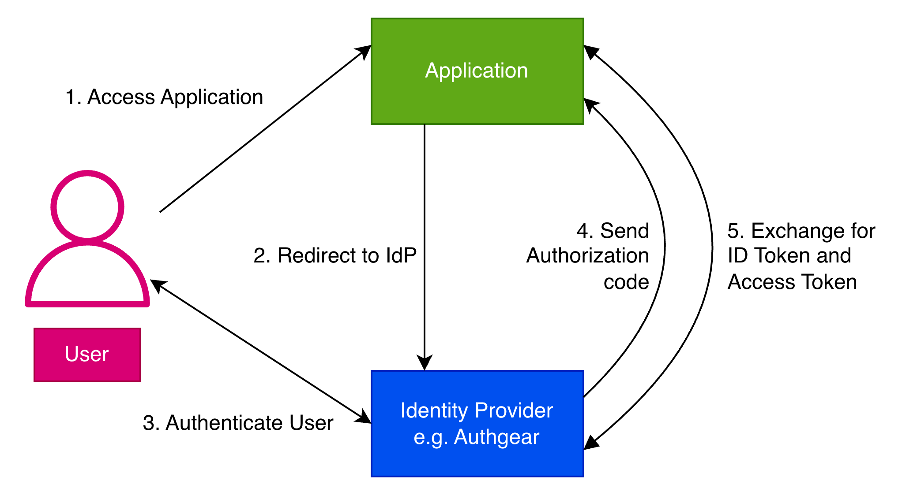
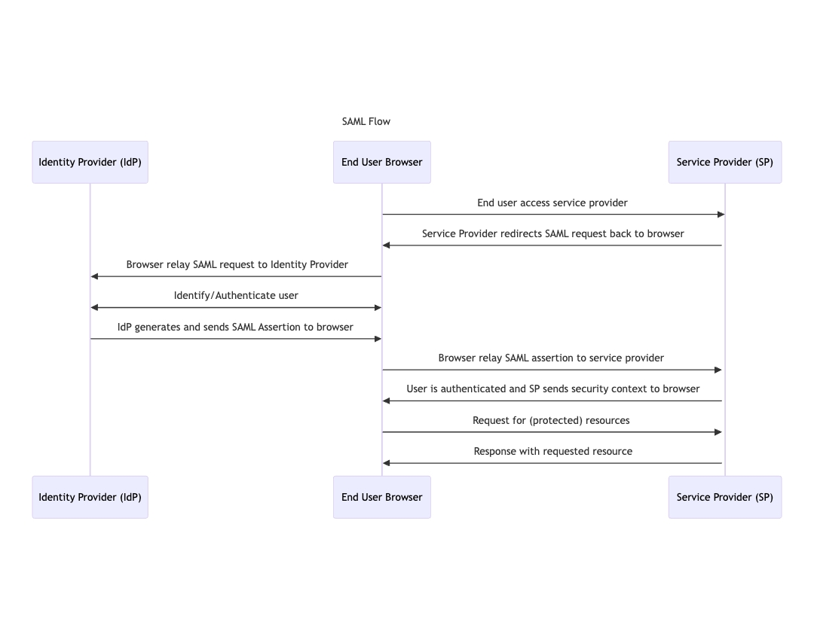

現代驗證早已不再綁定於單一應用。

企業同時使用多個雲端、SaaS、夥伴與內部系統，全部都需要安全且可共享的身分機制。聯邦身分與單一登入（SSO）正是為此而生：由可信任的身分提供者統一處理驗證，讓使用者可在多個應用間順暢存取。

最主流的兩大 SSO 標準是 OpenID Connect（OIDC）與 Security Assertion Markup Language（SAML）。SAML 更適合傳統企業瀏覽器型應用，OIDC 則為現代 API-first、行動端與雲原生系統而生。選對協定會直接影響安全性、開發成本與可擴展性。

理解 **OIDC vs SAML** 的差異，有助團隊做出最符合環境與需求的決策。

## **OIDC：總覽**

很多團隊會搜尋 **「什麼是 OIDC？」** 或 **「OpenID Connect vs OAuth2」**，理解 [OIDC 如何現代化驗證](/zh-hant/post/revolutionize-your-security-with-oidc-authentication-authgear)。OIDC 是建立在 OAuth 2.0 之上的輕量身分層，使用 JSON、REST 與 JWT 來安全驗證使用者。OAuth 2.0 專注授權，OIDC 專注驗證。

### **現代設計特性**

- 以 REST + JSON 為核心，開發整合友善
- 可支援行動、原生、IoT 與 Web 應用
- 採用輕量 JWT，便於高效驗證
- 專為雲原生與 API 驅動架構設計

### **常見使用情境**

- iOS、Android 等行動 App 驗證
- 現代 SPA（React、Angular、Vue）登入
- 分散式雲端與微服務系統
- 提供社群登入的消費型應用

  <table class="ag-table">
    <thead>
      <tr>
        <th>優點</th>
        <th>限制</th>
      </tr>
    </thead>
    <tbody>
      <tr>
        <td>非常適合現代 API 驅動與分散式架構</td>
        <td>因彈性高，若設定不當容易產生風險</td>
      </tr>
      <tr>
        <td>使用 JWT，驗證流程清楚且效率高</td>
        <td>需要妥善儲存與保護權杖</td>
      </tr>
      <tr>
        <td>在行動端與 SPA 提供流暢登入體驗</td>
        <td>部分舊式企業系統尚未原生支援 OIDC</td>
      </tr>
      <tr>
        <td>支援 PKCE 等現代安全標準</td>
        <td>必須嚴格遵循實作與安全最佳實踐</td>
      </tr>
    </tbody>
  </table>

你也可以使用 Authgear 這類平台更快落地 OIDC：它提供集中式雲端身分平台，並內建對現代應用與微服務的支援。

## **SAML：總覽**

SAML 是較早期但成熟且被廣泛信任的聯邦身分與 SSO 協定。它誕生於 2000 年代初，當時主流應用多為企業內部的傳統瀏覽器架構。

SAML 的核心目標是讓組織安全共享驗證資訊，避免使用者必須為每個系統分別管理密碼。

### **協定設計特性**

在 SAML 中，使用者不會拿到 JWT；系統會產生 XML 格式的 SAML Assertion，包含身分（與可選授權）資訊。

Assertion 會由身分提供者（IdP）以數位簽章簽署，服務提供者（SP）可直接驗證並信任，不一定需要即時回查。

### **常見使用情境**

- 傳統與舊有 Web 應用
- 內部員工身分系統與 HR 平台
- B2B 夥伴存取
- 企業 SaaS（如 Salesforce、Workday、ServiceNow）

  <table class="ag-table">
    <thead>
      <tr>
        <th>優點</th>
        <th>限制</th>
      </tr>
    </thead>
    <tbody>
      <tr>
        <td>標準成熟、可靠且長期被企業採用</td>
        <td>高度依賴 XML，開發與維護複雜度較高</td>
      </tr>
      <tr>
        <td>企業 IdP（ADFS、Azure AD、Okta）支援完整</td>
        <td>不適合行動端、SPA、API-first 架構</td>
      </tr>
      <tr>
        <td>IT、法遵與資安團隊熟悉度高</td>
        <td>缺乏部分現代安全機制的原生設計</td>
      </tr>
      <tr>
        <td>很適合瀏覽器型驗證流程</td>
        <td>設定與除錯門檻較高</td>
      </tr>
    </tbody>
  </table>

即使是 SAML 系統，Authgear 也能作為集中式 IdP，橋接舊系統與新應用，統一管理 OIDC 與 SAML 工作流。

## **SAML 與 OIDC 的相同點**

SAML 與 OIDC 都是聯邦身分標準，核心目標一致：在多應用間提供 SSO，避免使用者維護多組憑證。

兩者都把驗證外部化到可信 IdP，再由多個應用（SP 或 RP）信任驗證結果。

主要共通點如下：

- **聯邦與 SSO**：在中央 IdP 驗證一次即可存取多應用
- **瀏覽器轉址流程**：透過 redirect 傳遞身分資訊，降低在多系統儲存密碼風險
- **權杖式身分交換**：SAML 用 XML assertion、OIDC 用 JWT
- **主流 IdP 都支援**：Azure AD、Okta、Ping、Auth0、Google、AWS Cognito、ADFS 等
- **標準成熟**：皆為開放標準，工具與企業採用度高

## **協定流程怎麼運作**

SAML 與 OIDC 的驗證流程不同，會影響整合複雜度與應用設計。

### **OIDC 流程：現代 Token 驗證**

作為 **OIDC vs OAuth** 討論的一部分，OIDC 建立在 [OAuth 2.0](/zh-hant/post/what-is-oauth-2-0-and-how-it-works) 之上。典型流程如下：

1. 使用者進入應用
1. Client 轉址至 IdP 的授權端點
1. 使用者完成驗證
1. Client 取得授權碼，再換取 ID Token（JWT）與可選 Access Token
1. 驗證 Token 後建立會話

OIDC 支援 API 程式化存取，特別適合 SPA 與行動應用，也內建 PKCE、過期機制與刷新 Token 等現代安全措施。

<!--FIGURE-->

<!--/FIGURE-->

圖中展示 User、Relying Party（RP）與 Identity Provider（IdP）之間的 OIDC 驗證流程。方塊標示關鍵階段、箭頭標示資料交換順序，並以顏色區分角色與互動。

### **SAML 流程：企業導向 XML Assertion**

SAML 以瀏覽器流程為主，常用於企業員工 SSO。高層流程如下：

1. 使用者存取服務提供者（SP）
1. SP 將使用者轉址到 IdP 驗證
1. IdP 驗證成功後回傳 SAML assertion（XML 身分文件）
1. SP 驗證 assertion 後授予存取

SAML 在集中式稽核與單一登出（SLO）方面具優勢。理解 **OIDC vs OAuth** 也能幫助你掌握為何 OIDC 常成為現代驗證首選。

<!--FIGURE-->

<!--/FIGURE-->

這張圖以清晰流程呈現 SAML 驗證：從使用者登入請求、IdP 驗證，到 assertion 回傳與 SP 決策授權。

## **OIDC vs SAML：清楚比較**

兩者都可支援 SSO，但在底層技術、權杖格式與開發者體驗上差異顯著。

### **關鍵差異**

SAML 需謹慎處理 metadata 與憑證；OIDC 則可透過 well-known endpoint 與 JWKS 簡化整合。若團隊熟悉 OAuth 2.0，採用 OIDC 通常更快。

比較如下：

  <table class="ag-table">
    <thead>
      <tr>
        <th>面向</th>
        <th>SAML</th>
        <th>OIDC</th>
      </tr>
    </thead>
    <tbody>
      <tr>
        <td>基礎技術</td>
        <td>XML</td>
        <td>JSON + REST，建立於 OAuth 2.0</td>
      </tr>
      <tr>
        <td>目標應用</td>
        <td>企業 Web、舊式 SaaS</td>
        <td>Web、SPA、行動端、API-first</td>
      </tr>
      <tr>
        <td>權杖格式</td>
        <td>XML assertion</td>
        <td>JWT</td>
      </tr>
      <tr>
        <td>開發者體驗</td>
        <td>需 XML 解析與憑證管理</td>
        <td>較開發者友善，SDK 生態完整</td>
      </tr>
      <tr>
        <td>單一登出</td>
        <td>支援較完整</td>
        <td>視實作而定</td>
      </tr>
      <tr>
        <td>生態契合</td>
        <td>成熟企業 IdP</td>
        <td>現代雲端 IdP</td>
      </tr>
    </tbody>
  </table>

### **安全考量**

評估協定時，安全是核心：

- **SAML 安全性**：依賴 XML 簽章與憑證，風險包括 assertion replay 與 metadata 竄改；但稽核友善，適合高監管場景。
- **OIDC 安全性**：使用 JWT、PKCE、nonce、token expiry、refresh token；風險包括 token 洩漏與 redirect URI 設定錯誤。對照 **OAuth vs SAML** 可看出 OIDC 在現代 Web 與行動端的優勢。

兩者若正確實作都安全。SAML 偏向傳統企業合規環境；OIDC 偏向現代雲原生應用，但 token 管理必須嚴謹。

使用 Authgear 可集中管理兩種協定下的 token 驗證與安全策略。

### **應用適配與典型場景**

- **OIDC**：雲原生、SPA、行動 App、API、微服務；適合 CIAM
- **SAML**：舊式企業入口、ERP/HR、員工 SSO；適合稽核與法遵

### **實作考量**

實作複雜度、SDK 可用性與 metadata 管理差異會直接影響上線品質：

- **SDK 與函式庫支援**：OIDC 在 Spring Security、Express.js、Next.js、React Native、Flutter 與多語言生態普及；SAML SDK（如 OneLogin、Shibboleth、Spring SAML）通常需要更多 XML 與憑證知識。

- **Metadata 與金鑰管理**：SAML 需要手動交換 metadata 與管理憑證；OIDC 可透過 well-known endpoint 與 JWKS 簡化金鑰輪替與驗證。

- SAML assertion 有效期配置錯誤 → 可能造成登入失敗
- OIDC 的 SPA 若未使用 PKCE → 安全風險升高
- OIDC token 儲存方式不安全 → 容易遭 XSS 攻擊
- SAML 憑證更新需確保 IdP 與 SP 同步

## **如何為你的應用選對協定？**

在 **SAML vs OIDC** 的選擇上，關鍵是你的應用類型、使用者族群與長期身分策略。兩者都能提供 SSO 與聯邦身分，但各自最佳化場景不同。

### **何時選 OIDC**

OIDC 更適合現代雲端優先應用，例如：

- React／Angular／Vue 的 SPA
- iOS／Android 行動 App
- API-first 或微服務架構
- CIAM 與社群登入整合

OIDC 使用輕量 JWT、REST API，並支援 PKCE 與 token refresh。熟悉 OAuth 2.0 的團隊通常可快速導入。

### **何時選 SAML**

SAML 仍是傳統企業場景的強力選項，例如：

- HR 入口、ERP、內部 SaaS 等舊式 Web 系統
- 需要集中式員工 SSO
- 高監管、需詳細稽核軌跡的產業
- 依賴 ADFS、Ping Identity 等 SAML-first IdP

SAML 以 XML assertion 與簽章驗證見長，適合瀏覽器型企業登入流程。

### **混合策略**

很多組織採「SAML + OIDC」並行：舊系統維持 SAML，新系統採 OIDC。隨時間逐步遷移，可兼顧穩定與現代化。

## **總結**

**OIDC vs SAML** 的選擇不必複雜。若你主要開發現代 Web、行動或 API 應用，OIDC 通常更好整合；若是既有企業系統，SAML 仍是可靠且成熟的方案。

許多企業同時使用兩者，以最小干擾方式推進現代化。若你希望在微服務、行動與舊系統間實現集中式身分管理，Authgear Cloud 可協助你簡化驗證策略並提升整體安全性。

<a href="https://portal.authgear.com/" rel="https://portal.authgear.com/">立即開始你的 Authgear 免費試用</a>，統一所有應用的身分管理。

## **FAQs**

### OIDC 可以完全取代 SAML 嗎？

不一定。OIDC 非常適合 API、SPA、行動等現代架構；但在擁有大量舊系統或嚴格合規需求的企業裡，SAML 仍很常見。多數組織會兩者並用。

### SAML 與 OAuth 有什麼不同？

SAML 側重驗證（你是誰），OAuth 側重授權（你能做什麼）。SAML 使用 XML assertion，OAuth 使用 token。

### **OIDC 與 SAML 哪個更安全？**

兩者在正確實作下都安全。SAML 強於企業稽核場景；OIDC 適合現代應用，但需要妥善管理 token 與 redirect 設定。
