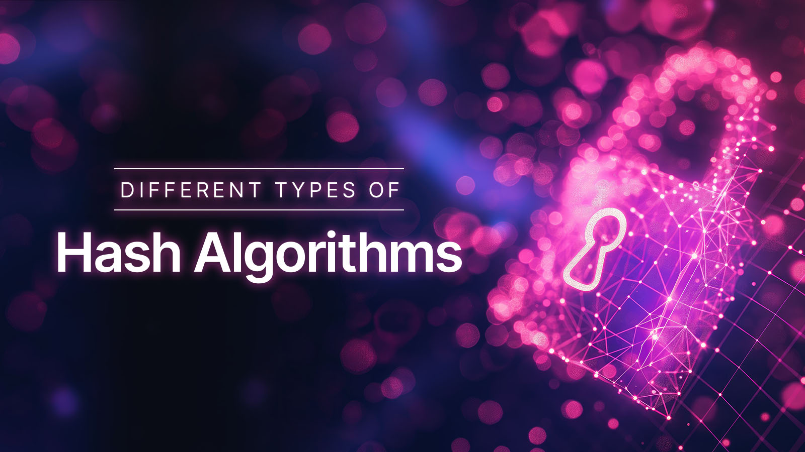

當用戶為其線上帳戶建立密碼時，密碼在儲存到任何資料庫之前都會經過雜湊處理。因此，即使是管理資料庫的人也無法讀取使用者的實際密碼。幾乎所有流行的線上服務都使用某種形式的雜湊技術來安全地儲存密碼。

想並排嘗試它們嗎？使用我們的[密碼雜湊產生器和驗證器（Argon2id、bcrypt、scrypt、PBKDF2）](/tools/password-hash-generator) — 完全在您的瀏覽器中運行。

## 什麼是雜湊？

<!--FIGURE-->

<!--/FIGURE-->

雜湊可以很簡單，就像在您喜歡的程式語言或框架中使用雜湊函數將文字（訊息）轉換為固定長度的字串（雜湊值）一樣。例如，下表顯示了使用 MD5 雜湊函數轉換原始文字後的一些文字及其雜湊值：

<table dir="ltr" style="table-layout: fixed; font-size: 10pt; font-family: Arial; width: 100%; max-width: 720px; border-collapse: collapse; border: medium; margin: 0 auto;" border="1" cellspacing="0" cellpadding="0" data-sheets-root="1" data-sheets-baot="1"><colgroup><col width="100"><col width="100"></colgroup>
<tbody>
<tr style="height: 21px;">
<td style="overflow: hidden; padding: 2px 3px; vertical-align: bottom; font-family: Arial; font-size: 11pt; font-weight: bold; white-space: normal; overflow-wrap: break-word; border: 1px solid #000000; width: 10px;">原始文字</td>
<td style="border-top: 1px solid #000000; border-right: 1px solid #000000; border-bottom: 1px solid #000000; overflow: hidden; padding: 2px 3px; vertical-align: bottom; font-family: Arial; font-size: 11pt; font-weight: bold; white-space: normal; overflow-wrap: break-word; width: 580px;">雜湊值</td>
</tr>
<tr style="height: 21px;">
<td style="border-right: 1px solid #000000; border-bottom: 1px solid #000000; border-left: 1px solid #000000; overflow: hidden; padding: 2px 3px; vertical-align: bottom; font-family: Arial; font-size: 11pt; font-weight: normal; white-space: normal; overflow-wrap: break-word; width: 10px;">password1</td>
<td style="border-right: 1px solid #000000; border-bottom: 1px solid #000000; overflow: hidden; padding: 2px 3px; vertical-align: bottom; font-family: Arial; font-size: 11pt; font-weight: normal; white-space: normal; overflow-wrap: break-word; width: 580px;">7c6a180b36896a0a8c02787eeafb0e4c</td>
</tr>
<tr style="height: 21px;">
<td style="border-right: 1px solid #000000; border-bottom: 1px solid #000000; border-left: 1px solid #000000; overflow: hidden; padding: 2px 3px; vertical-align: bottom; font-family: Arial; font-size: 11pt; font-weight: normal; white-space: normal; overflow-wrap: break-word; width: 10px;">#k-11@b33t0&amp;&amp;S</td>
<td style="border-right: 1px solid #000000; border-bottom: 1px solid #000000; overflow: hidden; padding: 2px 3px; vertical-align: bottom; font-family: Arial; font-size: 11pt; font-weight: normal; white-space: normal; overflow-wrap: break-word; width: 580px;">7a95be43c21160904ae79d4b7f504c37</td>
</tr>
</tbody>
</table>

在上表的左列中，您可以看到純文字形式的原始密碼，在右列中，您將找到每個密碼的雜湊值。

與加密不同，雜湊只是單向的。也就是說，雜湊演算法不提供將雜湊值反轉回原始輸入文字的方法。

不建議使用舊的雜湊演算法（如您在上面看到的 MD5）對密碼進行雜湊處理。這是因為很容易從常見密碼的預先計算值清單（例如彩虹表）中找到原始輸入的值。例如，簡單的 Google 搜尋「7c6a180b36896a0a8c02787eeafb0e4c」將在結果中傳回「password1」。這意味著，僅依靠 MD5 這樣的雜湊函數，攻擊者在能夠存取雜湊值時，仍然有機會獲取使用者密碼的純文字值。

那麼，如何使用更好的哈希，有哪些不同的哈希演算法、它們的缺點和攻擊向量呢？您還可以使用哪些其他操作和技術來提高應用程式安全性？

首先，讓我們來看看各種哈希演算法及其工作原理。

## 雜湊演算法有哪些不同類型？

<!--FIGURE-->

<!--/FIGURE-->

以下部分列出了不同類型的雜湊演算法。然而，這並不是哈希演算法的明確列表。相反，我們將使用它來解釋不同的雜湊演算法以及當您向下移動列表時它們如何改進。

我們列表中的每個哈希演算法都屬於以下類別之一：

1. 哈希函數（例如MD5）
1. 加密雜湊函數（例如 SHA256）
1. 金鑰導出函數及其在密碼中的應用（又稱密碼雜湊演算法，例如 bcrypt 和 PBKDF2）

### 1. 雜湊函數

哈希函數採用任意長度的任何文字並將其轉換為固定長度的雜湊值。對輸入文字的微小更改可能會導致完全不同的輸出。因此，雜湊函數非常適合驗證兩個輸入是否相同等應用。

#### 1.1。 MD5（訊息摘要演算法 5）

MD5（訊息摘要）是該清單中最古老的雜湊演算法。 MD5 速度很快，這也是它成為最不安全的密碼雜湊演算法的部分原因。在密碼哈希中，哈希演算法速度不快實際上是一件好事。例如，較慢的雜湊演算法會增加駭客建立大量常用單字及其雜湊值所需的時間，以便他們可以將被盜的雜湊密碼與它們進行比較。 **不再建議使用** MD5 進行密碼雜湊。然而，MD5 仍用於其他目的，例如驗證文件的完整性。

MD5 雜湊函數的另一個缺點是它容易發生衝突。當兩個不同的輸入產生相同的雜湊值時，就會發生衝突。 2005年3月，中國山東大學的Xiaoyun Wang和Hongbo Yu發表了[一篇文章](https://www.mathstat.dal.ca/~selinger/md5collision/)，描述了一種可以找到具有相同MD5哈希值的兩個序列的演算法。衝突可能會誘騙使用雜湊值驗證檔案完整性的系統執行與可信任檔案共用相同雜湊值的惡意檔案。

### 2. 加密雜湊函數

加密雜湊函數是具有附加安全性屬性的雜湊函數，使其適合[加密應用](https://www.nist.gov/cryptography)。它們的安全特性包括抵抗​​碰撞和暴力攻擊。

#### 2.1。 SHA-1（安全雜湊演算法 1）

SHA-1 是由美國國家標準與技術研究院 (NIST) 開發的雜湊演算法。它與 MD5 演算法非常相似，但提供了更高的安全性。 SHA-1 也**具有已知的安全漏洞**，不再建議在新應用程式中使用它。

SHA-1 的一些缺點包括 2017 年發現的[已知的 SHA-1 衝突](https://security.googleblog.com/2017/02/announcing-first-sha1-collision.html)，而且它速度很快，因此攻擊者很容易產生常見密碼及其各自哈希值的字典。

#### 2.2。 SHA-2（安全雜湊演算法 2）

SHA-2 系列雜湊演算法在舊版 SHA-1 的基礎上進行了改進。它仍然是 NIST [核准的雜湊演算法](https://csrc.nist.gov/projects/hash-functions) 的一部分。 SHA-2 雜湊演算法系列包括：**SHA-224**、**SHA-256**、**SHA-384**、**SHA-512**、**SHA-512/224** 和 **SHA-512/256**。

#### 2.3。 SHA-3（安全雜湊演算法 3）

SHA-3 是安全雜湊演算法家族的新成員。在內部，SHA-3 與 SHA-1 和 SHA-2 不同，因為它與 MD5 不同。 SHA-3 系列包括：**SHA3-224**、**SHA3-256**、**SHA3-384** 和 **SHA3-512**；

### 3. 金鑰匯出函數

金鑰衍生函數 (KDF) 非常適合對密碼進行雜湊處理。它們是這三個類別中最安全的。使用 KDF 時，可以根據您可以設定的迭代次數對輸入進行多次雜湊處理。因此，KDF 速度慢且很難使用暴力攻擊。以下是哈希密碼的金鑰導出函數的一些應用範例：

#### 3.1。密碼

bcrypt 演算法是基於 [Blowfish 密碼](https://www.schneier.com/academic/blowfish/)。它結合了“鹽”的使用，並且被設計得很慢，這樣就增加了攻擊者破解它所需的計算能力。

#### 3.2。氬氣2id

Argon2 是一個贏得 2015 年密碼雜湊競賽的[金鑰派生函數](https://en.wikipedia.org/wiki/Key_derivation_function)。它有 3 個版本，Argon2i、Argon2d 和 Argon2id。 Argon2id 是 Argon2i 和 Argon2d 的混合體，解決了側通道和基於 GPU 的攻擊問題。

Argon2 輸入參數包括密碼、salt、記憶體成本、時間成本、平行係數和雜湊長度。

#### 3.3。 PBKDF2

基於密碼的金鑰衍生函數 2 (PBKDF2) 是一種與其他演算法相比需要更高運算能力的金鑰衍生函數。它由美國國家標準與技術研究所 (NIST) 推薦。

.Net 中 PBKDF2 的實作是 [Rfc2898DeriveBytes](https://learn.microsoft.com/en-us/dotnet/api/system.security.cryptography.rfc2898derivebytes?view=net-8.0) 類別。它將輸入（要散列的密碼）、鹽和迭代次數作為參數，然後將輸入與鹽一起重複散列。因此，散列過程很慢並且降低了暴力攻擊的有效性。迭代的預設值為 1000。

關於我們在本節中介紹的所有雜湊演算法，值得注意的是，*演算法越慢*，或者*它需要的計算資源越多*攻擊者破解它就越困難。 」

更新、更複雜的哈希演算法很難破解碰撞。然而，它們可能仍然容易受到常見單字和短語的反向搜尋的影響。因此，建議在對輸入進行雜湊處理之前向輸入添加隨機鹽。

不確定選擇哪些設定？從 [密碼雜湊產生器](/tools/password-hash-generator) 中的預設（Argon2id、bcrypt、scrypt、PBKDF2）開始，然後調整到您的 SLA。

## 攻擊向量

<!--FIGURE-->

<!--/FIGURE-->

攻擊向量是攻擊者闖入依賴哈希安全性的系統的不同方式。以下是攻擊向量的範例：

### 暴力破解

典型的與雜湊相關的暴力攻擊涉及攻擊者針對一個或多個被盜雜湊值測試不同的單字（輸入）。一旦輸入的雜湊值與被盜雜湊中的值匹配，攻擊者現在就知道實際的密碼。

這種類型的攻擊可能非常耗時，但當使用者使用易於預測或包含常用單字的密碼時，攻擊就會變得更容易。

您可以透過新增速率限制並強制使用強密碼來降低暴力攻擊對系統的有效性。

### 碰撞攻擊

在衝突攻擊中，攻擊者試圖找到兩個不同的輸入來產生相同的雜湊值。碰撞攻擊者執行的兩種常見方式是[生日攻擊](https://en.wikipedia.org/wiki/Birthday_attack)和第二種[原像攻擊](https://eprint.iacr.org/2008/089.pdf)。

具有較大輸出（雜湊值長度）的雜湊函數不易受到衝突影響。 MD5 和 SHA-1 已經存在已知的衝突。

### 內部威脅

哈希內部威脅的一個常見範例是，員工或有權存取包含登入詳細資訊（例如使用者電子郵件地址（使用者名稱）和密碼雜湊值）的資料庫或檔案的人員濫用其存取權限。這種濫用的範圍包括導出雜湊值，以便他們可以嘗試透過暴力或其他方式逆轉它們。

內部威脅可能是故意的（例如惡意員工），也可能是由於員工的帳戶被駭客攻擊（例如網路釣魚）造成的。

洩漏登入詳細資訊（包括密碼雜湊）的資料外洩可協助攻擊者進行暴力攻擊和彩虹表攻擊。

您可以透過為員工和系統管理員使用更安全的身份驗證流程（例如多重身份驗證）來減少內部威脅的機會。您還應該使用最小權限原則（為員工提供完成工作所需的最低存取權限）並定期審查員工的存取權限。

### 彩虹桌

彩虹表由映射到特定雜湊演算法各自雜湊值的不同單字（或通用密碼）組成。為了執行彩虹表攻擊，攻擊者在現有的單字表及其雜湊值中尋找雜湊值。

存取現有的彩虹表就像簡單的 Google 搜尋一樣簡單。

## 如何正確使用雜湊

<!--FIGURE-->

<!--/FIGURE-->

使用哈希的更好方法是在使用建議的哈希演算法時添加“鹽”。為了進一步解釋上面的說法，我們先來看看鹽是什麼以及如何用好它。我們還將討論哪種哈希演算法仍然安全且值得推薦。

### 1. 在哈希中加入鹽

這裡的鹽只是一組隨機字符，您在實際散列之前將其添加到散列函數的輸入中。例如，如果使用者輸入“h0t#c0olR”作為密碼，並且您添加“17ADT1335tnngz5t”作為鹽，則最終輸入可以是“17ADT1335tnngz5th0t#c0olR”。然後，您對最終輸入進行雜湊處理，並將其儲存在資料庫中使用者的密碼列中。

透過在雜湊之前向密碼添加鹽，即使對於使用常用密碼的用戶，也可以降低字典和彩虹表攻擊的風險。例如，password1 和隨機鹽的雜湊值將與沒有鹽的雜湊值完全不同，因此攻擊者無法使用受損的雜湊值來取得實際密碼。

不建議為多個使用者使用相同的鹽值，因為這樣做已經損害了使用鹽的要點之一。也就是說，具有相同密碼的多個用戶不會具有相同的雜湊值。此外，如果您使用靜態鹽，一旦攻擊者獲得鹽，他們就可以使用它來存取更多密碼。您可以使用[加密強度](https://en.wikipedia.org/wiki/Strong_cryptography)偽隨機數產生器來產生安全鹽。由於每個使用者的鹽值應該是唯一的，因此您可以將使用者的鹽值以純文字形式儲存在使用者列中自己的列上。

當用戶登入時，您的應用程式將從資料庫中讀取該用戶的鹽值，將其添加到他們輸入的密碼中，然後散列最終值。然後將使用者輸入的雜湊值+鹽與資料庫中的雜湊密碼進行比較。

### 2. 選擇正確的雜湊演算法

有許多哈希演算法可供選擇。然而，在選擇演算法之前需要考慮的一些關鍵事項包括：

- 抗碰撞性：截至撰寫本文時，眾所周知 MD5 和 SHA-1 很容易受到碰撞。
- [原像抵抗](https://csrc.nist.gov/glossary/term/preimage_resistance)
- [第二原像抵抗](https://csrc.nist.gov/glossary/term/second_preimage_resistance)

不建議使用 MD5 和 SHA-1 等較舊的雜湊函數。

在三類雜湊演算法中，專業建議您只應使用金鑰派生函數的密碼雜湊應用程式來對密碼進行雜湊處理。 PBKDF2 就是一個很好的例子。

開放 Web 應用程式安全項目 (OWASP) [密碼儲存備忘單](https://cheatsheetseries.owasp.org/cheatsheets/Password_Storage_Cheat_Sheet.html) 建議使用 PBKDF2、Argon2id 或 bcrypt 進行密碼雜湊處理，因為它們都需要 salt，並且專為哈希密碼而設計。

## 其他可讓雜湊更安全的保護措施

<!--FIGURE-->

<!--/FIGURE-->

除了將密碼儲存為雜湊值之外，您還可以執行以下操作來提高應用程式的安全性。

### 新增速率限制

速率限制是一種應用程式安全措施，用於限制使用者在給定時間嘗試存取某項服務的次數。使用者驗證中速率限制的常見形式是限制使用者在鎖定帳戶之前可以嘗試使用錯誤密碼的次數。

速率限制是防止對使用者認證系統進行暴力攻擊的有效方法。它可以阻止攻擊者使用自動化腳本嘗試多個常見密碼，這些腳本可以在幾秒鐘內產生並嘗試數百甚至數千個密碼。

除了將密碼儲存為加鹽雜湊之外，您還應該考慮在應用程式中實施速率限制。

### 使用第三方身分驗證服務

最後但並非最不重要的建議是，保護應用程式上的使用者身份驗證是選擇由經驗豐富的團隊或服務提供者建立的身份驗證服務。這種方法的優點是它消除了在您自己的資料庫上實施散列、加鹽和保存密碼的所有壓力和風險。

Authgear 提供經過測試且值得信賴的身份驗證即服務解決方案，您現在就可以免費試用。它們消除了嘗試找出哪種雜湊演算法對於您的用例來說是正確且安全的壓力。 Authgear 使用最新的雜湊和應用程式安全實踐。

除了基於使用者名稱和密碼的身份驗證之外，Authgear 等第三方身份驗證服務提供者還提供其他安全身份驗證方法，例如簡訊和電子郵件 OTP、TOTP 和生物識別身份驗證。 [建立免費帳戶](https://accounts.portal.authgear.com/signup) 或使用 Authgear 網站上的[聯絡表單](/schedule-demo) 開始使用。
