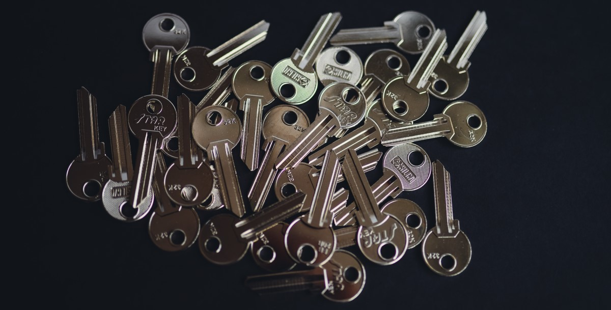
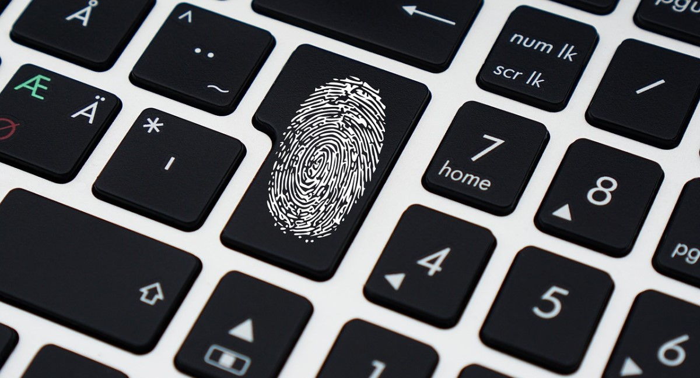
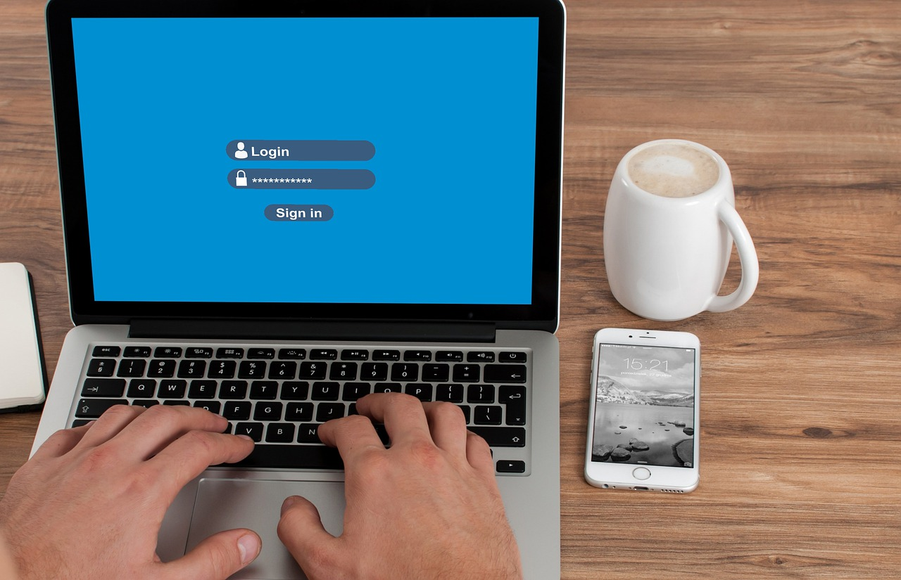

    
無密碼身份驗證包括無需要求使用者輸入密碼即可驗證使用者身份的所有身份驗證方法。無密碼身份驗證的範例包括生物識別技術，例如指紋和臉部辨識、實體安全性令牌金鑰、Magic Link 等。

儘管它們不能完全免受駭客攻擊，但無密碼身份驗證方法在某些方面仍然優於密碼身份驗證，並且各種應用程式（無論是商業應用程式還是企業應用程式）都採用了密碼身份驗證。

在這篇文章中，我們將詳細了解：

<ul>
<li><a href="#password-authentication">密碼身份驗證出了什麼問題？ </a></li>
<li><a href="#authentication-factors">無密碼身份驗證使用哪些因素？ </a></li>
<li><a href="#benefits">無密碼身份驗證的好處</a></li>
<li><a href="#mfa">無密碼身份驗證與多重身份驗證</a></li>
<li><a href="#how-to-implement">如何實施無密碼身份驗證？ </a></li>
</ul>

<h2 id="password-authentication">密碼驗證出了什麼問題？ </h2>

<!--圖-->

<!--/圖-->

由於多種原因，密碼本質上很容易受到駭客的攻擊。當用戶在線上註冊更多服務時，他們很容易忘記密碼，想出容易受到字典攻擊的簡單密碼，或對所有服務使用相同的密碼集。有時，用戶甚至可能自願洩露他們的密碼。駭客可以透過發送詐騙電子郵件或訊息輕鬆竊取使用者密碼。根據 2020 年 Verizon 資料外洩調查報告，81% 的駭客相關外洩涉及密碼被盜或弱密碼。

為了更好地保護使用者訊息，無密碼認證中使用了知識因素以外的因素，即使用者擁有的信息，如密碼、PIN、使用者名稱等。

<h2 id="authentication-factors">無密碼身份驗證使用的因素是什麼？ </h2>

不同類型的無密碼身份驗證依賴不同的身份驗證憑證或因素。這些因素，即固有因素和占有因素，被認為比知識因素更安全，因為知識因素很容易被竊取或遺忘。

### 固有因素

固有因素是指指紋、聲音、視網膜等個體固有的因素，使用者無需記憶。 <a href="/post/biometric-authentication" target="_blank">生物辨識身份驗證</a>是利用這些因素來驗證使用者身分的技術。

當用戶建立新帳戶時，他們的身體特徵將被掃描和分析，以建立儲存在資料庫中的數位副本。當他們想要登入不同的軟體或應用程式時，系統會將呈現的生理數據與資料庫中儲存的數據進行比較，以驗證他們的身份。

儘管駭客已經找到了欺騙某些生物識別數據的方法，但行為因素仍然難以複製，這使得生物識別身份驗證比密碼身份驗證安全得多。

### 控球因素

這些是使用者隨身攜帶的憑證，例如安全性令牌或可以從身分驗證應用程式接收程式碼的手機、<a href="/post/send-otp-on-whatsapp-and-telegram-2022" target="_blank">透過 Telegram 或 WhatsApp 的 OTP</a> 等。它會檢查用戶是否擁有經過批准的硬件，這比知識因素更難破解。儘管如此，駭客仍然有可能遠端存取硬體以實體竊取硬體。

有些人還認為，一些無密碼身份驗證（例如 Magic Link、OTP 和身份驗證器應用程式）並非完全無密碼，因為為了透過這些方法驗證其身份，用戶仍然需要使用使用者名稱和密碼登入其電子郵件帳戶或裝置。儘管如此，使用所有權和固有因素的身份驗證方法仍然比密碼身份驗證安全得多。

<h2 class="title cta-split-content-left">使用 Authgear 實作無密碼和 2FA
</h2>

您需要的唯一驗證和使用者管理解決方案

<a href="/talk-with-us" target="_blank" class="w-inline-block">

取得演示

<h2 id="how-it-works">無密碼身份驗證如何運作？ </h2>

<!--圖-->

<!--/圖-->

使用生物識別資料或硬體金鑰的無密碼身份驗證方法依賴具有公鑰和私鑰的加密金鑰對。儘管它的名字如此，公鑰實際上充當著由私鑰解鎖的掛鎖或鑰匙孔。

當使用者建立新帳戶時，會產生私鑰及其對應的公鑰。公鑰儲存在使用者建立帳戶的系統中，私鑰儲存在使用者的安全設備中。使用者只能透過出示身分驗證因素（例如指紋、臉部等）來存取私鑰，然後使用私鑰來解鎖公鑰。

<h2 id="benefits">無密碼身份驗證的好處</h2>

根據最近的研究，“<a href="https://www.weforum.org/agenda/2020/04/covid-19-is-a-reminder-that-its-time-to-get-rid-of-passwords/" target="_blank">當前形勢只會繼續加速全球經濟對互聯網的依賴身份</a>”，無密碼採用的無密碼。那麼，為什麼企業採用無密碼身份驗證來取代傳統密碼身份驗證呢？

<!--圖-->

<!--/圖-->

### 提供更好的使用者體驗

無密碼身份驗證比密碼身份驗證提供更好的用戶體驗，因為用戶不必遵循複雜的密碼策略、創建太複雜而難以記住的密碼，然後根據應用程式的要求不時更改它們。此外，用戶可以透過無密碼身份驗證更快地建立新帳戶或驗證其身份，而不必看到可怕的登入失敗訊息。

### 顯著提高資料安全性

普通用戶可能會經歷密碼疲勞，這是由於必須記住過多的密碼和用戶名而導致的一種壓倒性的感覺，並決定：

- 建立易於記住的密碼
- 所有服務或應用程式使用相同的密碼
- 將所有密碼保存在便利貼或任何不安全的地方

這些場景使駭客更容易猜測或竊取憑證並存取敏感資訊。

另一方面，透過無密碼身份驗證，用戶不必擔心記住數百個密碼，因為他們可以透過不同的硬體或天生的硬體登入應用程式。此外，用於無密碼身份驗證的憑證（例如生物識別資料、佔有因素和魔法連結）更難被駭客複製或欺騙，而且它們通常在用戶設備或 FIDO 安全金鑰上受到保護和加密。

### 降低 IT 和營運成本

重置和管理密碼實際上比人們想像的要昂貴。 Secret Double Octopus 和 Ponemon Institute 進行的一項研究表明，與傳統的用戶名和密碼身份驗證相比，無密碼身份驗證在兩年內平均節省了 53.4 萬美元的密碼相關支援成本，並額外節省了 140 萬美元的成本。

保留密碼認證系統意味著企業需要投資幫助台票務系統、招募員工為使用者重設密碼、維護認證系統的安全性以及購買系統所需的硬體。透過消除密碼，從長遠來看，公司可以節省數百萬美元，同時受益於無密碼身份驗證的其他特性。

<h2 id="mfa">Passwordless Authentication vs Multi-Factor Authentication</h2>

多重身份驗證 (MFA) 一詞與無密碼身份驗證不同，因為它主要描述使用多個身份驗證因素來驗證使用者身份的身份驗證過程。例如，當您現在登入 Gmail 或 Facebook 時，除了輸入使用者名稱和密碼之外，還必須確認是您使用身份驗證器應用程式登入的服務。在這種情況下，您將呈現兩個身分驗證因素，一個知識因素和一個擁有因素。擁有多個身份驗證因素可以增強身份驗證的安全性，因為攻擊者不僅必須獲得正確的使用者名稱和密碼組合，而且還必須存取使用者的裝置或設法欺騙其生物識別資料。

無密碼認證主要描述不需要使用者輸入密碼登入應用程式或系統的認證方式。現在許多應用程式都實現了多重身份驗證和無密碼身份驗證，以增強身份驗證安全性。

<h2 id="how-to-implement">如何實現無密碼身份驗證？ </h2>

在開始實施無密碼身份驗證之前，您必須做出一些決定：

1. 您將包含多少個身分驗證因素？

當然不建議使用一種身分驗證因素，因為這會增加資料外洩的機會。

2. 您將使用什麼無密碼身份驗證方法？

As mentioned above, there are several methods of passwordless authentication, ranging from fingerprint scan, face scan, OTP via SMS, etc., for you to choose.  
從那時起，您就可以開始開發自己的無密碼身份驗證系統。

## 使用 Authgear 輕鬆實現無密碼身份驗證

開發和維護內部身份驗證系統可能非常耗時且費力。 Authgear提供多種安全功能，例如SSO、社交登入、無密碼身份驗證、2FA等，為您的應用程式提供更好的安全性和更流暢的使用者體驗。此外，透過將您的應用程式與 Authgear 集成，您的應用程式還將配備其他功能，例如註冊頁面和管理門戶，幫助您優化轉換率並更好地管理用戶。

立即<a href="/talk-with-us" target="_blank">聯絡我們</a>，讓我們詳細了解您的需求以及 Authgear 如何為您提供協助。
