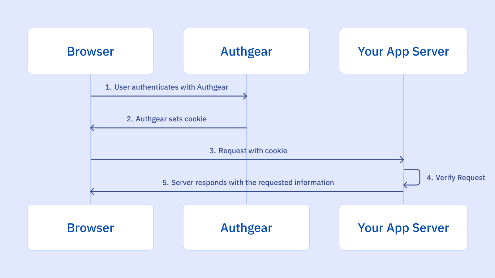
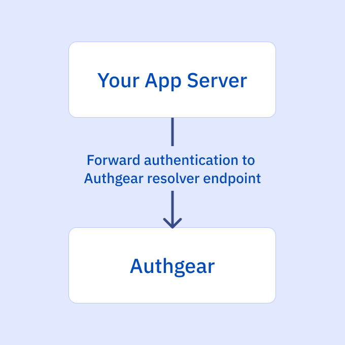

## 什麼是 Web 應用程式中的會話管理？

會話管理是一種追蹤使用者在特定時間內與 Web 應用程式互動的機制。它涉及創建、維護和最終終止用戶會話。此過程對於維護使用者狀態、個人化體驗以及確保安全存取受保護資源至關重要。

會話管理的核心是會話 ID，它是分配給每個使用者的唯一識別碼。此 ID 通常儲存在使用者裝置上的 cookie 中，並隨每個請求傳送到伺服器。伺服器使用此 ID 檢索相應的會話數據，從而識別使用者並維護其會話狀態。

雖然 cookie 通常用於儲存會話 ID，但也可以採用其他方法，例如 URL 重寫或隱藏表單欄位。然而，實施強大的安全措施來保護會話 ID 並防止未經授權的存取至關重要。

## 會話管理如何運作？

Session management refers to handling multiple requests and responses from a user or entity on a website or web application. Throughout these interactions, information of the user will be passed between the server and the browser, kept by the browser, and even processed. It is therefore critical for the web app to properly secure and manage sessions, especially within authenticated sessions, in order to prevent <a href="/post/broken-authentication-what-is-it-and-how-to-prevent-it" target="_blank">broken authentication</a>. Before we get into the attacks associated with session management and some best practices, let’s define a few terms first.

### 會話ID

會話 ID 或會話令牌是隨機產生的字串形式的唯一標識符，用於識別使用者在網站或應用程式上的會話。當使用者登入網站或應用程式時，伺服器會建立一個會話 ID，並在會話終止時銷毀它。

There are a few different ways to generate session ID, but it is recommended by <a href="https://owasp.org/" target="_blank">OWASP</a> to use a good Cryptographically Secure Pseudorandom Number Generator (CSPRNG) to create session IDs. This ensures that each cookie is unique and thus can withstand guessing attacks.

會話 ID 在一段時間內保持不變，如果使用者關閉瀏覽器並重新開啟 Web 瀏覽器造訪站點，則會產生新的會話 ID。會話 ID 將使用者會話綁定到使用者 HTTP 流量以及網站或應用程式施加的適當存取控制。

如果攻擊者獲得使用者的會話 ID，他們就能夠冒充該使用者並獲得對其帳戶的存取權限。因此，會話 ID 不應向公眾披露，並且只能以安全方式傳輸。

為了安全地交換會話ID，通常使用cookie來包含會話ID，因為它們具有一些可以保護會話ID的交換的屬性。

### 會話 Cookie

Session cookies can store a range of information and session ID is one of them. Cookies are small pieces of data sent from a website to a user's web browser and stored on the user's devices. When the user re-accesses the website, their browser sends the cookie back to the server. This allows the server to identify the user and track their activity on the site.

## 與會話管理相關的威脅和網路攻擊

### 會話劫持

會話劫持攻擊涉及攻擊者在使用者登入後嘗試取得受害者的會話 ID。然後，攻擊者可以冒充使用者並使用取得的會話 ID 代表使用者執行操作。

### 會話固定

Session fixation attack, sometimes confused with session hijacking, essentially exploits the flaws of authentication and session management of web app and “fixes” an established session on the user’s browser. To do this, the hacker tricks the victim into using an identifier that the hacker already knows instead of stealing new identifiers. Afterwards, the hacker can then impersonate the user.

## 會話管理漏洞

會話管理漏洞是由於會話管理機制不正確的實作或配置而產生的。這些漏洞可能導致嚴重的安全漏洞，使攻擊者能夠危害用戶帳戶並存取敏感資料。一些常見的會話管理漏洞包括：

- **會話固定：** 攻擊者操縱受害者使用可預測的會話 ID，使他們能夠稍後劫持會話。
- **會話劫持：** 攻擊者竊取有效的會話 ID 來冒充合法使用者。
- **會話過期：** 不正確的會話逾時設定可能會導致會話延長，從而增加未經授權存取的風險。
- **會話固定：** 攻擊者操縱受害者使用可預測的會話 ID，使他們能夠稍後劫持會話。
- **沒有 HttpOnly 標誌的會話 Cookie：** 如果會話 Cookie 缺少 HttpOnly 標誌，攻擊者可能會使用 JavaScript 竊取 Cookie 並利用會話。
- **不安全的會話 ID 產生：** 弱或可預測的會話 ID 產生演算法可以使攻擊者更容易猜測或暴力破解會話 ID。

透過了解這些漏洞並實施建議的最佳實踐，您可以顯著降低會話相關攻擊的風險。

## 實施會話管理的最佳實踐

Effective session management is critical for safeguarding user data and preventing unauthorized access in web applications. By implementing robust session management practices, you can protect sensitive information, maintain user trust, and comply with security regulations. This involves carefully considering session ID generation, cookie configuration, and session expiration policies. Additionally, monitoring for suspicious activity and implementing regular security audits are essential components of a comprehensive session management strategy.

### 會話 ID 的屬性

配置良好的會話 ID 是安全會話管理策略的基礎。幾個關鍵特性有助於其有效性：

- **長度：** 足夠長的會話 ID 對於阻止暴力攻擊至關重要。雖然 128 位元經常被引用為基準，但最佳長度取決於預期會話數量和所需安全等級等因素。較長的會話 ID 可提供更好的保護，但可能會影響效能。
- **隨機性：** 採用加密安全隨機數產生器 (CSPRNG) 來建立不可預測的會話 ID。避免可能被攻擊者利用的模式或可預測序列。
- **熵：** 高熵確保會話 ID 包含足夠的隨機性，使其在計算上無法猜測。此屬性與長度和隨機性密切相關。
- **模糊性：** 會話 ID 的內容應該毫無意義且不含任何敏感資訊。這可以防止攻擊者提取有價值的數據，即使他們設法獲取 ID。此外，請考慮對會話 ID 進行編碼或混淆以進一步阻礙分析。 ****
- **唯一性：** 每個會話都應該有一個不同的會話 ID，以防止會話固定攻擊。重複的會話 ID 可能允許攻擊者劫持現有會話。

### Cookie 的屬性

Cookie 提供了多個屬性來增強會話 ID 安全性：

- **安全性：** 此屬性可確保 cookie 僅透過 HTTPS 連線傳輸，提供加密並防止中間人攻擊。
- **HttpOnly：** 此屬性可防止用戶端腳本 (JavaScript) 存取 cookie，從而減少跨站點腳本 (XSS) 漏洞。
- **SameSite:** This attribute controls cookie sending behavior based on the request origin.some text<ul><li>**Strict:** Cookies are only sent in same-site requests, preventing cross-site request forgery (CSRF).
- **寬鬆：** Cookie 在同網站和一些跨站點請求中發送，提供安全性和使用者體驗之間的平衡。
- **無：** Cookie 隨所有要求一起發送，需要額外的安全措施，例如 Secure 和 HttpOnly。 ****

### 新會話 ID 的生成

定期重新產生會話 ID 對於維護強大的安全性至關重要：

- **登入：** 成功登入後發出新的會話 ID 有助於防止會話固定攻擊。
- **權限等級變更：** 當使用者權限變更（例如，從訪客權限變更為經過驗證的權限）時，產生新的會話 ID 以保護敏感資料。
- **密碼變更：** 要求使用者在更改密碼並發出新會話 ID 後重新進行身份驗證，增加了額外的保護層。 ****
- **空閒逾時：** 考慮在一段時間不活動後重新產生會話 ID，以減輕會話劫持風險。

## 會話管理如何與 Authgear 搭配使用

<!--FIGURE-->

<!--/FIGURE-->

當您的使用者使用 Authgear 進行身份驗證時，Authgear 將負責產生並正確配置 cookie 以確保安全身份驗證。從瀏覽器發送到應用程式伺服器的後續請求現在將包含會話 cookie。若要驗證會話，請將請求轉送至 Authgear 解析器端點。

<!--FIGURE-->

<!--/FIGURE-->

**請求範例**`
> 取得 /api_path HTTP/1.1
> 主機：yourdomain.com
> cookie：會話=
`

## 會話管理和中斷存取控制

It's crucial to recognize the interconnectedness of session management and access control. A compromised session can directly lead to broken access control, granting unauthorized access to sensitive resources. For instance, if an attacker successfully hijacks a user's session, they can potentially access data or perform actions that are restricted to the legitimate user. Therefore, implementing robust session management practices is essential for preventing broken access control vulnerabilities. For a deeper dive into broken access control and its countermeasures, refer to our comprehensive guide: [Defending Against Broken Access Control Vulnerabilities: A Comprehensive Guide](/post/what-is-broken-access-control-vulnerability-and-how-to-prevent-it)

## 使用 Authgear 保護會話管理和身份驗證

實施會話管理時可能會出現許多問題，資料外洩會導致企業失去一半以上的使用者並面臨重大的財務損失。

Let Authgear secure session management and the overall security of your apps. Authgear not only follows cybersecurity best practices to ensure that your users’ personal data is well-protected but also provides various authentication and user management features, including <a href="/features/biometric-authentication" target="_blank">biometric authentication</a>, <a href="/features/social-login" target="_blank">social login</a>, <a href="/features/passkeys" target="_blank">passkeys</a>, <a href="/features/whatsapp-otp" target="_blank">WhatsApp OTP</a>, and more, to make sure that you can deliver a secure yet frictionless digital experience to your users.

<a href="https://accounts.portal.authgear.com/signup" target="_blank">Sign up for a free trial</a> or <a href="/talk-with-us" target="_blank">contact us</a> to see how your app can benefit from integrating with Authgear.
