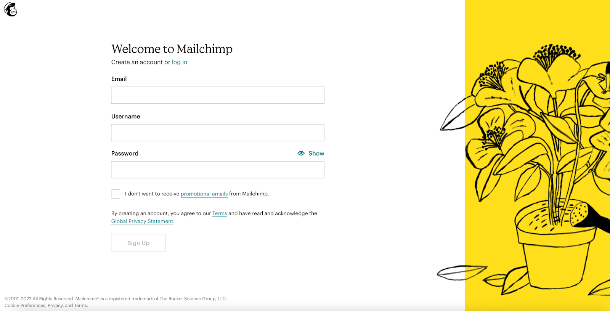
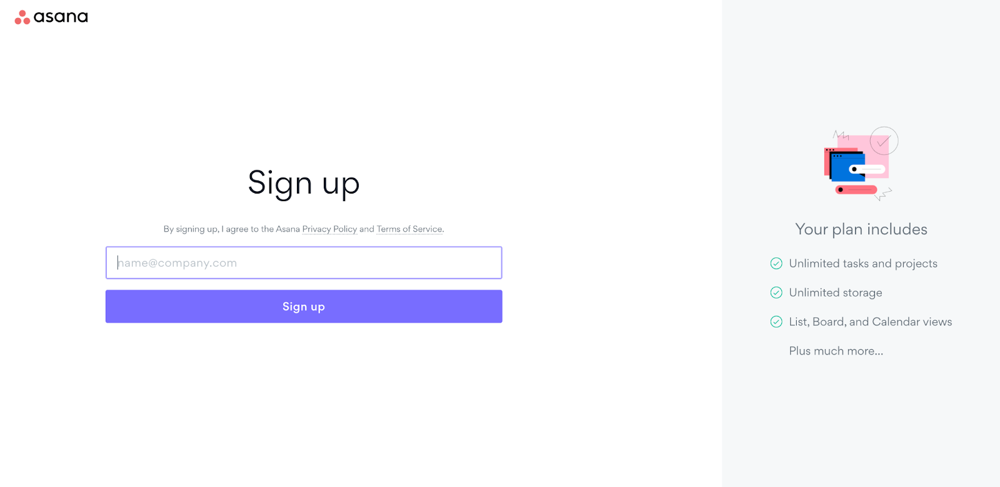

    
如今，訂閱服務產業正在蓬勃發展，公司以前所未有的速度成長，消費者的選擇也多種多樣。網路賺的錢比以往任何時候都多，但競爭也很激烈。確保您分得一杯羹的最佳方法是擁有一個出色的註冊表單或註冊頁面，但如何優化註冊流程以獲得成功呢？

**本文將介紹您可以用來優化註冊表單並大幅提高應用轉換率的最佳提示和技巧。 **

<nav id="table-of-content"> Table of Content
    <ul style="margin-top:15px">
        <li><a href="#why-sign-up">Why It’s Important to Have a Good Sign Up Form?</a></li>
        <li><a href="#best-practices">Sign Up Form Best Practices</a>
            <ol style="margin-top:15px;margin-bottom:15px">
                <li><a href="#minimal-design">Minimal Design to Eliminate Distraction and Confusion</a></li>
                <li><a href="#form-fields">Remove Unnecessary Form Fields</a></li>
                <li><a href="#user-experience">Manage User Expectations</a></li>
                <li><a href="#social-login">Allow Social Login and Auto-Fills</a></li>
                <li><a href="#rwd">Optimize Sign Up Page for Mobile Devices</a></li>
            </ol>
        </li>
        <li><a href="#authgear">Create High Conversion Sign Up Page with Authgear</a></li>
    </ul>
</nav>

<h2 id="why-sign-up">Why It’s Important to Have a Good Sign Up Form?</h2>

Sign up forms are perhaps the most important part of your customer acquisition process. You can have a great product or service and an excellent website, but without having a simple, attractive sign up form, you'll be losing a good amount of business. As a matter of fact, the <a href="https://andrewchen.com/investor-metrics-deck/" target="_blank">bounce rate of sign up or landing pages can be over 80%</a>. Conversely, when you have an intuitive sign up form, you can boost engagement, increase your conversions, and ultimately generate way more revenue.

也就是說，僅有註冊表單或註冊頁面還不夠。您需要確保您的註冊過程簡單且易於理解，以便您的客戶能夠與您的表單互動並真正成為客戶。因此，讓我們回顧一下創建令人驚嘆的註冊表單的一些最佳實踐，這些註冊表單看起來很棒，更重要的是，表現良好。

<h2 id="best-practices">Sign Up Form Best Practices</h2>

<h3 id="minimal-design" style="margin-top:0">1. Minimal Design to Eliminate Distraction and Confusion</h3>

許多註冊頁面的設計都保持最小化，並且只包含一個註冊表單。

<!--FIGURE-->

<!--/FIGURE-->

以 Mailchimp 為例。註冊頁面刪除了導覽列和頁腳。它也沒有其他部分來分散用戶的注意力；此外，除了條款和隱私權聲明等必需的連結之外，沒有其他連結會使用戶脫離註冊過程。這有效地將用戶的注意力集中在註冊表單本身上，並最大限度地減少了跳出的可能性。

<h3 id="form-fields">2. Remove Unnecessary Form Fields</h3>

作為資格認證過程的一部分，許多網站或應用程式可能會要求提供大量資訊。然而，最好的註冊表單總是乾淨簡單，以盡量減少摩擦。理想情況下，您的表單應該只要求提供在資料庫中註冊客戶所絕對必需的信息，例如他們的姓名、密碼和電子郵件地址。

<!--FIGURE-->

<!--/FIGURE-->

一個完美的例子是 Asana 的註冊表單，它只需要使用者提供電子郵件地址即可發送驗證電子郵件。

當然，根據您的行業，您可能需要收集比這更多的信息，但請盡力使表格盡可能簡短，這樣您將大大提高轉換率。

如果您使用自動化工具來建立註冊表單，那麼您的表單很可能會產生包含大量並非真正必要的欄位。自動產生表單並使用它來完成可能很容易，但這是一個巨大的錯誤。在將表單放到您的網站或應用程式之前，您應該仔細檢查您的表單。

確保每個欄位都是絕對必要的，並刪除不需要的任何欄位。透過這種方式，您可以保持事情乾淨和最小化，這是客戶在註冊新服務時所尋求的。

	<h2 class="title cta-split-content-left">Increase Your App's Conversion Rate with Authgear</h2>
  
Tested and proven sign-up page template, following the best practices for user conversion

  <a href="/talk-with-us" target="_blank" class="w-inline-block">
  	
Get Demo

<h3 id="user-experience">3. Manage User Expectations</h3>

除了縮短流程以盡量減少摩擦之外，設定正確的期望也很重要。告知他們需要什麼以及該過程需要多長時間，以便他們有足夠的背景資訊。讓他們知道為什麼需要某些信息，例如支付信息、身份證號碼和其他個人信息以及如何使用這些信息也很重要，這樣用戶在這個過程中不會感到不安全和掉線。

<h3 id="social-login">4. Allow Social Login and Auto-Fills</h3>

建立註冊流程時可以做的最好的事情之一就是允許人們使用現有的社交憑證登錄，例如使用 Google 或 Facebook（元）帳戶。研究表明，如果人們無需填寫新的註冊表單而只需使用現有憑證登錄，他們就更有可能註冊您的服務。

如果您無法允許社交登錄，那麼最好的方法就是允許自動填寫，這將允許客戶使用已儲存在其裝置上的資訊快速填寫您的表單。自動填入功能使客戶可以在幾秒鐘而不是幾分鐘內完成冗長的註冊表單，這對於提高註冊表單和頁面的轉換率大有幫助。

<h3 id="rwd">5. Optimize Sign Up Page for Mobile Devices</h3>

Mobile usage has increased steadily over the last few years. According to <a href="https://techjury.net/blog/mobile-vs-desktop-usage/#gref" target="_blank">Techjury</a>, 50% B2B inquiries were made on mobile, mobile phones generated 54.25% of the traffic, and 55% of page views came from mobile phones in 2021. It is therefore important to optimize sign up pages for mobile devices; otherwise, a poorly designed mobile page can easily drive the users away.

<h2 id="authgear">Create High Conversion Sign Up Page with Authgear</h2>

<!--FIGURE-->

<!--/FIGURE-->

Authgear 是一種適用於 Web 和行動應用程式的身份驗證和使用者管理解決方案。透過將您的應用程式與 Authgear 集成，您可以為使用者提供安全、流暢的身份驗證體驗。此外，我們還提供遵循最佳實踐的可自訂註冊和登錄頁面，幫助您提高註冊率、擴大訂閱者群，並最終為您的應用程式創造更多收入。

Ready to take your app to the next level? <a href="/talk-with-us" target="_blank">Get in touch with us</a> today to learn more about how we can help you and your apps reach new heights.
