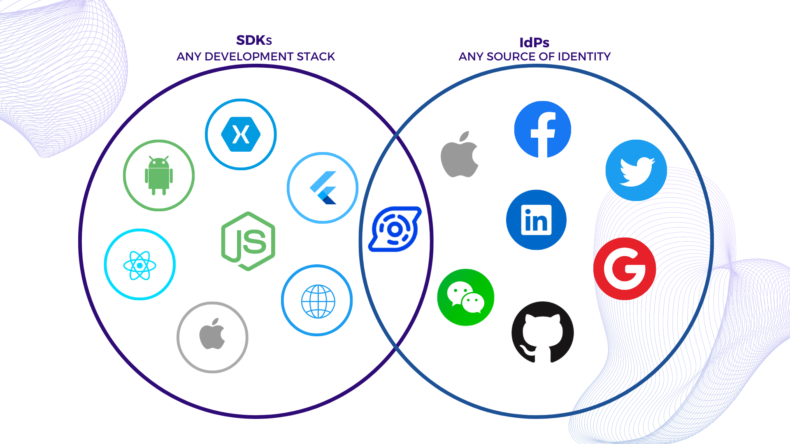
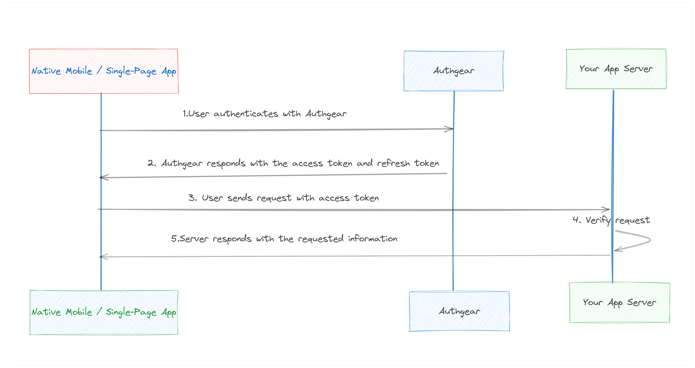
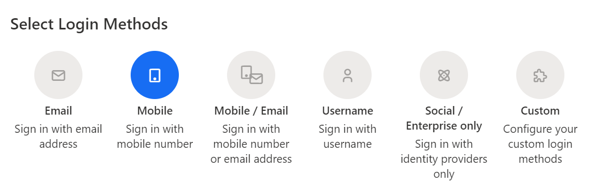

在當今的數位行業中，任何成功的應用程式都必須優先考慮安全性和用戶體驗。使用者身份驗證是應用程式安全的關鍵方面之一，但它對開發人員來說也可能是一個重大挑戰，因為它需要理解並正確實現複雜的協定。建立內部身份驗證系統可能需要**三到六個月**。作為開發人員，我們不斷尋找使身份驗證整合更容易的解決方案，同時確保用戶資料的最大保護。值得慶幸的是，SDK 庫可以讓這項任務變得更加容易。本文探討了 **Authgear 提供哪些 SDK 和 API** 以及它們如何為開發人員**簡化身份驗證整合**。

## 什麼是 Authgear？

Auhgear is a highly adaptable **identity-as-a-service (IDaaS) platform** for web and mobile applications. As Auhgear is constructed on the <a href="https://openid.net/developers/how-connect-works/" target="_blank">OpenID Connect</a> (OIDC) standard, it supports a wide range of identity providers, including <a href="https://developers.google.com/identity" target="_blank">Google</a>, <a href="https://support.apple.com/en-gb/guide/deployment/depa64848f3a/web" target="_blank">Apple</a>, and <a href="https://azure.microsoft.com/en-gb/products/active-directory/" target="_blank">Azure Active Directory</a> (AD). Authgear enables developers to integrate **multiple authentication methods**, such as <a href="/features/social-login" target="_blank">social logins</a>, <a href="/features/passwordless-authentication" target="_blank">passwordless</a>, <a href="/features/biometric-authentication" target="_blank">biometrics logins</a>, <a href="/features/whatsapp-otp" target="_blank">one-time-password (OTP) with SMS/WhatsApp</a>, and multi-factor authentication (MFA)**.**  Authgear takes care of the heavy lifting in terms of user authentication, making it easier and faster to implement by integrating it into various types of applications - from single-page web apps to mobile applications to API services. You can also change how the end-users see your <a href="/solutions/customer-identity-and-access-management" target="_blank">signup and login pages</a> with a **user-friendly drag-drop low-code** dashboard. Most importantly, you can <a href="https://accounts.portal.authgear.com/signup" target="_blank">get started</a> **with Authgear for free** until you have a lot of active users and you want to customize pages under your brand.

## Authgear SDK 函式庫

Authgear SDK 可以輕鬆整合到您的應用程式中，無論是**單頁應用程式**（Angular、Vue、React）**、行動應用程式**（IOS、Android、React Native、Flutter）**，還是常規 Web 應用程式**。在大多數情況下，它只涉及**幾行程式碼**。還有全面的文檔和社群支援可以引導您完成整合過程。 Authgear 提供適用於各種平台和語言的 SDK。下面，我們按應用程式類型細分著名的庫和 SDK，並選擇您的應用程式類型作為入門指南。

<!--FIGURE-->

<!--/FIGURE-->

### 單頁應用程式 (SPA) SDK 庫

您需要保護完全在瀏覽器中運行的 JavaScript SPA 應用程式：

  <table>
    <thead>
      <tr>
        <th>SDK</th>
        <th>Description</th>
        <th>Getting started</th>
      </tr>
    </thead>
    <tbody>
      <tr>
        <td>Angular</td>
        <td>Add authentication to your Angular application</td>
        <td><a href="https://docs.authgear.com/tutorials/spa/angular" target="_blank">https://docs.authgear.com/tutorials/spa/angular</a></td>
      </tr>
      <tr>
        <td>Flutter</td>
        <td>Integrating Authgear with a Flutter app</td>
        <td><a href="https://docs.authgear.com/get-started/flutter" target="_blank">https://docs.authgear.com/get-started/flutter</a></td>
      </tr>
      <tr>
        <td>JavaScript</td>
        <td>Integrate Authgear to your website with the Web SDK</td>
        <td><a href="https://docs.authgear.com/get-started/website" target="_blank">https://docs.authgear.com/get-started/website</a></td>
      </tr>
      <tr>
        <td>React</td>
        <td>Add user logins to your React apps</td>
        <td><a href="https://docs.authgear.com/tutorials/spa/react" target="_blank">https://docs.authgear.com/tutorials/spa/react</a></td>
      </tr>
      <tr>
        <td>Vue</td>
        <td>Add authentication to your Vue application</td>
        <td><a href="https://docs.authgear.com/tutorials/spa/vue" target="_blank">https://docs.authgear.com/tutorials/spa/vue</a></td>
      </tr>
    </tbody>
  </table>

### 本機和行動應用程式 SDK 庫

如果您正在開發行動或桌面應用程序，請從這些 SDK 中選擇一個適合您平台的 SDK 來開始使用。

  <table class="column-spacing">
    <thead>
      <tr>
        <th>SDK</th>
        <th>Description</th>
      </tr>
    </thead>
    <tbody>
      <tr>
        <td>Android</td>
        <td>Integrating Authgear with an Android app</td>
      </tr>
      <tr>
        <td>Flutter</td>
        <td>Integrating Authgear with a Flutter app</td>
      </tr>
      <tr>
        <td>IOS</td>
        <td>Integrating Authgear with an IOS app</td>
      </tr>
      <tr>
        <td>React Native</td>
        <td>Integrating Authgear with a React Native app</td>
      </tr>
      <tr>
        <td>Xamarin</td>
        <td>Integrating Authgear with a Xamarin app</td>
      </tr>
    </tbody>
  </table>

請注意，這些 SDK 會經常更新，可能會定期添加新的 SDK。

可用於單頁和行動應用程式的基於令牌的身份驗證方法：

<!--FIGURE-->

<!--/FIGURE-->

## 後端服務和API認證

If your API or backend service needs authentication, you can validate the JWT token in your application server code. You can find <a href="https://docs.authgear.com/get-started/backend-integration/jwt#decode-user-from-an-access-token" target="_blank">step-by-step examples</a> for **Python, Go, and Node.js** to verify and decode the JWT token from the Authorization header of an incoming HTTP request. For other programming languages, you can use Authgear Authentication APIs to configure OIDC authentication.

## 常規網路應用程式

If you have a traditional web application like **Java EE, Express, PHP, GO, Laravel, or**<a href="http://ASP.NET" target="_blank">**ASP.NET**</a>**Core MVC** and you want to integrate authentication features, you can use a <a href="https://docs.authgear.com/get-started/authentication-approach/cookie-based" target="_blank">Cookie-based</a> authentication method.

<!--FIGURE-->

<!--/FIGURE-->

## 管理介面

If you need to programmatically perform Authgear administrative tasks like managing users or anything that can be done through the Authgear Portal’s dashboard can also be done through this API, you use <a href="https://docs.authgear.com/apis/admin-api" target="_blank">Admin API</a> REST or GraphqQL endpoints.

### 事件和掛鉤

Yet another cool feature of Authgear is <a href="https://docs.authgear.com/integrate/events-hooks" target="_blank">Events and Hooks</a> where you can easily customize the authentication pipeline. Hooks are secure, self-contained functions that allow you to customize the behavior of Auhgear. Authgear invokes hooks during runtime to execute your custom [JavaScript](https://docs.authgear.com/integrate/events-hooks/denohooks) code. For instance, you can add logic to assign roles to new users, trigger actions after login, block suspicious activity, and more.

## Authgear 入門

Authgear 可讓您根據程式語言、您正在使用的框架或從上述部分中選擇的 SDK 新增身份驗證。以下是有關如何開始使用任何 SDK 的 **常見** **步驟**。

**Step 1. Create an Authgear account** Signup for a free Authgear Portal account at <a href="https://portal.authgear.com/" target="_blank">https://portal.authgear.com/</a>.

Or you can use your self-deployed (using <a href="https://docs.authgear.com/deploy-on-your-cloud/local" target="_blank">Docker</a> or <a href="https://docs.authgear.com/deploy-on-your-cloud/helm" target="_blank">Helm chart</a>) Authgear.

**步驟 2. 在入口網站中建立應用程式**

若要使用 Authgear 服務，您需要在 Authgear 入口網站中設定應用程式。您可以在 Authgear 應用程式中設定您正在開發的專案的身份驗證工作方式。

- 登入後，導航至“應用程式”選項卡，然後按一下“新增應用程式”。
- 選擇適當的應用程式類型（例如，傳統 Web 應用程式、單頁應用程式或本機應用程式）並為您的應用程式提供名稱。
- 點擊“儲存”並保留**客戶端 ID**。透過 Authgear SDK 初始化連線時您將需要它。

Every application in Authgear is assigned an alphanumeric, unique client ID that your application code will use to call Authgear APIs through the SDK. Learn more about <a href="https://docs.authgear.com/integrate/using-sdk-to-call-your-application-server" target="_blank">how to call your application server</a> using SDKs.

**步驟 3. 設定應用程式**

- 建立應用程式後，您將被定向到「設定」選項卡，您可以在其中配置應用程式的設定。
- 使用應用程式中對應的 URL 填寫必填字段，例如「授權重定向 URI」和「登出後重定向 URI」。
- 儲存您的變更。

**步驟 4. 選擇使用者的驗證方式**

從「身份驗證」標籤中，您可以為您的使用者選擇**登入方法**。選項包括透過電子郵件、行動裝置或社交媒體、僅使用使用者名稱或您指定的自訂方法。

<!--FIGURE-->

<!--/FIGURE-->

**步驟5.安裝相關的Authgear SDK**

您可以按照上表中**相應 Authgear SDK** 的入門指南中的說明進行操作，具體取決於您的平台。

## 概括

Authgear SDKs and APIs make auth integration significantly more straightforward for developers. By offloading much of the complexity associated with authentication, developers can focus on creating value-adding features for their applications. Authgear is a <a href="/solutions/customer-identity-and-access-management" target="_blank">cloud-based solution</a> that scales with your needs. Whether you have hundreds of users or millions, it can handle the load, providing reliable and fast authentication.

### 相關資源

- <a href="/post/authentication-as-a-service" target="_blank">Authentication-as-a-Service: What Is It and Why You Need It</a>
- <a href="/post/frictionless-authentication" target="_blank">Frictionless Authentication: What Is It & How To Implement It?</a>

### 推薦內容

- <a href="/post/social-login-guide" target="_blank">Social Login - Why You Should Implement It</a>
- <a href="/post/web-application-authentication-guide" target="_blank">Web Application Authentication: How It Works and How to Implement It</a>
