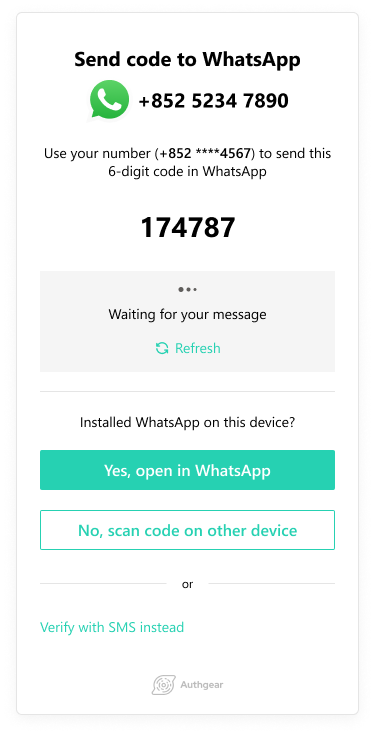

如今，企業不能再將網路安全視為事後的想法，因為駭客和詐騙者正在尋找竊取資訊的新方法。需要採取雙重認證等新的預防措施來保護客戶資料。

雙重認證 (2FA) 要求使用者在授予應用程式或線上平台存取權限之前提供兩項證據或資訊。一種廣泛使用的輔助身份驗證方法是簡訊身份驗證。直到今天，隨著行動用戶數量的不斷增加，簡訊驗證仍然是最廣泛使用的驗證方法之一。

遺憾的是，簡訊雙重認證並不是最佳選擇。 SMS 系統不安全，並且是在網路安全尚處於起步階段時開發的。在本文中，我們討論：

<nav id="table-of-content">
<ul>
<li><a href="#definition">What Is SMS Authentication?</a></li>
<li><a href="#sms-disadvantages">Why Using SMS Authentication for 2FA Isn't Ideal?</a></li>
<li><a href="#sms-alternatives">Other More Secure Authentication Methods</a>
<ul style="margin-bottom:0">
<li style="margin-top:15px"><a href="#whatsapp-otp">WhatsApp OTP</a></li>
<li><a href="#email-otp">Email OTP</a></li>
<li><a href="#biometric">Biometric Authentication</a></li>
</ul>
</li>
<li><a href="#authgear">More Cost-Effective and Secure Authentication with Authgear</a></li>
</ul>
 </nav>

<h2 id="definition">What Is SMS Authentication?</h2>

SMS 身份驗證是一種簡單類型的 2FA 或多重身份驗證 (MFA)。登入的用戶會收到一封帶有驗證碼的簡訊。他們所要做的就是在平台上填寫程式碼即可獲得存取權限。它在 Twitter、Instagram 和 Google 等主要社交網站上廣泛使用。

SMS 驗證增加了一層依賴基於所有權的身份驗證（即您是唯一擁有該號碼的人）的安全層。因此，想要未經授權的存取的人必須竊取您的密碼和電話。

雖然簡訊驗證似乎易於使用且常見，但它是最安全的嗎？

<h2 id="sms-disadvantages">Why Using SMS Authentication for 2FA Isn't Ideal?</h2>

雖然簡訊驗證簡單方便，但它也有其缺點。因此，組織必須確定其是否足夠安全以保護其組織和客戶資料。

以下是 SMS 身份驗證不理想的一些原因。

<!--FIGURE-->

<!--/FIGURE-->

### SMS 訊息未加密

SMS 訊息未進行端對端加密。因此，政府和行動服務提供者實際上可以看到您的訊息。訊息會在系統中儲存數天，而元資料則保留更長時間。

其次，簡訊可能被駭客攔截。行動電話網路透過網路犯罪盛行前所推出的信令協定進行連線。信號系統以前曾被破壞過，銀行驗證碼等資訊也曾被盜過，這使得它成為不太安全的通訊或身份驗證方法。

### 簡訊欺騙

過去，網路釣魚在電腦和筆記型電腦上很普遍。然而，手機上網的能力使它們容易受到利用。短信欺騙允許犯罪分子將自己偽裝成受信任的組織，並向您發送一個鏈接，將您重定向到他們請求關鍵信息（例如密碼和身份驗證碼）的網站。

犯罪分子使用簡訊欺騙用戶，因為他們必須點擊連結才能確定其真實性。當你點擊它時，你可能已經被駭客攻擊了。

### SIM卡可更換

更換 SIM 卡實際上比您想像的要容易。當攻擊者偽裝成號碼所有者時就會發生這種情況。然後，他們使用所有者的信息來欺騙手機服務提供商，讓他們相信他們是所有者。

然後，提供者會將電話號碼連結到攻擊者的 SIM 卡。然後他們可以訪問您的所有短信，包括身份驗證密碼。

### 簡訊驗證的成本可能相當高

如果您是一家以利潤為導向的企業，您總是希望保持較低的營運成本。因此，在確保資訊安全的同時，您需要使用最便宜、最安全的選項。

簡訊驗證取決於提供者的服務，並將按照提供者的費率收費。價格因提供者而異，並可能根據地點和時間而變化。如果您的用戶群呈指數級增長並且每天必須發送數千個身份驗證代碼，則成本會迅速增加。

<h2 id="sms-alternatives">Other More Secure Authentication Methods</h2>

考慮到簡訊認證的缺點和安全性，企業必須尋找更好的方法來取代簡訊認證。由於網路犯罪的增加，您需要一個能夠提供更高安全性的系統。

以下是對使用者進行身份驗證的更安全的方法。

<h3 id="whatsapp-otp">WhatsApp OTP</h3>

另一種更直接的用戶身份驗證方法是透過 WhatsApp。 WhatsApp OTP 與 SMS 驗證非常相似。然而，Authgear 的 WhatsApp OTP 機制與其他機制不同。

當用戶嘗試透過 WhatsApp OTP 登入您的應用程式時，系統會在螢幕上顯示 OTP，而不是在 WhatsApp 上向他們發送 OTP，如下所示。

<!--FIGURE-->

<!--/FIGURE-->

然後，使用者可以將 OTP 傳送到 Authgear 進行身份驗證。這使得企業可以大幅降低營運成本，因為用戶在 WhatsApp 上發起的對話比企業發起的對話便宜得多，而且還具有其他好處。

除了降低成本外，WhatsApp 還為用戶提供端對端加密。換句話說，犯罪分子將無法攔截您發送和接收的訊息。 WhatsApp 本身也無法存取這些訊息。

<a href="/features/whatsapp-otp" target="_blank">WhatsApp OTP</a> also provides a frictionless signup process and an increased app conversion rate. Users can easily create new accounts with existing information without facing issues with deliverability.

<h3 id="email-otp">Email OTP</h3>

電子郵件 OTP 的工作方式與簡訊身份驗證相同，只是透過不同的管道。

當用戶首次在您的平台上註冊時，您會要求他們提供一封電子郵件以供驗證。今後，每當他們登入網站時，他們都會透過該電子郵件收到 OTP。然後，用戶將使用該程式碼來獲得存取權限。

電子郵件不依賴蜂窩服務，這意味著它們更安全。然而，他們對網路連線的依賴使他們容易受到駭客攻擊。

<h3 id="biometric">Biometric Authentication</h3>

生物辨識身份驗證已變得無處不在，因為大多數消費者現在都擁有具有臉部或指紋識別功能的蜂窩設備。

用戶只需查看手機或將拇指按在指紋掃描上即可輕鬆存取不同的應用程式或軟體。它消除了記住長而複雜的密碼的需要，為用戶提供了更流暢的體驗。

該方法速度很快，因為您無需等待 OTP 交付。它也比簡訊身份驗證更安全，因為駭客複製用戶的生物識別數據要困難得多。

<h2 id="authgear">More Cost-Effective and Secure Authentication with Authgear</h2>

Authgear 是一種客戶身分和存取管理解決方案，具有您的應用程式所需的所有安全性和使用者管理功能。透過將您的軟體或應用程式與Authgear集成，您可以輕鬆實現多種身份驗證方式，例如SMS OTP、WhatsApp OTP、社交登入、生物識別身份驗證等，不僅提供流暢的用戶體驗，更重要的是增強資料安全性、提高用戶對話率並降低成本。

<a href="/talk-with-us" target="_blank">Request a demo</a> or <a href="https://accounts.portal.authgear.com/signup" target="_blank">sign up for a free</a> trial to see how you can benefit from Authgear.
