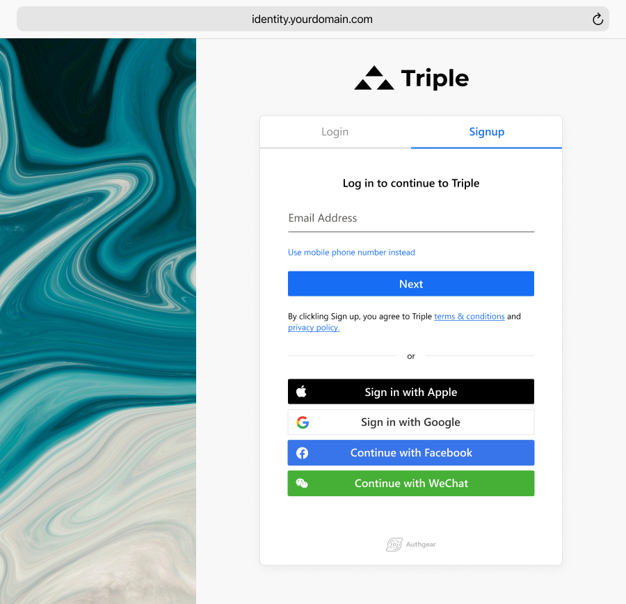
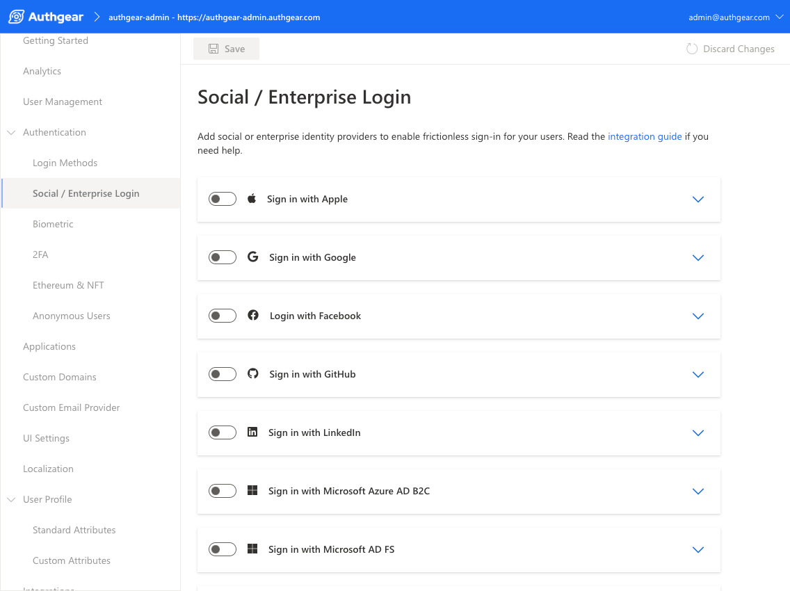

網路徹底改變了人們互動與社交的方式，也讓線上取得內容、資訊與服務前所未有的容易。因此，如今全球竟有高達 <a href="https://datareportal.com/global-digital-overview" target="_blank">51.6 億人</a>使用網路，其中許多人每天都會上線，也就不令人意外。

若你常上網，多半遇過想使用某個服務或網站時，被要求先註冊帳號——這是許多人覺得煩躁的流程之一。事實上，有 **86%** 的網路使用者表示，在瀏覽網站時被要求建立新帳號會讓他們感到困擾。<a href="https://www.shopify.com/blog/shopping-cart-abandonment" target="_blank">24%</a> 的消費者表示，曾因結帳前被迫註冊而放棄在電商網站完成購物。這些數字值得警惕，也凸顯網站需要更好的使用者驗證方式——**社群登入（social login）**正是在這樣的背景下出現。這篇文章會說明你該知道的觀念，以及為什麼值得在網站上導入。

<nav id="table-of-content">
    <ul>
        <li><a href="#def">什麼是社群登入？</a></li>
        <li><a href="#steps">社群登入如何運作？</a></li>
        <li><a href="#benefits">社群登入能帶來哪些好處？</a>
            <ul>
                <li><a href="#sales">提升註冊完成率並帶動銷售</a></li>
                <li><a href="#email">更容易取得已驗證的電子郵件</a></li>
                <li><a href="#updated">取得更豐富且即時的使用者輪廓</a></li>
                <li><a href="#audience">觸及更廣的潛在客群</a></li>
                <li><a href="#security">強化網站或 App 的安全性</a></li>
            </ul>
        </li>
        <li><a href="#risks">社群登入有哪些風險？</a>
            <ul>
                <li><a href="#privacy">隱私議題</a></li>
                <li><a href="#security-issue">安全議題</a></li>
            </ul>
        </li>
        <li><a href="#authgear">用 Authgear 享受社群登入的效益</a></li>
    </ul>
</nav>

<h2 id="def">什麼是社群登入？</h2>

<!--FIGURE-->

<!--/FIGURE-->

社群登入是一種驗證方式：使用者可以沿用既有**社群帳號的憑證**，來存取某個服務或網站。它也常被稱為 social sign-in 或 social authentication。

今日各類網站與 App 都能看見社群登入，因為它同時對**使用者**與**服務提供者**有利。對使用者而言，不必再多記一組帳號密碼；對服務提供者而言，社群登入能降低註冊摩擦、提升轉換率，並取得更有價值且相對即時的使用者資料。

<h2 id="steps">社群登入如何運作？</h2>

<!--FIGURE-->

<!--/FIGURE-->

流程相當直覺，大致如下：

**步驟 1：** 系統請使用者建立帳號，並提供以 Facebook、Google、Twitter 等社群平台的憑證註冊的選項。

**步驟 2：** 使用者選定社群平台後，該平台會收到登入請求，驗證使用者身分，並回傳結果給你的網站或服務。

**步驟 3：** 若驗證成功，使用者即完成登入，並可存取目標內容。

當使用者以社群媒體帳號登入時，應用程式通常會透過 **OAuth 2.0** 與 **OpenID Connect（OIDC）** 等協定驗證身分，並授權存取應用程式資源。

OAuth 2.0 是**授權（authorization）**協定，讓使用者能安全地透過第三方應用存取資源；其核心概念是核發 **access token**，以特定權限存取特定資源。**OpenID Connect** 則是建立在 OAuth 2.0 之上的**身分驗證（authentication）**層，可進一步確認「正在登入的人是誰」，降低未授權存取與惡意存取敏感資料的風險。

  <h2 class="title cta-split-content-left">用 Authgear 輕鬆啟用社群登入</h2>
  
專注打造產品，而不是再造一組登入

  <a href="/zh-Hant/talk-with-us" target="_blank" class="w-inline-block">
    
預約示範

  </a>

<h2 id="benefits">社群登入能帶來哪些好處？</h2>

<!--FIGURE-->

<!--/FIGURE-->

社群驗證的主要目標是讓登入更順暢，但對企業同樣好處多多。導入後，你大致能獲得以下效益：

<h3 id="sales">提升註冊完成率並帶動銷售</h3>

當客戶可以沿用既有社群檔案註冊，而不必填寫冗長表單時，他們更可能完成註冊。事實上，<a href="https://cxl.com/blog/social-login/" target="_blank">77%</a> 的使用者認為社群登入是很好的驗證解法。

受惠的不只是註冊數字——**銷售也會跟著改善**。結帳流程越簡單，購物車放棄率往往越低。

<h3 id="email">更容易取得已驗證的電子郵件</h3>

社群平台通常會驗證使用者的電子郵件，讓你更容易取得可信的客戶資料。當客戶以社群檔案登入，你可以自動帶入姓名、地址，以及**已驗證的 email**，有助降低網站上的垃圾訊息與詐欺風險。

<h3 id="updated">取得更豐富且即時的使用者輪廓</h3>

多數人在社群檔案上填寫的資訊，往往比註冊表單更完整，企業因此能取得興趣、嗜好、地點等更豐富的資料。社群登入也讓使用者資料更容易與社群平台上的最新資訊同步，利於分眾與行銷活動規劃。

<h3 id="audience">觸及更廣的潛在客群</h3>

在網站開放社群驗證，能觸及比以往更廣的對象。全球使用社群的人持續增加，整合社群登入能降低註冊門檻、擴大潛在客戶池，並帶來新的行銷機會，進而提升銷售與獲利。

<h3 id="security">強化網站或 App 的安全性</h3>

社群登入也有助防範惡意行為。Google、Facebook、Twitter 等大型供應商擁有龐大使用者基礎，若發生資料外洩將承受嚴重後果，因此在安全投資上通常相當積極。存取請求也會先經由社群平台的 API 驗證，再決定是否授權。

<h2 id="risks">社群登入有哪些風險？</h2>

儘管好處不少，社群登入仍伴隨特定風險，例如：

<h3 id="privacy">隱私議題</h3>

社群驗證需要在客戶的社群帳號與你的網站或應用之間交換資料，部分人可能不願分享這些資訊。此外，若社群平台隱私政策改變，也可能影響資料使用方式，進而衝擊依賴社群登入的企業。

<h3 id="security-issue">安全議題</h3>

由於仰賴第三方驗證，若社群平台遭入侵，攻擊者可能取得使用者帳號，並連帶影響所有使用該社群登入的其他網站或 App。若個人社群帳號被盜，攻擊者也可能利用相同機制嘗試登入其他服務。

<h2 id="authgear">用 Authgear 享受社群登入的效益</h2>

社群登入能幫企業取得更完整的客戶輪廓、減輕客服負擔，並提升參與度；但要在網站或 App 逐一串接不同供應商，確實耗時費力。讓 Authgear 分擔這些工程工作：完成整合後，你通常只要幾下點擊，就能啟用或關閉 Apple、Google、Facebook、LinkedIn 等常見社群登入。

<!--FIGURE-->

<!--/FIGURE-->

如此一來，客戶在註冊與登入時能享有更一致的體驗，同時降低惡意行為對業務的威脅。

歡迎<a href="/zh-Hant/talk-with-us" target="_blank">聯絡我們</a>，或<a href="https://accounts.portal.authgear.com/signup" target="_blank">開始免費試用</a>，了解如何透過更順暢、更安全的驗證提升體驗與轉換率。
