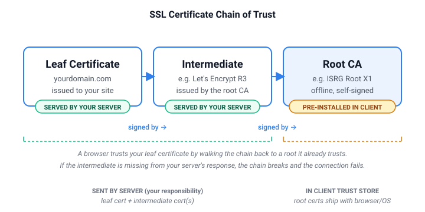

> **重點摘要** — SSL 憑證鏈是一連串連回瀏覽器信任的根 CA 的數位憑證：你的**末端憑證** → 一張或多張**中繼憑證** → 一張受信任的**根憑證**。伺服器必須送出末端與中繼；根則預先內建於客戶端。**只要少一張中繼**，行動瀏覽器與 API 客戶端會立刻失敗——但桌面 Chrome 可能因快取而繼續可用，讓問題不易察覺。

## 什麼是 SSL 憑證鏈？

**SSL 憑證鏈**（亦稱憑證信任鏈或 trust chain）是一串憑證，把你的網站憑證一路連回瀏覽器內建信任的**根憑證機構（CA）**。

可想像成連環保證：你網站的憑證由**中繼 CA** 背書，中繼 CA 再由**根 CA** 背書。瀏覽器預裝受信任根 CA 清單。若能從你的憑證一路連到受信任根且**無斷鏈**，連線即受信任。若鏈上缺一環，瀏覽器會顯示安全錯誤——**即使你的網站憑證本身完全有效**。

> 💡 **剛接觸 SSL？** 深入鏈結前可先讀 [什麼是 SSL 憑證？開發者指南](/zh-hant/post/what-is-ssl-certificate)，了解憑證如何運作。

## 憑證鏈的三個層級

不論由哪家 CA 簽發，鏈結結構皆相同：

<div class='ag-table-wrap'><table class='ag-table'><thead><tr><th>層級</th><th>名稱</th><th>是什麼</th><th>誰提供</th></tr></thead><tbody><tr><td>1（末端）</td><td>末端憑證（Leaf）</td><td>核發給你特定網域的憑證</td><td>你——安裝在網頁伺服器</td></tr><tr><td>2（中間）</td><td>中繼憑證</td><td>根 CA 授權中繼 CA 代為簽發網域憑證</td><td>你的 CA——**也必須由你的伺服器一併送出**</td></tr><tr><td>3（根）</td><td>根憑證</td><td>受信任根 CA 的自簽憑證</td><td>CA——預裝在瀏覽器與作業系統</td></tr></tbody></table></div>



瀏覽器連上你的網站時，伺服器應送出**末端憑證**與所有**中繼憑證**。瀏覽器檢查鏈是否能連到其信任庫中的根。**根憑證本身不由伺服器傳送**——預設客戶端已有。

## 為何需要鏈結：根 CA 保持離線

根 CA 的私密金鑰是網際網路基礎建設中最敏感的機密之一。根 CA 若遭入侵，可偽造全球任意網站的可信憑證——銀行、政府、郵件等。為保護根金鑰，根 CA 通常**離線**保存，與網際網路實體隔離。

根 CA 離線，無法直接簽署網站憑證。因此改由根 CA 簽發**中繼 CA 憑證**，交由下屬機構日常簽發網域憑證。若中繼 CA 遭入侵，可撤銷中繼而不動根 CA、不推翻整個信任階層。

因此**你的伺服器負責提供中繼憑證**。根假設已在客戶端信任庫；從末端到根之間的每一環，都應由你的伺服器補齊。

## 最常見的鏈結錯誤：缺少中繼憑證

最常見的 SSL 設定問題是**未一併提供中繼憑證**。只裝了末端憑證，回應中沒有附上中繼 CA。

此錯誤很具欺騙性：

- **桌面瀏覽器常快取中繼**——Chrome、Firefox 會快取曾遇過的中繼憑證。若其他網站用過同一中繼 CA，瀏覽器本地已有，便**不會**發現你漏附中繼。
- **行動瀏覽器通常不快取**——iOS Safari、全新安裝的 Android Chrome 等，若伺服器回應缺中繼，會**立刻**失敗。
- **API 客戶端與伺服器對伺服器呼叫一律失敗**——`curl`、Python `requests`、Node `https`、Java `HttpClient` 等**不會**快取中繼，直接拒連。

因此鏈設定錯可能通過所有桌面測試，卻在正式環境**默默搞壞**行動使用者與後端 API 整合。

> ⚠️ **典型事故模式：** 部署續約憑證後，桌面 Chrome 正常（先前已快取中繼）。你結案。三小時後行動 App 團隊回報所有 API 呼叫 SSL 錯誤——伺服器只送**末端憑證**，沒有中繼。

## 如何檢查憑證鏈

### 選項 1：Authgear SSL 檢查工具（建議）

使用 [Authgear SSL 檢查工具](/zh-hant/tools/ssl-checker) 視覺化完整憑證鏈。會顯示各層——末端、中繼、根——並立即標示是否缺中繼或無法連到受信任根。

> 🔒 **每次憑證續約後都請跑一次。** Let's Encrypt 的 Certbot 使用 `fullchain.pem` 時會正確設定鏈——但若手動安裝付費 CA 憑證，很容易只部署末端。SSL 檢查工具可立刻抓出問題。

### 選項 2：OpenSSL（命令列）

可精確看到伺服器送出了什麼：

```
# 檢視伺服器送出的完整憑證鏈
openssl s_client -connect yourdomain.com:443 -showcerts

# 數輸出中有幾個 BEGIN CERTIFICATE 區塊：
# - 2 個：末端 + 一個中繼（Let's Encrypt 常見）
# - 1 個：僅末端——你的中繼遺失
```

若只看到一個 `BEGIN CERTIFICATE` 區塊，表示伺服器只送末端，**鏈不完整**。

### 解碼後的憑證鏈長什麼樣子

要看到鏈中每張憑證的內部資訊，可用 `openssl x509 -text -noout` 解碼。以下是 `cloudflare.com` 的真實範例（節錄）：

```
# 末端憑證
Subject: CN = cloudflare.com
Issuer:  C = US, O = Google Trust Services, CN = WE1
Validity:
    Not Before: Apr  3 00:00:00 2026 GMT
    Not After : Jun 30 23:59:59 2026 GMT
Signature Algorithm: ecdsa-with-SHA256
Subject Alternative Name:
    DNS:cloudflare.com, DNS:*.cloudflare.com, ...

# 中繼憑證（伺服器也必須送出）
Subject: C = US, O = Google Trust Services, CN = WE1
Issuer:  C = US, O = Google Trust Services LLC, CN = GTS Root R4
Validity:
    Not Before: Dec 13 09:00:00 2023 GMT
    Not After : Feb 20 14:00:00 2029 GMT
Signature Algorithm: ecdsa-with-SHA384

# 根憑證（伺服器不會送出——已預裝於客戶端信任庫）
Subject: C = US, O = Google Trust Services LLC, CN = GTS Root R4
Issuer:  C = US, O = Google Trust Services LLC, CN = GTS Root R4    ← 自簽
Signature Algorithm: ecdsa-with-SHA384
```

注意這個樣式：每張憑證的**發行者（Issuer）**都會等於上一張憑證的**主旨（Subject）**。瀏覽器就是這樣一路驗證鏈到根。根憑證為自簽——主旨與發行者相同——也是伺服器不必送出的那一張，因為客戶端信任庫裡已經有了。

## 如何修復中斷的憑證鏈

概念永遠相同：設定網頁伺服器在送出末端憑證時**一併附上中繼憑證**。實際步驟依伺服器與憑證取得方式而定。

### 若使用 Certbot（Let's Encrypt）

Certbot 會在 `/etc/letsencrypt/live/yourdomain.com/` 產生多個檔案。最常見錯誤是用錯檔：

```
# fullchain.pem   — 請用這個：末端 + 中繼合併
# cert.pem        — 不要用：僅末端（無中繼）
# chain.pem       — 僅中繼憑證
# privkey.pem     — 你的私密金鑰
```

網頁伺服器設定中，憑證檔請一律指向 **`fullchain.pem`**，不要用單獨的 `cert.pem`。

### Nginx

```
server {
    listen 443 ssl;
    server_name yourdomain.com;
    ssl_certificate     /etc/letsencrypt/live/yourdomain.com/fullchain.pem;
    ssl_certificate_key /etc/letsencrypt/live/yourdomain.com/privkey.pem;
    ssl_protocols TLSv1.2 TLSv1.3;
    ssl_ciphers HIGH:!aNULL:!MD5;
}
```

### Apache

```
<VirtualHost *:443>
    ServerName yourdomain.com
    SSLEngine on
    SSLCertificateFile    /etc/letsencrypt/live/yourdomain.com/fullchain.pem
    SSLCertificateKeyFile /etc/letsencrypt/live/yourdomain.com/privkey.pem
</VirtualHost>
```

### Caddy

```
yourdomain.com {
    reverse_proxy localhost:3000
}

# 若手動提供憑證：
yourdomain.com {
    tls /path/to/fullchain.pem /path/to/privkey.pem
}
```

### 若使用付費 CA（手動憑證）

```
# 合併末端與中繼（末端在前，中繼在後）
cat yourdomain.crt intermediate.crt > fullchain.crt
```

更新設定後重新載入伺服器，並以 [Authgear SSL 檢查工具](/zh-hant/tools/ssl-checker) 驗證。

## 如何避免鏈結問題

- 使用 Certbot 時**一律用 `fullchain.pem`**——不要單獨引用 `cert.pem`。
- **在乾淨環境測試**——使用 [Authgear SSL 檢查工具](/zh-hant/tools/ssl-checker)，每次連線皆新鮮、無快取中繼。
- **每次憑證變更後立即檢查**——部署當下驗證鏈，再關部署窗口。
- **設定到期監控**——UptimeRobot、Checkly、Datadog 等可在憑證將到期或鏈失效前告警。

## 常見問題

### 什麼是 SSL 憑證鏈？

SSL 憑證鏈是一連串的數位憑證，把你的網站憑證一路連回瀏覽器內建信任的根 CA。鏈通常有三層：你的末端憑證、一個或多個中繼憑證，以及一張受信任的根憑證。

### SSL 憑證鏈如何運作？

瀏覽器連到你的網站時，伺服器會送出末端憑證與所有中繼憑證。瀏覽器逐層驗證每張憑證的簽章，直到抵達其信任庫中的根憑證。每一環都通過驗證，連線即受信任；任何一環斷了，瀏覽器就會顯示安全錯誤。

### 憑證和憑證鏈有什麼差別？

一張憑證是單一被簽名的證書，證明特定網域或身分的所有權。憑證鏈是從你的憑證一路通到受信任根憑證的完整路徑，包含中間每一張幫下層簽章的中繼憑證。瀏覽器只信任根，不信任末端；鏈正是用來證明你的憑證確實由受信任 CA 所簽。

### 憑證鏈長什麼樣子？

用 `openssl x509 -text` 解碼後，鏈中的每張憑證會顯示其主旨（代表誰）、發行者（誰簽的）、有效期、簽章演算法。在有效鏈中，第 N 張的發行者必須等於第 N+1 張的主旨，一路推到自簽的根。本文的解碼範例可參考。

### 為什麼我的憑證鏈不完整？

最常見的原因是網頁伺服器設定指向錯誤的檔案。使用 Certbot 時應指向 `fullchain.pem`（末端 + 中繼），不要用 `cert.pem`（僅末端）。使用付費 CA 時可能需要手動將末端與中繼合併成單一檔案才能部署。

### fullchain.pem 是什麼？

`fullchain.pem` 是 Certbot 產生的檔案，包含你的末端憑證接著所有中繼憑證，以 PEM 格式串接。Nginx、Apache、Caddy 設定中應一律指向這個檔，絕不要單獨用 `cert.pem`，否則會造成斷鏈。

## 下一步

- 用免費 [Authgear SSL 檢查工具](/zh-hant/tools/ssl-checker) [檢查你的憑證鏈](/zh-hant/tools/ssl-checker)
- 基礎觀念見 [什麼是 SSL 憑證？開發者指南](/zh-hant/post/what-is-ssl-certificate)
- 協定演進見 [SSL 與 TLS 有何不同、為何重要](/zh-hant/post/ssl-vs-tls)
