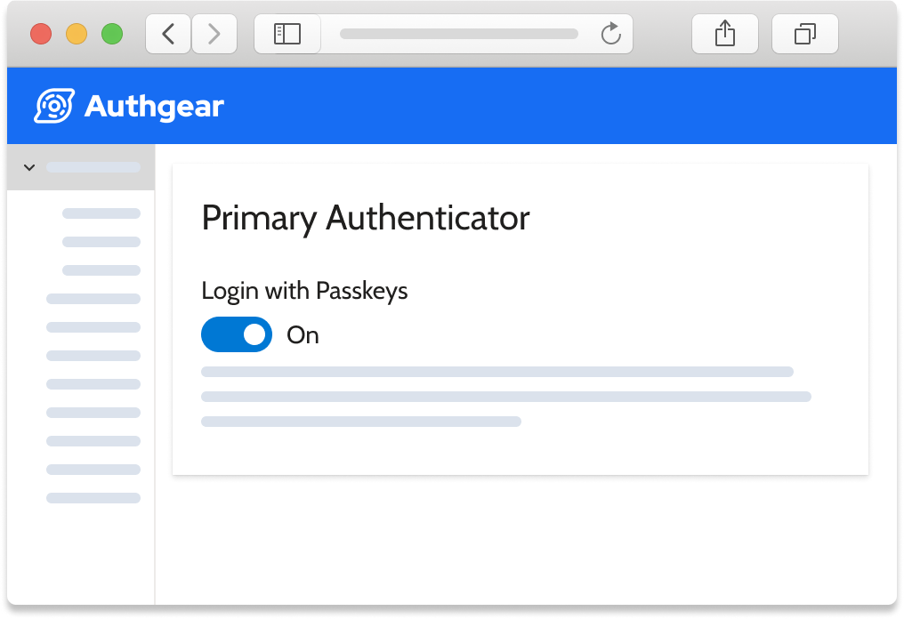

儘管存在種種缺點，密碼仍然是保護用戶資料安全的最主流機制。有些人或許認為「無密碼的未來」並非新鮮概念——現有的認證技術，如生物辨識感應器和硬體金鑰，已可讓用戶無需輸入複雜密碼即可登入。然而，由於各種原因（將在「現有的無密碼選項」一節中說明），初次建立帳號時仍然需要使用密碼。

今年稍早，<a href="https://www.theverge.com/2022/5/5/23057646/apple-google-microsoft-passwordless-sign-in-fido" target="_blank">Apple、Google 和 Microsoft 攜手合作，致力於在所有主要平台實現無密碼登入</a>。Apple 在 2022 年 5 月的全球開發者大會（WWDC22）上宣布，透過<a href="https://thetechtutor.medium.com/a-future-without-passwords-dfc7d755f9f1" target="_blank">2022 年推出的 iOS 16 和 macOS Ventura</a>，將採用 passkeys 邁向無密碼的未來。2022 年秋季推出的 iOS 和 macOS 更新，以及<a href="https://android-developers.googleblog.com/2022/10/bringing-passkeys-to-android-and-chrome.html" target="_blank">Google 於 2022 年 10 月宣布將 passkey 支援帶入 Android 和 Chrome</a>，是實現無密碼未來的重要一步。然而，許多人仍未完全理解我們如何能擁有真正的無密碼數位世界，這正引出了 passkeys 的概念。在本文中，我們將探討密碼的問題所在，以及 passkeys 如何幫助我們更接近無密碼的未來。

<ul>
    <li><a href="#passwords">密碼有什麼問題？</a></li>
    <li><a href="#passwordless">現有的無密碼選項</a></li>
    <li><a href="#passkeys">Passkey：向無密碼未來邁進一步</a></li>
    <li><a href="#authgear">使用 Authgear 在您的應用程式支援 Passkeys</a></li>        
</ul>

<h2 id="passwords">密碼有什麼問題？</h2>

密碼存在多項安全漏洞。首先，密碼是共享的秘密。當用戶建立新帳號時，密碼會儲存在伺服器上，伺服器透過比對儲存的密碼與用戶輸入的內容來驗證身份。駭客可以攻擊伺服器並取得用戶的密碼。即使開發者正確地以<a href="/zh-Hant/post/password-hashing-salting" target="_blank">雜湊和加鹽</a>方式儲存密碼，伺服器軟體仍可能透過其他漏洞洩露密碼，例如<a href="https://www.theregister.com/2022/05/27/github_publishes_a_post_mortem/" target="_blank">將密碼記錄在日誌中</a>。此外，密碼也極易受到網路釣魚、中間人攻擊（MITM）等各類攻擊手段的威脅。

此外，據統計，<a href="https://dataprot.net/statistics/password-statistics/" target="_blank">一個密碼平均用於存取五個帳號</a>，這是人們遭到駭客入侵的主要原因之一。使用不同的密碼也可能是風險因素，因為人們往往難以記住所有密碼。正因如此，Apple、Google 和 Microsoft 等科技巨頭正攜手合作，以 passkeys 打造無密碼的未來。

<h2 id="passwordless">現有的無密碼選項</h2>

目前已有多種無密碼選項，以下是一些例子：

- 一次性密碼（OTP）
- 硬體金鑰
- 生物辨識
- Magic Links

總體而言，無密碼登入比用戶自行設定的密碼更為安全，因為無密碼認證所使用的憑證更難被駭客複製或偽造。

然而，目前無密碼認證的現狀尚未足以普及於日常使用。硬體金鑰使用不便且備份有限，影響其普及程度；生物辨識資料無法在 iOS 和 Android 裝置之間轉移；駭客也可能在 OTP 透過簡訊或電子郵件傳送給目標用戶前予以攔截，或透過網路釣魚取得 OTP。

<h2 id="passkeys">Passkey：向無密碼未來邁進一步</h2>

<!--FIGURE-->

<!--/FIGURE-->

此外，Authgear 還提供一套完整的認證與用戶管理功能，包括預建的註冊頁面和用戶個人資料頁面、用戶數據分析、WhatsApp OTP、社交登入等，協助您提升用戶體驗、提高應用程式轉換率，並提升用戶留存率。

進一步了解我們的 <a href="/features/passkeys" target="_blank">Passkey API</a>，或<a href="/zh-Hant/talk-with-us" target="_blank">申請示範</a>，了解您如何從 Authgear 中獲益。
