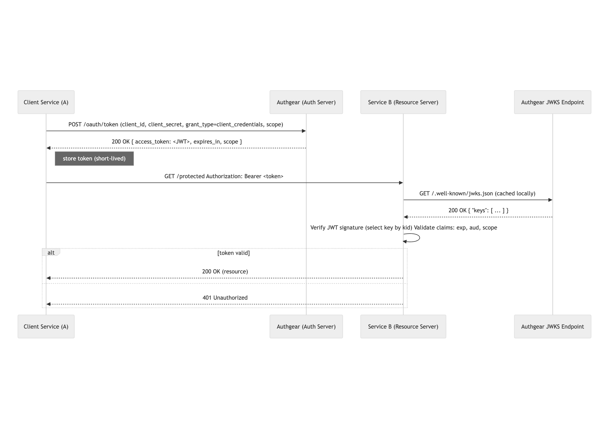

## OAuth Client Credentials、M2M Token、JWKS 與最佳實務

Machine-to-machine（M2M）驗證讓兩個服務——伺服器、daemon、CI/CD pipeline 或 IoT 裝置——在沒有人類使用者參與下彼此驗證與授權。最常見且符合標準的做法，是透過 **OAuth 2.0 Client Credentials Flow** 發放短時效 **access token**（常見為 JWT），由呼叫端服務在請求受保護 API 時攜帶。可參考 OAuth 2.0 規範：<a href="https://datatracker.ietf.org/doc/html/rfc6749" target="_blank">RFC 6749.</a>

本指南將說明：

- 什麼是 M2M 驗證，以及它為何優於靜態 API key
- OAuth Client Credentials Flow 的逐步運作方式
- 實作範例（curl、Node、Python、Go）
- JWKS（JWK 格式與託管）與驗證策略
- 金鑰輪替、撤銷與正式環境安全最佳實務
- Authgear 如何支援 M2M token（產品連結）

## 為什麼用 M2M token（而不是 API key）？

靜態 API key 容易外洩，也很難在大規模環境下輪替。以 OAuth 發放的 M2M token 提供：

- **短生命週期** — token 快速過期，外洩價值受限。
- **Scope 化存取** — token 可攜帶細緻 scope，限制機器可執行操作。
- **可撤銷與輪替** — 可輪替 client secret，token 也可撤銷或自然過期。
- **簽章 token（JWT）** — 接收方可在本地驗證簽章與 claims（或使用 introspection）。JWT 規範見：<a href="https://datatracker.ietf.org/doc/html/rfc7519" target="_blank">RFC 7519</a>。
- **可稽核性** — token 發放與使用可記錄，滿足合規需求。

因此，M2M token 是安全 **service-to-service authentication** 的建議模式。

## OAuth Client Credentials Flow 如何運作

1. **註冊 client**：在你的授權伺服器（如 Authgear）註冊呼叫端服務，取得 `client_id` 與 `client_secret`。
1. **請求 token**：client 以 `application/x-www-form-urlencoded` 將憑證送至 token endpoint（`/oauth/token`）。（見 **OAuth 2.0**：<a target="_new">RFC 6749, Section 4.4 — Client Credentials Grant</a>。）
1. **取得 access token**：憑證正確時，伺服器回傳 access token（常見為已簽章 JWT），並可選回傳 refresh token（Client Credentials 中較少見）。
1. **呼叫資源**：client 在 API 請求附上 `Authorization: Bearer <access_token>`。
1. **驗證**：API 驗證 token——可用已發布 JWK（JWKS）做簽章驗證，或呼叫 token introspection endpoint（RFC 7662）。Token Introspection 見：<a target="_new">RFC 7662</a>。

此流程完全不需要使用者登入，非常適合後端與自動化系統。

## 範例：取得 M2M access token（curl）

### 成功回應範例

## 範例：Node JS 請求與驗證

### 請求 token

### 使用 `jose` 與 JWKS endpoint 驗證 JWT

## 範例：Python

### 安裝依賴

### 請求 token

### 驗證

若要驗證 JWT，可參考 <a href="https://docs.authgear.com/get-started/backend-api/jwt#tab-python" target="_blank">我們文件中的程式碼範例。</a>

## Go

### 安裝依賴

### 請求 token

### 驗證

在 Go 中驗證 JWT，可使用 `golang-jwt/jwt` 或 `square/go-jose` 套件抓取 JWKS 並驗證 token。

## 驗證策略：本地驗證 vs introspection

- **本地驗證（效能優先，推薦）**：定期抓取 JWKS（含快取），依 JWS 規則在本地驗簽 JWT。用 `kid` header 選對應 JWK。
- **Token Introspection**：呼叫授權伺服器 introspection endpoint 檢查 token 有效性。適合 opaque token 或需即時撤銷判斷的情境。

可混合使用：平時本地驗證提升效能，若簽章未知或缺少 `kid` 時再 fallback 到 introspection。

## 金鑰輪替與撤銷

輪替必須事先規劃，避免停機。常見策略：

### 1. **雙重簽章（Dual-signing）**

- 先引入新金鑰與新 `kid`，並在開始簽發前先發布到 JWKS。
- 舊金鑰需保留在 JWKS，直到所有使用舊金鑰簽發的 token 過期。
- 等最長 token 壽命過後，再自 JWKS 移除舊金鑰。

### 2. **Client credentials 的 secret 輪替**

以原子或分階段方式輪替 `client_secret`：

- 若平台支援，先新增第二組 secret，部署客戶端改用新 secret，再撤銷舊 secret。
- 若不支援雙 secret，安排短維護窗口進行輪替。

**檢查清單**

- 文件化輪替計畫與 SLA。
- 可自動化就自動化（CI 工作）。
- 確保 JWKS 在重疊期含所有必要金鑰。
- 對利害關係人公告輪替窗口。

## 正式環境安全最佳實務

- **不要把正式環境私鑰貼到瀏覽器工具**；正式金鑰應在 HSM 或 KMS 產生。
- **使用短生命週期 token**，refresh token 僅在適當場景使用（M2M 較少需要）。
- **依服務切分 scope**，落實最小權限原則。
- **妥善保護 client secret**（HashiCorp Vault、雲端 KMS、CI secret 儲存）。
- **監控與告警** 異常 token 發放或使用行為。
- 視需求採用 **TLS/mTLS** 強化服務通訊。
- **記錄 token 發放與使用**，支援稽核與事件鑑識。

## 常見問題排查

- **「Invalid signature」** — 確認 API 抓到正確公鑰（檢查 `kid`），且 JWKS 含對應 `kid`。
- **「Expired token」** — 針對長任務審慎調高 token 壽命，或實作自動重新認證取得新 token。
- **「Invalid scope」** — 確認請求 scope 與 client 被授權 scope 一致。
- **時鐘漂移** — 確保伺服器時間同步（NTP），使 `exp`/`nbf` 檢查通過。

## 真實世界使用情境

- **微服務**：每個服務用自己的 client credentials 對其他服務驗證，取得具 scope 的 token。
- **CI/CD agent**：建置代理可取得 token 來部署或存取內部 API。
- **IoT 裝置**：裝置可拿到 per-device token 做遙測。受限裝置建議非對稱金鑰與短生命週期。
- **批次作業**：排程工作可在無使用者參與下請求 token 執行任務。

## Authgear 如何協助

Authgear 提供 M2M token 的快速落地路徑：client 註冊體驗、token endpoint、JWKS 託管、短時效 JWT、稽核日誌，以及雲端與自架部署選項。詳見 [**Machine-to-Machine Token** 功能](/zh-Hant/features/machine-to-machine-token)。

## 序列圖範例

<!--FIGURE-->

<!--/FIGURE-->

## FAQ

**Q: M2M token 建議壽命多長？**

A: 以「越短越好、仍能支撐作業」為原則——5 到 60 分鐘很常見。長任務可採自動重新認證，按需請求新 token。

**Q: 該用對稱（`HS256`）還是非對稱（`RS256`）token？**

A: 若追求高安全與跨服務金鑰管理便利，建議 **非對稱（RS/ES）**，可透過 JWKS 發布公鑰。僅在發行者與驗證者能安全共享密鑰且分發簡單時才用對稱。

**Q: 如何安全輪替 client secret？**

A: 若支援雙 secret，採分階段輪替最安全；不支援則安排維護窗口，並以自動化快速更新 client。理想上每個 client 應支援多組同時有效 secret。

## 結語

M2M token 是機器與服務驗證最安全、最符合標準的方式。若你希望用開發者友善體驗快速落地這些最佳實務，可參考 Authgear 的 [Machine-to-Machine Token 功能](/zh-Hant/features/machine-to-machine-token)——*幾分鐘內完成後端安全基線。*
