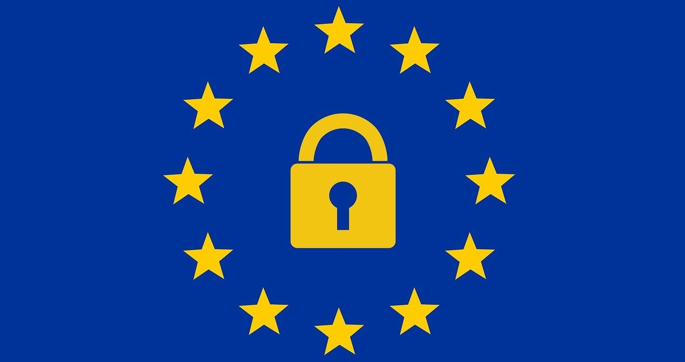
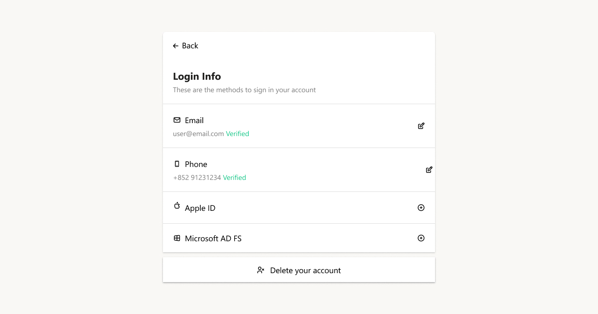

    
   資料收集一直以來都幫助各類企業分析客戶行為，以提供個性化服務或調整行銷策略。然而，消費者如今對自身資料的使用或濫用越來越有意識，開始要求對其資料擁有更多控制權。因此，各國政府也相繼出台不同法規來規範資料收集行為。

刪除權也通常被稱為被遺忘權。這是<a href="https://www.privacypolicies.com/blog/gdpr-compliance-apps/" target="_blank">GDPR 第 17 條</a>賦予個人的一項權利，允許個人要求資料控制者刪除其個人資料。然而，刪除權並非在所有情況下都適用。在本文中，我們將探討您需要了解的關於刪除權的一切，幫助您的應用程式遵循最新的資料保護政策。

<nav id="table-of-content">目錄
    <ul>
        <li><a href="#background">刪除權的背景</a></li>
        <li><a href="#exceptions">刪除權的例外情況</a></li>
        <li><a href="#public-data">個人資料已被公開時</a></li>
        <li><a href="#erasure-process">資料刪除的流程</a></li>
    </ul>
</nav>

<h2 id="background">刪除權的背景</h2>

<!--FIGURE-->

<!--/FIGURE-->

《一般資料保護規則》（GDPR）是一個負責規範個人資料如何被收集、處理和刪除的法律框架。最初，刪除權的出現源於一場針對搜尋引擎的法院訴訟。在該訴訟中，搜尋引擎因在索引中保留已不再準確或具新聞價值的舊資料而處於被告地位。

隨後，歐洲法院於 2014 年確認了刪除權。自此，搜尋引擎允許用戶對其數位足跡擁有更多控制權。其他利益相關方也相應調整。例如，Apple 宣布，所有允許用戶建立帳號的應用程式也應允許其在應用程式內發起帳號刪除請求。此要求原定於 2022 年 1 月 31 日生效，但為讓開發者有更充裕的準備時間，延期至 2022 年 6 月 30 日。

如前所述，資料控制者必須在滿足特定條件時才需遵循<a href="https://ico.org.uk/your-data-matters/your-right-to-get-your-data-deleted/#:~:text=The%20right%20to%20get%20your%20data%20deleted%20is%20also%20known,'right%20to%20be%20forgotten'." target="_blank">刪除權</a>。根據 GDPR，資料主體在以下情況下有權行使此權利：

- 個人資料不再符合其收集或處理時的目的
- 資料主體撤回同意，且沒有其他合法處理依據
- 個人資料被非法處理
- 控制者受法律義務約束須刪除該資料
- 資料主體對處理行為提出有效異議
- 資料是在向兒童提供資訊社會服務的情況下收集的

<h2 id="exceptions">刪除權的例外情況</h2>

GDPR 列明了資料主體不能行使被遺忘權的情形。若處理行為是基於以下目的所必要，則刪除權不適用：

- 基於公共衛生領域的公共利益原因
- 確立、行使或抗辯法律主張
- 遵守法律義務
- 行使言論自由和資訊自由的權利
- 出於公共利益、科學或歷史研究目的，或統計目的之存檔

	<h2 class="title cta-split-content-left">使用 Authgear 輕鬆遵循刪除權規定</h2>
  
為您的應用程式配備保護用戶隱私所需的一切

  <a href="/zh-hant/talk-with-us" target="_blank" class="w-inline-block">
  	
獲取示範

<h2 id="public-data">個人資料已被公開時</h2>

有時，<a href="https://www.experian.co.uk/business/glossary/right-to-erasure/" target="_blank">資料主體</a>可以請求刪除其資料，而資料控制者可能已將這些資料公開。在這種情況下，控制者需要通知正在處理該資料的其他控制者，告知已有請求要求刪除其任何副本或相關連結。

此外，若資料控制者已將個人資料披露給其他組織，則必須通知相關組織進行資料刪除。資料主體也有權向資料控制者索取接收方組織的相關資訊。

<h2 id="erasure-process">資料刪除的流程</h2>

鑑於 GDPR 下的刪除權，開發者需要<a href="https://iapp.org/news/a/how-to-comply-with-the-right-to-erasure-if-you-havent-already/" target="_blank">處理</a>刪除個人資料的請求。雖然 GDPR 並未規定特定的資料刪除方式，但這是一個包含多個步驟的流程，如下所述。

### 準備支援系統

儲存和處理資料主體資料的系統、應用程式和資料庫，應使組織能夠輕鬆定位和刪除資料。因此，組織需要對現有 IT 系統進行審計，以確認其能夠處理此功能。

審計後，組織可以確定系統是否需要重新配置或升級以勝任此任務。值得注意的是，GDPR 不允許組織以資料刪除不可能為由拒絕請求。因此，阻止進一步處理資料並不構成刪除。

一個較為接近的替代方案是對個人資料進行匿名化處理。由於匿名資料無法與其關聯，因此不再被視為個人資料。

### 建立資料治理架構

擁有資料治理架構對於回應資料刪除請求至關重要。資料治理圍繞著映射資料在系統、部門和第三方之間的流動等功能展開，同時確保資料質量——處理備份和硬拷貝中可能出現的重複項等問題。

值得注意的是，某些資料可能需要額外的義務，例如涉及未成年人的資料。擁有資料治理架構可確保此類事項得到妥善處理，以確保組織在刪除過程中覆蓋所有層面。

### 制定政策和程序

GDPR 並不要求組織必須制定政策或程序。然而，組織可能需要相關政策和程序才能完全合規。這些政策和程序將教育組織的開發者和其他員工了解資料刪除生命週期中的必要步驟。

記錄這些政策和程序也是組織遵守個人資料權利義務的證明。政策和程序需要集中管理，以確保組織各部門之間的一致性。

### 確認資料主體的身份

在資料控制者根據請求刪除資料主體的資料之前，必須能夠確認資料主體的身份。若資料控制者對其身份存有疑慮，可以請求提供更多資訊進行驗證。

GDPR 並未規定組織確認身份的具體步驟。然而，大多數資料控制者都有現成的程序。例如，若控制者在資料主體進入協議時已驗證其身份，則可以藉此驗證身份。

若資料控制者希望以身份疑慮為由拒絕資料主體的刪除請求，必須告知資料主體。

然而，在某些情況下，確認資料主體的身份並非必要。當識別資料主體身份的個人資訊對於處理目的而言並非必要時，即屬此類情況。

### 資料刪除的費用

原則上，行使刪除權是免費的。然而，若請求無根據或過度，資料控制者可以在合理範圍內收取費用或拒絕請求。

若資料主體頻繁提出刪除請求，您可以將其視為無根據或過度的請求。但您必須證明該請求的無根據性或過度性。

### 資料刪除的時間框架

作為資料控制者，您必須在不無故拖延的情況下回應資料刪除請求，且不得遲於收到請求後一個月。在回覆中，您應告知資料主體您針對其請求所採取的措施。

若您收到多個或複雜的請求，可以回覆資料主體告知需要更多時間處理。在這種情況下，期限可以延長不超過兩個月。

若您拒絕資料主體的請求，也需要在收到請求後一個月內告知其原因，並必須<a href="https://simple.life/privacy-1.htm" target="_blank">說明拒絕理由</a>。

## Authgear 對開發者的好處

隨著時間推移，資料控制問題越來越受到重視。現在，用戶比以往任何時候都更希望掌控自己的資料，包括刪除資料的權利。使用 Authgear，您可以透過我們最新的應用程式內帳號刪除功能，輕鬆遵循刪除權規定以及 Apple 的帳號刪除要求。

<!--FIGURE-->

<!--/FIGURE-->

Authgear 是您的應用程式所需的認證與用戶管理解決方案，提供各類功能，包括 SSO、2FA、生物辨識、管理員入口等，滿足消費者應用程式的各項需求。作為開發者，您將高度讚賞 Authgear 易於客製化的特點以及豐富的預設功能。

<a href="/zh-hant/talk-with-us" target="_blank">立即聯絡我們</a>，進一步了解 Authgear 以及它如何幫助您的應用程式獲得競爭優勢。
