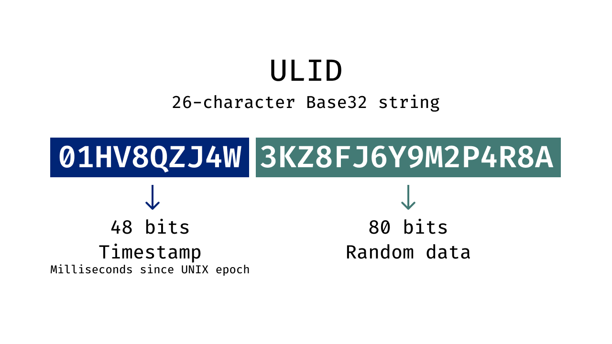
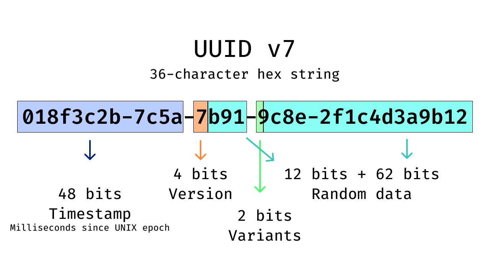
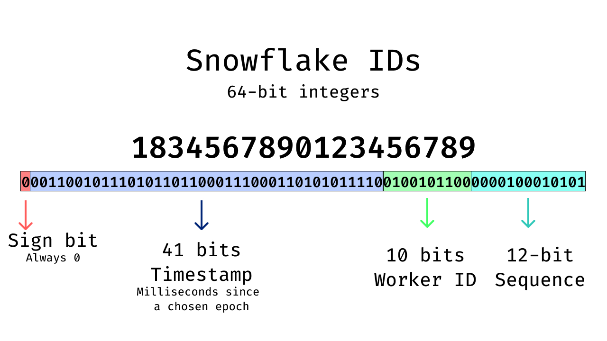

識別碼是軟體系統的基礎元素。每一筆資料庫紀錄、事件、使用者與交易，都仰賴識別碼才能被建立、被引用，並在系統間可靠地流動。

當系統擴展並走向分散式後，傳統的連號 ID 很快就會暴露限制。它們會造成寫入競爭、限制擴展性，且常常暴露內部系統細節。為了避免這些問題，現代架構通常依賴可獨立產生的全域唯一識別碼。

在這些識別碼中，時間可排序識別碼已成為分散式系統中的實務預設。

本文會說明什麼是時間可排序識別碼、它們為何在分散式系統中重要，並從架構與維運角度比較 UUIDv7、ULID 與 Snowflake ID。

## 為什麼識別碼設計在分散式系統中很重要

識別碼設計會直接影響系統效能、可靠性與長期可維運性。在分散式環境中，識別碼必須能在多個服務與區域間無需協調地產生，同時維持全域唯一與高寫入吞吐。

識別碼結構也會影響資料庫索引行為、複寫效率與可觀測性。不良的識別碼選擇通常會間接反映在索引碎片化、寫入效能下降，或是生產事故時難以重建事件流程。

因此，識別碼選型應被視為架構決策，而非實作細節。

## 什麼是時間可排序識別碼？

時間可排序識別碼會把時間資訊嵌入其中，並在排序時保留時間先後順序。較晚建立的紀錄會自然排在較早紀錄後面，無需額外排序邏輯。與完全隨機識別碼相比，時間可排序 ID：

- 改善寫入區域性並減少索引碎片
- 簡化分頁與區間查詢
- 讓日誌與稽核軌跡更易解讀
- 提升分散式系統可觀測性

重要的是，這些好處都不需要依賴集中式計數器。

## 現代識別碼系統的核心需求

在比較具體識別碼格式前，先釐清現代系統通常對識別碼提出的需求很有幫助。這些需求來自維運現實，而非理論設計。

最基本上，識別碼必須全域唯一且可本地產生。它們應能支援高吞吐而不引入協調成本。保留時間排序能力有助於改善資料庫效能與可觀測性。最後，識別碼應能與既有資料庫、API 與工具順利整合，同時避免不必要地暴露敏感系統細節。

UUIDv7、ULID 與 Snowflake ID 都嘗試滿足這些需求，但在設計取捨上各不相同。

## ULID：可字典序排序的識別碼

ULID（Universally Unique Lexicographically Sortable Identifier）是為改善傳統 UUID 的排序能力與可讀性而提出的替代方案。它將時間戳與隨機資料結合，並編碼為固定長度的 Base32 字串。

### ULID 長什麼樣子

- 01HV8QZJ4W3KZ8FJ6Y9M2P4R8A

ULID 是 26 字元的 Base32 字串，設計上可直接以字串排序。

### ULID 結構

ULID 的結構會把毫秒精度時間戳放在識別碼前段，後段則是用來確保唯一性的隨機位元。

<!--FIGURE-->

<!--/FIGURE-->

- 時間戳：Unix epoch 起算的毫秒數
- 隨機資料：確保跨系統唯一性

因為時間戳在前，ULID 能用標準字串排序自然排序。

### 主要特性

- 容易閱讀與複製
- 不需要協調機制
- 適合字串型資料庫與 API

**限制：**在同一毫秒內產生的 ULID，若未使用單調遞增變體，可能無法嚴格排序。

## UUIDv7：時間有序 UUID

UUIDv7 是 UUID 標準的現代演進，目標是解決早期版本的限制。傳統 UUID 不是嵌入硬體識別資訊，就是完全依賴隨機性，兩者都在現代分散式系統中帶來挑戰。

### UUIDv7 長什麼樣子

- 018f3c2b-7c5a-7b91-9c8e-2f1c4d3a9b12

UUIDv7 是 128 位元 UUID，在保持 UUID 生態相容性的同時嵌入時間資訊。

### UUIDv7 結構

<!--FIGURE-->

<!--/FIGURE-->

- 時間戳：Unix epoch 起算的毫秒數
- 版本位元：標示 UUID 第 7 版
- 變體位元：指定 UUID 版面與解析規則
- 隨機資料：避免碰撞

當以二進位格式儲存時，UUIDv7 值會隨時間遞增，相較隨機 UUID 可減少索引碎片。

在實務上，可使用 Authgear 的 UUIDv7 Generator & Timestamp Extractor（RFC 9562）等工具產生與解析 UUIDv7 時間戳。

### 主要特性

- 熟悉的 UUID 格式
- 完全去中心化產生
- 改善資料庫寫入效能

**限制：**生態系支援仍在發展中，但採用率正持續提升。

## Snowflake ID：結構化高吞吐識別碼

Snowflake 風格識別碼對 ID 產生採取更結構化的方法。它最初是為了支援極高寫入吞吐而設計，將多段資訊編碼進緊湊整數中。

### Snowflake ID 長什麼樣子

- 1834567890123456789

Snowflake ID 是為極高寫入吞吐優化的 64 位元整數。

### Snowflake ID 結構（典型）

<!--FIGURE-->

<!--/FIGURE-->

常見版型如下：

- 時間戳（41 位元）：自訂 epoch 起算的毫秒數
- Worker ID（10 位元）：標識產生節點
- 序列號（12 位元）：同一毫秒內計數器

此結構允許每個節點每毫秒產生數千個 ID，並維持節點內嚴格排序。

### 主要特性

- 緊湊且索引效率高
- 吞吐量非常高
- 每個 worker 具強排序保證

**限制：**需要管理 worker ID，且需可靠時鐘同步。

## 這些識別碼類型如何比較

雖然 UUIDv7、ULID 與 Snowflake 都支援時間排序，它們優先考量的系統特性不同。

- ULID 強調簡潔、可攜與自然字串排序，維運負擔低。
- UUIDv7 著重標準化與相容性，並在 UUID 生態中改善資料庫效能。
- Snowflake 優先追求吞吐與儲存效率，但代價是更高維運複雜度。

最合適的選擇取決於系統規模、效能需求與團隊可掌控的基礎設施程度。

### 效能與維運影響

時間可排序識別碼讓插入接近順序寫入，能減少索引碎片並提升快取區域性。隨著資料成長，可帶來更可預測的寫入效能。

它們也能提升可觀測性，工程師可直接由識別碼推估建立順序，簡化日誌關聯與事故除錯。

### 可觀測性與維運效益

以下是使用時間可排序識別碼的幾項主要可觀測性與維運效益：

- 不需額外 metadata，就能從識別碼推估大致建立順序
- 簡化跨服務與系統的日誌關聯
- 讓分散式流程除錯更直接
- 在事故期間快速重建事件序列
- 讓識別碼設計成為可實際利用的診斷工具，而非隱藏的實作細節

## 安全與隱私考量

所有時間可排序識別碼都會暴露大致建立時間。

- UUIDv7 與 ULID 主要只暴露時間
- Snowflake ID 可能透露如 worker 數量或規模等基礎設施訊息

若識別碼會暴露在 API 或 URL 中，應依隱私需求與威脅模型審慎評估。

## 如何選擇正確的識別碼策略？

選擇識別碼策略是基礎架構決策，會影響系統如何擴展、效能表現與長期維運。許多系統一開始採用簡單預設，但隨資料量、流量與分散程度上升，這些選擇往往難以回頭。及早審慎評估，可避免日後效能瓶頸與維運複雜度。

在 UUIDv7、ULID 與 Snowflake 等選項間抉擇時，團隊應同時評估短期需求與長期預期。以下考量可協助決策。

### 了解系統規模與發展軌跡

系統目前與未來規模，對識別碼策略選擇有關鍵影響。規模較小、併發有限的系統彈性較高；快速成長或大規模系統則需要在持續寫入壓力下仍可靠的識別碼。

在分散式架構中，識別碼必須能於服務與區域間獨立產生。時間可排序識別碼特別適合這類環境，因為它能降低資料庫索引碎片，並在資料成長時維持可預測的寫入模式。

團隊也應考慮未來成長，包括吞吐提升或跨區擴張，確保所選方法在這些情境下依然有效。

### 對齊資料庫與儲存行為

識別碼與資料庫高度互動，其結構會直接影響儲存效率與查詢效能。部分資料庫在寫入密集工作負載中，對有序識別碼的處理效率高於隨機識別碼。

團隊應評估識別碼如何儲存與建立索引，以及是否用於區間查詢或分頁。UUIDv7 在二進位儲存下能改善寫入效能，同時維持與既有 UUID 系統相容。ULID 適合仰賴字串鍵與字典序排序的環境。Snowflake 以緊湊整數形式，在針對數值主鍵最佳化的資料庫中表現強勁。

理解這些取捨，能避免只在大規模下才出現的效能問題。

### 納入維運複雜度

維運成熟度應強烈影響識別碼選型。某些策略會引入需要持續管理的額外責任。

例如 Snowflake 風格識別碼，仰賴精確分配 worker 識別與一致時鐘同步。這些要求在嚴格控管環境中可管理，但在更動態或去中心化系統中會提高風險。時鐘漂移或設定錯誤都可能直接影響識別碼產生。

相較之下，UUIDv7 與 ULID 完全去中心化、較易維運。它們不需要協調機制，並降低維運失誤風險，對重視簡潔與韌性的團隊更具吸引力。

### 考慮安全與暴露面

識別碼如何、在哪裡被暴露，是另一個重要因素。僅內部使用的識別碼，風險與透過 API、URL 或用戶端暴露的識別碼不同。

時間可排序識別碼會揭露近似建立時間，是否可接受取決於情境。Snowflake ID 可能額外暴露基礎設施或規模資訊。UUIDv7 與 ULID 通常僅暴露時間資訊，對多數公開場景而言更安全。團隊在決策時應評估隱私需求、法規義務與威脅模型。

### 做出有依據的選擇

沒有放諸四海皆準的識別碼策略。正確選擇取決於系統規模、資料庫特性、維運能力與安全考量。對許多現代應用而言，UUIDv7 是兼顧平衡且維運成本低的預設。ULID 在重視可讀性與字串排序的場景仍是強項。Snowflake ID 最適合具成熟維運控管的高吞吐系統。

把識別碼選型視為有意識的架構決策，團隊才能採用支撐長期擴展性、效能與維運清晰度的策略。

## 重點整理

選擇正確識別碼策略，是打造可擴展且可靠系統的關鍵。UUIDv7、ULID 與 Snowflake 等時間可排序識別碼，有助改善資料庫效能、簡化可觀測性，並在系統成長時支援分散式架構。

透過理解其取捨並對齊系統規模、維運成熟度與安全需求，團隊可做出經得起時間考驗的識別碼決策。

像 Authgear 這類現代平台，透過實用且開發者友善的工具支援這種做法。

Authgear 的 UUID v7 Generator & Timestamp Extractor（RFC 9562）可輕鬆產生時間有序 UUID 並擷取內含時間戳，協助團隊更有信心地採用 UUIDv7。

[探索 Authgear UUIDv7 工具](/zh-Hant/tools/uuidv7-generator)，產生符合規範的識別碼、理解其結構，並從一開始就打造可高效擴展的系統。

## FAQs

1. 什麼是時間可排序識別碼？為什麼重要？   <ul><li>時間可排序識別碼會在結構中嵌入時間戳，讓紀錄或事件可依建立時間大致排序。這可改善資料庫效能、簡化日誌與除錯，並在不依賴集中式計數器下支援分散式系統。
1. UUIDv7 與 ULID、Snowflake ID 有何不同？   <ul><li>UUIDv7 在保持 UUID 生態相容性的同時嵌入時間戳。ULID 是字串型且可字典序排序，適合日誌與 API。Snowflake ID 是為高吞吐設計的緊湊整數，但需更謹慎管理 worker ID 與時鐘。
1. 時間可排序識別碼會暴露敏感資訊嗎？   <ul><li>UUIDv7 與 ULID 主要暴露建立時間，通常風險較低。Snowflake ID 可能額外透露 worker ID 或基礎設施細節。評估隱私時應考慮識別碼在 API 或日誌中的可見度。
1. 時間可排序識別碼如何提升資料庫效能？   <ul><li>由於插入更接近順序寫入，可減少索引碎片、改善快取區域性，並降低 page split 開銷。這對寫入密集系統與分散式資料庫特別有幫助，避免隨機 ID 長期拖累效能。
