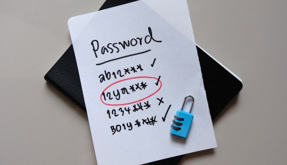

    
    
    2021 年，拜登總統在聯邦政府範圍內推行 MFA，作為提升網路安全計劃的一部分。此舉源於美國國家網路安全負責人指出，多因素驗證可以防止 80-90% 的網路攻擊。面對日益增加的威脅，MFA 在提升線上安全方面的有效性正迅速使其成為網路安全的必備工具。

若要進一步了解 MFA、它的運作方式及其帶來的好處，請繼續閱讀：

<nav id="table-of-content">目錄
    <ul>
        <li><a href="#mfa">什麼是多因素驗證 (MFA)？</a></li>
        <li><a href="#why-mfa">有了密碼，為何還需要 MFA？</a>
            <ul>
                <li><a href="#guess">容易被猜到的密碼</a></li>
                <li><a href="#stolen">被竊取的密碼</a></li>
            </ul>
        </li>
        <li><a href="#how">MFA 是如何運作的？</a>
            <ul>
                <li><a href="#knowledge">知識因素</a></li>
                <li><a href="#possession">持有因素</a></li>
                <li><a href="#inheritance">繼承因素</a></li>
            </ul>
        </li>
        <li><a href="#benefits">使用多因素驗證的好處</a></li>
        <li><a href="#2fa">什麼是雙因素驗證 (2FA)？</a></li>
        <li><a href="#conclusion">只需幾次點擊，即可發揮 MFA 的強大功能。</a></li>        
    </ul>
</nav>

<h2 id="mfa">什麼是多因素驗證 (MFA)？</h2>

<!--FIGURE-->

<!--/FIGURE-->

MFA 代表多因素驗證，其特點在於要求使用者提供不只一個驗證因素，才能存取應用程式、線上帳戶等。

MFA 是任何<a href="/zh-hant/post/what-is-customer-identity-and-access-management-ciam" target="_blank">客戶身份與存取管理</a> (CIAM) 的核心組成部分，因為它將使用者名稱和密碼與一個或多個額外的驗證因素相結合。MFA 僅透過分層驗證方式，就能降低網路攻擊成功的可能性。它如此簡單的特性絲毫不影響其有效性。如果有什麼的話，這正是它最大的優勢之一——它易於採用和使用，同時仍能提供出色的攻擊防護。

*在 Authgear，我們確保創建了*<a href="/solutions/customer-identity-and-access-management" target="_blank">*MFA 解決方案*</a>*，無需您額外進行開發或管理——企業可以在毫不麻煩的情況下獲得增強安全性和更滿意用戶的所有好處。*

<h2 id="why-mfa">有了密碼，為何還需要 MFA？</h2>

<!--FIGURE-->

<!--/FIGURE-->

如果您和帳戶之間唯一的驗證關卡只是使用者名稱和密碼，那麼您的資訊遠不如您想象的那樣安全。若沒有多因素驗證，密碼可能因以下挑戰而容易遭受駭客攻擊：

<h3 id="guess">容易被猜到的密碼</h3>

根據英國國家網路安全中心 2019 年的<a href="https://www.ncsc.gov.uk/news/most-hacked-passwords-revealed-as-uk-cyber-survey-exposes-gaps-in-online-security" target="_blank">報告</a>，密碼「123456」在全球超過 2300 萬個被入侵的帳戶中使用。選擇易於猜測的密碼仍是全球性問題。其他常見的密碼選擇包括生日、常見的字典詞彙，或流行的樂團和運動隊名稱。一個執著且有方法的駭客可以使用機器人和猜測，直到找到您的正確密碼，屆時您的帳戶可能被入侵，您的資訊可能被竊取。

<h3 id="stolen">被竊取的密碼</h3>

即使使用者確實選擇了稍微複雜的密碼，他們也常常犯下在多個帳戶使用相同密碼的錯誤。同樣，這使人們容易遭受攻擊。密碼本身是對抗網路攻擊的低效保護措施。您可以為每個帳戶創建高度複雜且唯一的密碼，但仍可能遇到麻煩，因為如果密碼被竊取且沒有 MFA，將沒有任何其他東西能阻止駭客進入。

網路釣魚郵件和<a href="/zh-hant/post/credential-stuffing" target="_blank">憑證填充</a>攻擊意味著您的個人隱私始終面臨風險。更令人擔憂的是，一旦密碼和使用者名稱組合被獲取，駭客就會互相出售被竊取的密碼。這意味著人們的個人資料往往在網路上流通，而他們通常在為時已晚時才發現。

<h2 id="how">MFA 是如何運作的？</h2>

<!--FIGURE-->

<!--/FIGURE-->

MFA 的運作方式是要求使用者透過不僅僅是使用者名稱和密碼的組合來識別自己的身份。這是對抗被竊取密碼的額外保護層，因為這意味著即使有人獲得了您的詳細資料，仍然有另一層身份驗證需要跨越。

在系統中添加多因素驗證的組織不僅能更好地保護自身，也能保護使用其服務的任何人。對於多因素驗證，通常使用三種類型的驗證因素：

<h3 id="knowledge">知識因素</h3>

知識因素是最常用的因素。使用知識因素進行的身份驗證要求使用者提供他們應該知道的資訊。在單層身份驗證中，知識因素——包括密碼、通行短語、個人安全問題的答案和 PIN 碼——通常是用於身份驗證的憑證。

知識因素被認為是最容易受到攻擊的，因為許多使用者傾向於讓其憑證易於記憶，或在多個帳戶中重複使用。

<h3 id="possession">持有因素</h3>

某些身份驗證系統會使用安全鑰匙扣（也稱為硬體令牌）、磁條徽章，或您必須持有的其他實體物品，以便驗證您的詳細資料並授予存取權限。一個典型的例子是銀行在您刷卡後要求您在機器上輸入 PIN 碼，但這在實體安全系統中最為常見。

#### 驗證器應用程式生成的 TOTP

MFA 最常見的例子之一，OTP 被算作持有因素，因為您必須持有智慧型手機這個實體物品才能從應用程式獲取 OTP。與透過簡訊發送的 OTP 相反，驗證器應用程式消除了與基於簡訊的攻擊相關的任何風險。

#### 透過簡訊或電子郵件發送給使用者的 OTP

當您透過簡訊或電子郵件收到 OTP 時，情況相同。您的筆記型電腦或平板電腦可以是接收持有驗證因素的另一個裝置。

#### 實體安全物品，例如智慧卡、門禁徽章、鑰匙扣、USB 裝置或安全金鑰

多因素驗證以更實體形式呈現的例子，存取徽章和鑰匙扣等物品通常用於對實體安全系統的存取進行身份驗證。

<h3 id="inheritance">繼承因素</h3>

繼承因素依賴於您身體上的某些東西或您「繼承」的東西，也就是您的生物特徵數據。想想 Apple 的觸控或面容 ID——這些是最安全的身份驗證形式之一，因為每個人都有完全獨特的生物特徵數據。複製或竊取某人的指紋非常困難，更好的是，掃描快速且易於使用。

#### 指紋

可能是最廣為人知和廣泛使用的<a href="/zh-hant/post/biometric-authentication" target="_blank">生物特徵驗證</a>形式，指紋掃描利用每個人指紋的獨特紋路，系統可以儲存您的獨特紋路，然後與您在想要驗證存取時呈現的生理證據進行比較。

#### 人臉識別

當今最常用的 MFA 例子之一，人臉識別是一種快速、高度安全的身份驗證方法，我們許多人的智慧型手機都可以使用。

#### 使用視網膜、聲紋或虹膜掃描

這是多因素驗證的一個較小眾的例子，但聲紋、視網膜和虹膜掃描的採用率正在不斷提高。它們通常與指紋或人臉識別一起使用，以進一步提升安全性。

<h2 id="benefits">使用多因素驗證的好處</h2>

<!--FIGURE-->

<!--/FIGURE-->

如果您仍然在問「MFA 是如何運作的？」，了解它的最佳方式可能是看看它能提供的好處：

### 保護帳戶免受憑證竊取和欺詐

使用 MFA 最重要的好處在於它所增加的安全深度，確保使用者的線上安全不僅僅依賴於可能被竊取或分享的密碼。如果該密碼落入錯誤的手中，MFA 意味著它仍然不足以獲取帳戶存取權限。

例如，透過啟用 Authgear 的<a href="/features/whatsapp-otp" target="_blank">WhatsApp OTP</a> 功能，您的應用程式將要求擁有密碼的人還必須擁有使用者的智慧型手機才能進入其帳戶，這極不可能發生。

### 提供強大的終端使用者存取體驗

MFA 不僅增加了額外的驗證障礙以阻止駭客，還允許使用者以更簡單的方式登入應用程式。啟用多因素驗證後，使用者不再需要透過輸入使用者名稱和密碼來登入。相反，他們可以簡單地查看裝置上的通知、將手指按在指紋掃描器上，或者甚至只需看向裝置即可。MFA 在保護使用者安全的同時，也為他們整體創造了更個性化、更好的體驗。

### 滿足合規要求和法規

現在許多行業都要求針對不同使用者群體、員工和消費者進行多因素驗證，一些法規進一步要求特定的驗證器保障標準。這些法規對企業來說可能令人感到棘手，但透過選擇 Authgear 的保障因素和方法範圍，可以輕鬆滿足這些要求。無論您的行業要求什麼，我們都有能夠幫助您的解決方案。

<h2 id="2fa">什麼是雙因素驗證 (2FA)？</h2>

雙因素驗證，簡稱 2FA，是一種需要恰好 2 個驗證因素的多因素驗證類型。通常，其中一個因素是您知道的東西，例如密碼或 PIN，而第二個因素是您擁有的東西，例如您的手機或硬體令牌。

在 2FA 中，一次性密碼 (OTP) 可以在使用者輸入密碼後透過簡訊或電子郵件發送到其手機號碼。或者，使用者也可以在驗證器應用程式上驗證是本人正在登入服務。

<h2 id="conclusion">只需幾次點擊，即可發揮 MFA 的強大功能。</h2>

Authgear 為希望在其應用程式中添加身份驗證的開發人員提供了多種強大的多因素驗證工具。設計上易於整合到現有系統，您只需點擊幾下，就能利用 MFA 並提升使用者和服務提供者的網路安全。

<!--FIGURE-->

<!--/FIGURE-->

此外，開發人員還可以輕鬆配置雙因素驗證（如下所示），在不需要繁複編碼的情況下確保使用者的數據安全。

<!--FIGURE-->

<!--/FIGURE-->

<a href="https://accounts.portal.authgear.com/signup" target="_blank">立即註冊</a>，輕鬆啟用 Authgear 的 MFA，或<a href="/zh-hant/talk-with-us" target="_blank">聯絡我們</a>，進一步討論最適合您和您的安全需求的解決方案。
