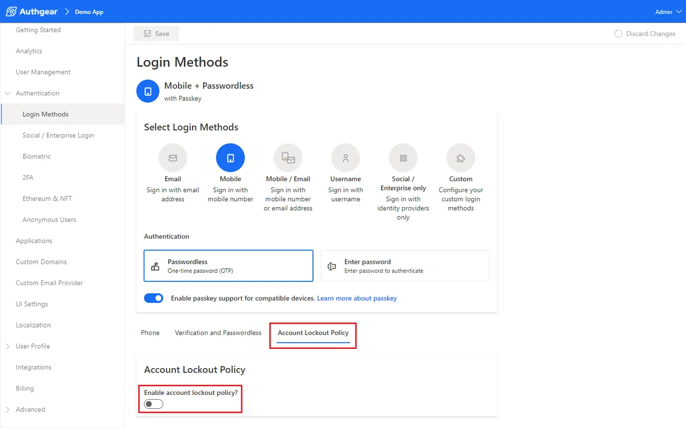
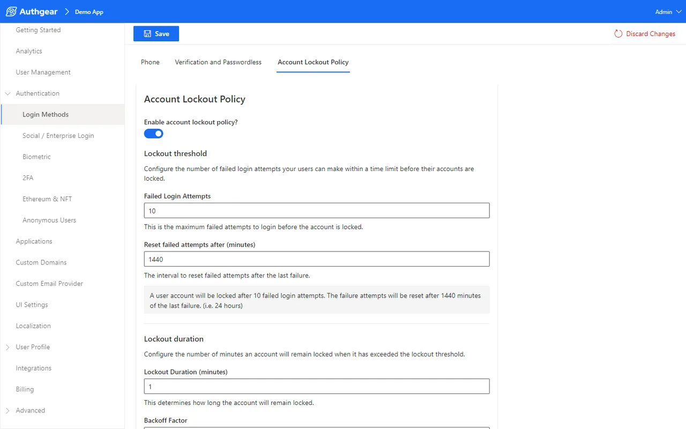
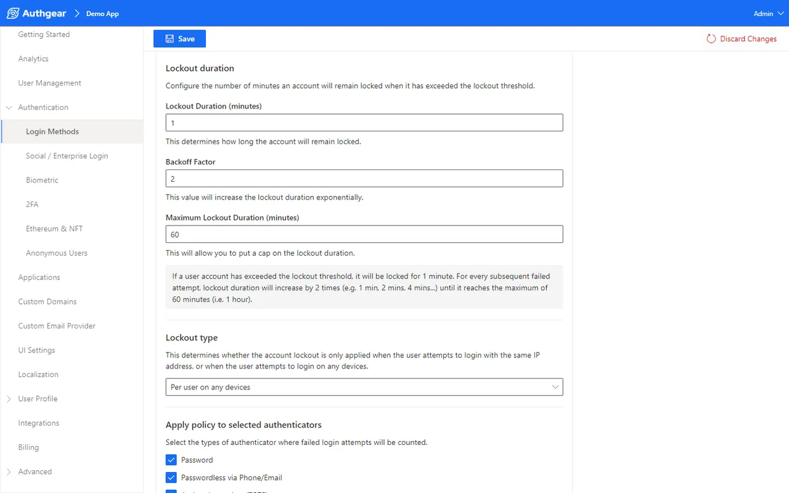
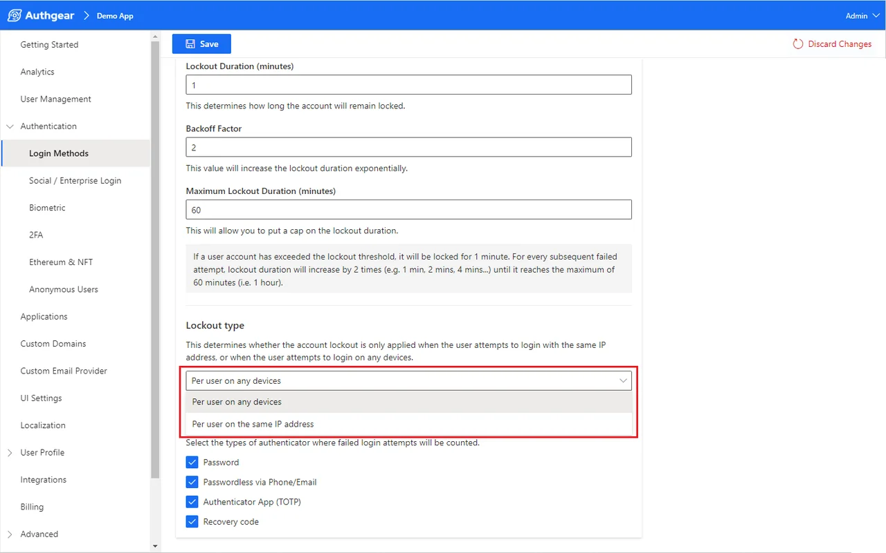
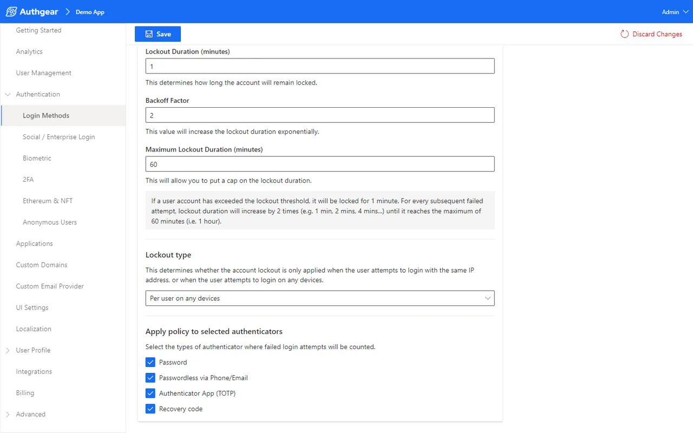

Brute force attack are a prevalent cyberattack involving systematically trying multiple combinations of usernames and passwords until the right one is found.

To help you protect your users from brute force attack, we’ve released the account lockout policy feature for you to configure lockout threshold, lockout duration, and type of lockout. Let’s see how it works.

### Account Lockout Policy

The new feature can be found in **Authentication > Login Methods > Account Lockout Policy**

Click on the toggle switch to turn on and beginning configuring account lockout policy.

### Lockout Threshold

Under the lockout threshold section, you can specify the maximum number of failed attempts the user can make before the account gets locked.

Aside from that, you can also configure the amount of time it takes before the failure attempts are reset.

### Lockout Duration

In addition to the threshold, you can also configure the lockdown duration, the backoff factor by which the lockout duration will be multiplied for every subsequent failed attempt, and a maximum lockout duration.

### Lockout Type

Lockout type provides two options for you to determine whether the lockout is based on user’s device or IP address.

Lastly, the last “Apply policy to selected authenticators” feature allows you to select the types of authentication method where failed login attempts will be counted.

For more information, visit our [documentation page](https://docs.authgear.com/security/brute-force-protection) to properly configure your account lockout policies to protect your users from brute-force attacks.
